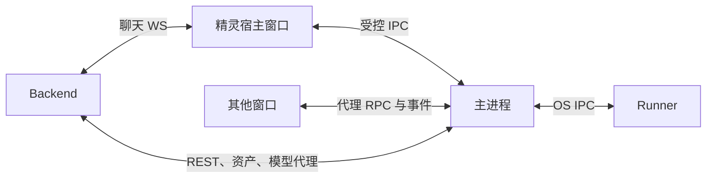

# Client

负责桌面呈现、凭据、协议中转、Runner 生命周期与更新。推理归 Backend，本机工具归 Runner。内部实现分别进入[主进程](main/README.md)和[渲染层](renderer/README.md)，本文维护跨进程与跨窗口协作。

## 任务入口

| 要修改的功能 | 实现起点与联动 |
|---|---|
| 登录、换号与会话过期 | [session.ts](main/backend/session.ts)（多账户凭据存储）、[session-runtime.ts](main/backend/session-runtime.ts)、[auth.ts](main/ipc/auth.ts) → [account-lifecycle.ts](renderer/app/workflows/account-lifecycle.ts)、[auth store](renderer/shared/store/auth.ts)；[凭据契约](../docs/PROTOCOL.md#凭据落盘) |
| 网关、Runner 派发与断连 | [gateway.ts](main/ipc/gateway.ts)、[runner.ts](main/ipc/runner.ts) → [host-runtime.ts](renderer/app/runtime/host-runtime.ts)、[tool-dispatch.ts](renderer/app/runtime/handlers/tool-dispatch.ts)；[本机工具契约](../docs/PROTOCOL.md#本机工具) |
| 历史、语音与资产缓存 | [session-history.ts](main/ipc/session-history.ts)、[asset-disk-cache.ts](main/ipc/asset-disk-cache.ts) → [session-history-cache.ts](renderer/modules/conversation/session-history-cache.ts)、[conversation-speech.ts](renderer/app/workflows/conversation-speech.ts)；[缓存规则](#资产与历史缓存) |
| 场景与背景切换 | [生成服务任务链](../backend/services/application/generation/README.md#场景改动链)贯穿前后端 |
| 窗口、拖拽、主题与动作播放 | [主进程窗口](main/README.md#窗口与几何)、[渲染层](renderer/README.md#角色呈现契约)；核对几何、命中与可见性 |
| 设置同步与 Runner 更新 | [runner-config.ts](main/ipc/runner-config.ts)、[config-sync.ts](main/shared/lib/config-sync.ts)、[updater.ts](main/runner/updater.ts)；[同步](../docs/PROTOCOL.md#配置所有权与云同步)与[验签](../docs/PROTOCOL.md#自更新签名) |
| 桌面应用更新 | [update.ts](main/ipc/update.ts)、[auto-updater.ts](main/lifecycle/auto-updater.ts) ↔ [update-bridge.ts](renderer/shared/lib/update-bridge.ts)（生活空间和桌面入口）、[about-page.tsx](renderer/app/features/living/settings/about-page.tsx)；[更新契约](../docs/PROTOCOL.md#自更新签名) |

## 进程与代码边界

| 代码 | 职责 |
|---|---|
| `main` | 身份、窗口、Runner、缓存与更新 |
| `renderer` | 交互与呈现，各物理窗口独立运行；桌面内部面板共享运行时 |
| `shared/ipc` | 跨进程通道与载荷 |
| `shared/runtime.ts`（`@runtime`）、`shared/speech-text.ts` | 两个进程共用的运行时原语与朗读文本清理 |

主进程不导入依赖窗口环境的 `renderer/shared`。main / preload 由 tsup 构建，renderer 由 Vite 构建；preload 格式、安全和产物路径见[主进程边界](main/README.md#包边界)。

## 连接与设备就绪

- 精灵宿主持唯一 WS 并负责 Runner 派发。主进程只向宿主发放 `ws-url`，其他窗口经主进程代理 RPC；每窗独立水合、读取斜杠目录，不自行建立聊天连接。
- 宿主每次连接直接请求新票据，签发失败保留原错误，不回落无票连接；REST 与资产请求不签票。重连由宿主运行时管理，业务请求失败后不自动重放。
- 相同模块不代表共享内存。角色默认显示比例经主进程 IPC 跨窗同步，消费见[渲染层](renderer/README.md#角色呈现契约)。

Runner 握手、配置推送与工具清单读取由主进程完成；`tools.sync` 与撤销由宿主 [host-runtime.ts](renderer/app/runtime/host-runtime.ts) 按 Runner 状态发起，顺序见 [握手与工具同步](../docs/PROTOCOL.md#握手与工具同步)。运行期能力通知和进程代次尚未接入，见[当前限制](../docs/PROTOCOL.md#能力与进程代次)；迟到查询不得恢复已撤销资格。

普通会话切换不重置实时事件水位；调用恢复使用原 `call_id`，不能因响应丢失生成新标识重做操作。

## 窗口与主题

- 窗口模式中生活空间与工作台互斥，各自用一个透明物理窗口承载内容和侧边伙伴；本机偏好与几何权威见 [主进程](main/README.md#窗口与几何)，显示规则见 [DESIGN](../docs/DESIGN.md#窗口与会话)。
- 开关窗口只改变呈现，不取消已执行工具。
- 主题在 `loadURL` 前从配置镜像写入入口参数，渲染模块加载时优先消费并移除参数；localStorage 是即时缓存，云端水合负责收敛。
- 镜像没有主题时不写入口参数，渲染层依次使用 localStorage 与默认主题 `day-clear`；非法值归一为 `day-clear`，不阻塞开窗。
- 透明窗口和首帧 body 必须同时透明；圆角与阴影由 CSS 绘制，不用系统矩形底填满外侧透明区。
- 鼠标穿透是窗口级能力，精灵与弹层共同登记命中区域，不能让弹层捕获整个桌面。
- 精灵窗使用系统 `floating` 层置顶，使 macOS 输入法候选窗等系统浮层可以显示在其上；独占全屏应用可能覆盖精灵。
- 精灵窗只覆盖当前显示器工作区，跨屏统一换算原点与坐标，避免二次平移；恢复先选屏再定位，拔屏回到可用显示器。
- 跨窗口附件通过主进程信箱转交；会话跳转只把目标 ID 交给目标窗口，来源窗口保留自己的会话。

Windows 另提供统一桌面模式，交互主屏整合全部业务功能，其他屏只显示背景；普通应用覆盖整个桌面。呈现与系统恢复见[主进程](main/README.md#桌面承载与恢复)，体验见 [DESIGN](../docs/DESIGN.md#桌面模式)。

## 资产与历史缓存

### 资产字节与目录

- 主进程按本机账户隔离资产目录，只为 `preferCache` 请求与 `/api/companion/asset/` 路径下的伙伴资产（立绘、媒体、语音、动作片段与遮罩等）落盘缓存，其余资产直连获取。`preferCache` 命中时直接返回，不等待后端就绪；未命中才连接后端。缓存键为调用方提供的 `contentHash`，否则为剥离签名参数后的 URL 摘要（当前调用方均未提供 `contentHash`）；该路径资产在非 `preferCache`、非 `cacheOnly` 请求时按 ETag 复验。签名变化不代表内容变化。已有平铺缓存只迁入启动时已选账户，不作为其他账户的回退来源。
- 动作目录另持久化最近成功 manifest 快照，启动先本地恢复再网络校准。
- 外观页另缓存外观列表并预取。
- 旧字节可先呈现，新资产就绪后替换；网络失败保留旧形象，鉴权失败进入会话过期流程。

语音条首次点播或自动播放时经资产缓存下载到磁盘，后续播放及重启后优先本地读取，同一音频的并发下载合并。仅为即将播放的语音下载音频。

收听状态与断点由主进程独立保存在 `cache/voice-playback`，不随历史快照失效而清除，语义见[语音契约](../docs/PROTOCOL.md#语音保存与重试)。每秒保存进度，中断和结束立即保存；退出有界等待在途写入。主进程串行写入并广播带版本的快照，账户保留与移除遵守同一缓存生命周期；编辑、撤回、清空和删除只清理确认删除的消息，截断历史不作为删除依据。

| 场景 | 缓存行为 |
|---|---|
| 图片、语音、视频缓存增长 | 不按数量或字节淘汰 |
| 会话过期、主动登出或换号 | 保留各账户的资产、历史快照、收听记录和渲染层持久索引；切换时重置内存视图，切回后从对应账户恢复 |
| 明确移除账户（含非当前账户） | 只删除该账户的缓存与持久索引；取消或等待该账户在途写入，迟到结果不得恢复已移除数据，也不得影响其他账户 |
| 文件损坏 | 可移除后重新获取 |
| 空间不足 | 报告写入失败，不自动删除其他有效资产 |
| 主动台词合成（`speak`） | 只做内存与在途合并 |
| 预制台词与反应池音频（`speakScripted`） | 按内容落盘，登出不清理 |

### 历史同步

- 历史按本机账户和会话缓存快照，同一数字用户 ID 位于不同后端时仍隔离；缓存 IPC 携带发起时的鉴权会话标识，主进程拒绝已切走账号的请求。
- 打开会话先显示快照，再以末条消息 ID 请求增量，锚点失效则全量恢复；IM 始终全量更新 queued 状态。
- 快照不记录实时回合，不能用其旧 seq 请求帧重放；`last_seq` 只用于重连时仍保有活数据的列表。

| 历史变化 | 快照与同步 |
|---|---|
| 已有消息更新语音音频或视频状态 | 保留界面历史，废弃磁盘快照，下次强制全量同步；更新与在途请求交错时重新读取 |
| 连续变化超出重试预算 | 保留界面并报告同步失败 |
| 重复完成事件中的空音频 | 不覆盖已就绪音频 |
| 编辑、撤回或带 hydrate 的历史变化 | 覆盖对应快照，包括清空状态与手动压缩 |
| 自动压缩 | 只插入摘要卡 |
| 删除会话 | 同步删除缓存 |

末条消息 ID 无法发现旧消息音频或媒体状态变化。缓存含等待视频时不使用消息 ID 增量锚点，事件无法重放则全量读取。媒体终态可能早于完成帧，客户端暂存后与完成帧或历史水合合并；气泡与事件契约见 [PROTOCOL](../docs/PROTOCOL.md#媒体引用验图与原位交付)。

## 契约与验证

字段与通道定义在 [shared/ipc](shared/ipc/)。`IPC` 常量用扁平 camelCase 键，使 `satisfies` 能约束叶子通道名；嵌套结构会绕过该校验。IPC 修改同时核对类型、preload、[渲染侧全局类型](renderer/shared/types/global.d.ts)、主进程和调用方；异步修改覆盖切换、断连、登出与迟到结果。透明合成、多屏、快捷键和 GPU 恢复在对应平台验证，命令见 [Scripts](../scripts/README.md#按改动选择验证)。
