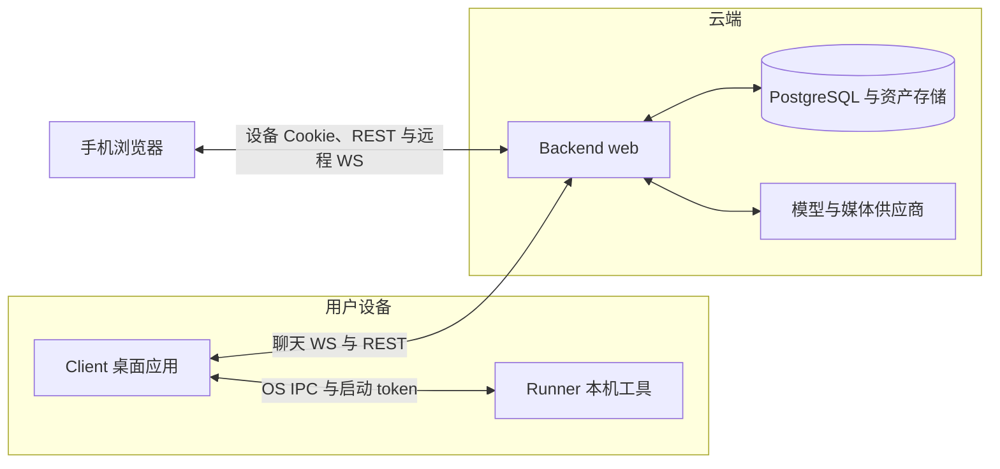

# 系统架构

本文维护模块职责、依赖方向、状态权威、部署与信任边界。按任务进入的阅读路由统一见 [AGENTS](../AGENTS.md)。

## 运行拓扑

- Backend 运行于 Linux Docker；Client、Runner、Installer 支持 Windows 与 macOS 原生运行。底层库的跨平台能力不等于产品平台支持。
- 主进程保管桌面身份并桥接本机执行；精灵宿主承载唯一聊天 WS，其他窗口经主进程代理。Runner 不持后端凭据，反向模型请求通道经 Client 转交 Backend，当前内置工具未使用。
- Windows 桌面模式由各屏的只读背景、交互屏的透明界面与独立精灵舞台承载，独立 Rust helper 接入 Explorer 并临时设置交互屏工作区；guardian 负责主进程或宿主异常时恢复系统界面。后台精灵 renderer 保留唯一聊天 WS 与 Runner 派发权限。
- 进程拆分隔离职责与凭据，不构成完整安全沙箱。

## 模块职责

| 模块 | 负责 | 不负责 |
|---|---|---|
| Backend | 对话编排、供应商调用、云端工具、角色与记忆、资产、调度及持久化 | 本机工具执行、桌面窗口与像素坐标 |
| Client | 桌面交互与渲染、登录凭据、本地设置、云端连接、Runner 生命周期及请求中转 | 云端业务状态的权威副本 |
| Remote | 手机浏览器交互与设备展示状态 | 桌面凭据、Runner 注册、本机执行和云端业务状态 |
| Runner | 本机终端、文件、浏览器等工具，报告实际能力 | 后端登录凭据、云端角色与会话状态 |

Installer 负责首次安装和环境修复；安装后的运行与更新由 Client 管理。安装载荷不包含完整离线运行环境，Python 与依赖准备仍需联网。

## 依赖方向

桌面 Client 与浏览器 Remote 独立构建，通过根 `shared/protocol.ts` 共用纯协议类型；浏览器代码不依赖 Electron 桥或桌面运行时。

Backend 按协议适配、应用编排、领域和基础设施分层；跨域流程由 application 组织，注册和启停集中在 bootstrap。动作编排调用生成服务，生成收尾经动作领域层发布目录，不反向调用动作编排。内部依赖矩阵与检查入口归 [Backend](../backend/README.md#services-依赖边界)。

## 状态权威与副本

| 状态 | 权威来源 | 副本边界 |
|---|---|---|
| 角色、角色卡、会话、长期记忆、动态、日记 | Backend 数据库 | Client 与 Remote 展示和提交操作；不得用旧视图覆盖已提交数据 |
| 形象、外观、场景及激活关系 | Backend 数据库与资产存储 | Client 与 Remote 缓存字节和展示状态，缓存命中不改变激活关系 |
| 在途回合与会话互斥 | Backend 账户运行态 | 各连接独立持有重放与 ACK；Client 与 Remote 持恢复快照 |
| 动作库（含提案、素材版本、目录、播放账本） | Backend 数据库与资产存储 | Client 缓存片段字节与播放实例状态，不决定动作是否可用 |
| 可同步用户偏好 | Backend 配置 | Client 保存带用户归属的离线镜像；冲突按协议处理 |
| 激活凭据、本机连接和机密配置 | Client 主进程 | 仅向 Runner 提供执行所需配置，不向渲染层暴露凭据 |
| 窗口、位置、当前可见表面 | Client | Backend 不决定开窗、桌面坐标和窗口吸附 |
| 本机能力及执行结果 | Runner | Client 同步能力；Backend 注册表不是执行成功的证明 |
| 定时任务、陪伴意图、待投递事件 | Backend 数据库 | 在线、输入、锁屏等短期信号不作为持久事实 |

镜像、缓存和派生值必须可追溯权威来源；角色卡领域层管理资料与并发编辑，生成应用层管理分析与初始资产衔接。

## 跨模块数据流

### 通信选择

Backend 与 Client 通过 WebSocket 交付持续会话和事件，通过 REST 操作独立资源。Client 与 Runner 使用本地 OS IPC 承载 WebSocket 帧，由 Client 建立端点、Runner 主动连接。
本地 IPC 避免标准输出污染协议，也不暴露 TCP 监听端口；它仍需要端点权限和启动 token。

Remote 由 Backend 同源托管，使用独立设备身份、REST 与 WS；云端功能不依赖桌面在线，本机调用仍走 Client 与 Runner。身份与恢复规则见 [远程访问](PROTOCOL.md#远程访问)。

### 工具与表达

本机调用沿 `Backend → Client → Runner → Client → Backend` 返回；模型给出意图，各边界校验权限、能力和参数。Backend 产生语义，Client 决定可见表面、动画与位置；正文不是控制通道。调用身份、结果未知与恢复定义归 [PROTOCOL](PROTOCOL.md#本机工具)。

## 调度与异步交付

### 有界主动回合

数据库保存意图与等待条件，时间或情境满足且通过闸门后才启动有轮数和时长边界的回合，等待期间不持续推理。普通自动化使用独立任务会话，主动陪伴复用陪伴主会话；夜间流水线只处理陪伴域。三者的交付与恢复统一见 [调度](PROTOCOL.md#调度)。

### 事件持久化

- 需共同生效的业务状态与异步通知在同一事务写入 outbox。
- 数据库通知只负责唤醒，持久化事件行负责恢复；聊天流另走会话 emitter。
- 共享业务通知交付同账户的在线端，桌面执行与主动回合指令仅由桌面接收。各连接独立 ACK，离线端重连后回源；过期主动回合请求例外清理。
- 认领成功或发送成功都不证明端到端恰好执行一次。

### 打扰档位与情境

Client 计算生效档位、可见性、锁屏与空闲信号；Backend 用新鲜信号执行闸门，不推测桌面状态。档位约束实时主动打扰，生活创作与夜间活动另有政策；具体作用范围由 [DESIGN](DESIGN.md#主动陪伴) 定义。

### 部署与运行时边界

当前 Backend web 按单副本部署。WebSocket、运行时会话、工具等待表、用户锁、接口限流计数及连接重放均有进程内状态。

默认 Compose 在本机回环地址暴露 HTTP，可选 Caddy 服务提供公网 HTTPS；数据库、资产与更新包分别持久化。公网配置和模型服务部署操作归 [Backend](../backend/README.md#部署与排障)。
Cron 的数据库竞争认领和 outbox 持久化不代表整个 web 服务可水平扩展。增加副本或 worker 前，必须解决连接路由、回合互斥、调用关联、任务恢复和连接所有权；不能只修改容器数量。

## 身份、资产与记忆

### 角色与资产

角色卡绑定确认图，人设管理人格，衣柜管理造型；生成、激活和渲染分离。场景独立于衣柜，以数据库激活指针表示当前环境，供聊天、自主与夜间共享查询。身份输入及派生资产失效由 [PIPELINE](PIPELINE.md#身份造型与参考输入) 定义。

### 表达归属

正文用于阅读与朗读，语音元数据用于演绎，心情用于身份区，视觉表达用于动画，空间决策用于移动意图。任何一条通道的失败都不能伪造另一条通道的成功。

### 记忆与叙事

长期记忆及模型可读派生事实按 `(user_id, system_preset_id)` 隔离，同预设跨会话共享。异步任务与委派继承服务端捕获的域；automation 不装配长期记忆或学习技能。访问及证据规则归 [PROTOCOL](PROTOCOL.md#预设记忆与学习作用域)。

检索事实与生活叙事分离，伙伴自身记录不能独立证明用户事实。时区、语言与渲染资产可按用户共享，陪伴人格、关系、情绪与日记仅用于陪伴。

## 信任边界与安全

- Backend 保管供应商凭据并校验资源归属，不执行模型生成代码或为其启动执行容器；Client 主进程保管桌面登录凭据，Runner 只持本地准入 token 与执行所需配置。
- 渲染桥和工具入口独立校验权限，提示词不能替代准入。Runner 不是任意代码安全沙箱；路径与网络检查只降低风险，文件、截图和工具结果可能进入云端上下文。
- 更新、配置、保留参数与备份边界见 [安全契约](PROTOCOL.md#安全更新与备份)。

## 模块入口

[Backend](../backend/README.md) · [Remote](../remote/README.md) · [Client](../client/README.md) · [Runner](../runner/README.md) · [Installer](../installer/README.md) · [Scripts](../scripts/README.md)
