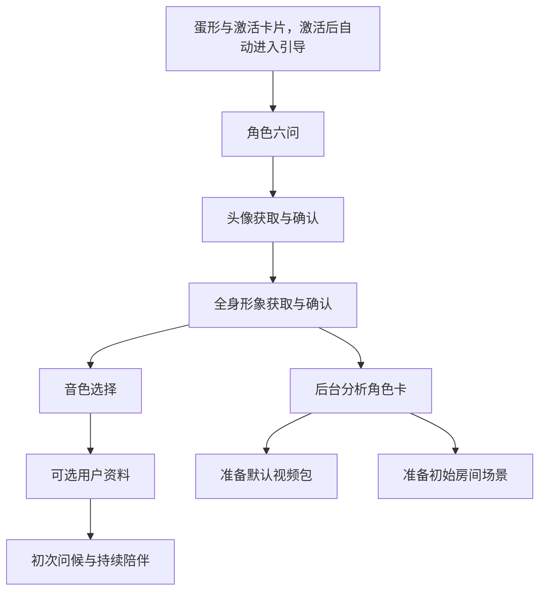

# 伙伴体验设计

本文定义用户可见行为、设计理由和体验验收边界。资产生成与恢复见 [PIPELINE](PIPELINE.md)，跨端状态和交付见 [PROTOCOL](PROTOCOL.md)。

## 设计目标

- 持续陪伴重视自然回应与稳定身份；工作体验重视过程可见与结果可信。两者共享形象，对话历史、画像与记忆按预设分开。
- 生命感服从打扰档位、锁屏和降低动态偏好。系统通知不冒用伙伴口吻，未取得推理结果时不编造台词。
- 机械反馈与预制兜底只用于本文明确允许的场景；失败时保留可用呈现并说明真实状态。

## 认识伙伴

### 引导与后台准备

- 引导从认识伙伴开始，不先呈现技术配置表。未激活时蛋形旁自动打开激活卡片；激活后自动打开引导；引导没有关闭入口，完成前保持打开。
- 视频与场景在后台准备，失败不阻断后续信息采集与问候；等待过程与其余引导重叠。
- 确认音色即完成引导（此后的用户资料问题可跳过，重启不恢复）。初次问候由伙伴经主动回合生成，遵循[主动陪伴](#主动陪伴)的档位，两小时内有效；未能及时开口或推理失败时保持安静，不以模板台词代替。

| 资料阶段 | 内容 | 必填、跳过与修改 |
|---|---|---|
| 角色 | 名字、物种、性别、关系、性格、说话风格，依次询问 | 名字、生灵描述、说话风格必填，其余可跳过；回答即时保存，可返回修改 |
| 音色 | 描述声音，试听当前语言的推荐或完整目录 | 确认后保存，后续可重新选择或创建音色 |
| 用户 | 称呼、性别、生日、爱好、补充信息 | 全部可选；跳过、缺失或后续删除不重新启动引导，可在记忆管理补填 |

- 资料问题同时提供文字和预制语音；音色试听使用固定示例句；生成、保存等等待与失败状态以系统说明呈现。
- 称呼类型只提示类别，生灵标签只提供示例，允许自由描述物种或自创角色。
- 关系影响相处方式，不参与外貌生成；生日用日期选择器，只接受真实日期。
- 重启恢复未完成的角色、形象与音色步骤。

### 形象获取与确认

头像与全身均提供 AI 生成和直接上传，完成后依次进入全身、音色步骤。

| 场景 | 用户可见行为 |
|---|---|
| AI 生成前 | 头像描述侧重面容与辨识细节；全身描述侧重体型、服饰与稳定姿态，沿用已确认头像的面容与物种 |
| AI 生成后 | 当前图与近期旧版本一并显示，可恢复旧图继续调整或确认；确认步骤内不提供上传入口 |
| 进入全身步骤 | 恢复已有草稿；无草稿时等待用户选择生成或上传，不自动生成 |
| 直接上传 | 无需先获取提示词，不调用生图；采纳即确认。上传头像或选择“继续当前头像”后进入全身步骤 |
| 本次描述 | 仅用于本次绘图；失败或重新加载时保留，成功加载预览后清空本次提交的输入 |
| 参考图 | 形象参考图用于借鉴外形，不直接成为头像；已有形象参考图时，重新生成可再附“光线与构图参考”，只调整光线、色调与构图，不改变身份，没有形象参考图时不提供 |
| 加载或确认失败 | 预览失败只重试加载；确认失败回到本步骤并说明原因。先恢复已保存图片，再决定是否重试生成，不展示原始异常 |
| 外部制作 | 按需展开提示词和参考资料，支持复制提示词、查看与另存参考图 |

“微调”与“重新生成”是两个显式操作，界面说明作用及不可用原因。结构、姿态与执行条件见 [PIPELINE](PIPELINE.md#微调与重新生成)。

### 身份锁定与角色卡

- 询问物种与性别时告知形象确认后不可更改；全身确认后锁定头像、物种与性别。名字、性格、说话风格、关系、音色和用户资料仍可修改；换装与视频重建不重新孵化。
- 系统从两张确认图整理固定外形，无需新增问答或逐项确认。“角色与记忆”展示原图及头部、身体资料，不提供已确认角色的全身重绘、上传或历史管理入口。
- 角色卡文字可编辑、清空或恢复自动值，仅辅助后续生成；已确认图片仍是外形依据。重新提取保留手改内容，失败可重试，跨窗口更新保留未保存草稿。
- 可变造型在衣柜管理。角色卡提取与技术采纳流程见 [PIPELINE](PIPELINE.md#角色卡与并发写入)。

### 资产准备与复核

| 情况 | 呈现与处理 |
|---|---|
| 角色卡分析失败 | 保留确认图，暂停依赖它的新生成；显示状态与重试入口，不要求用户补填资料 |
| 默认视频核查通过 | 自动启用；衣柜显示进度、失败原因与重试 |
| 整包视频或单独制作的动作有疑点 | 整包视频保留预览、不自动启用；动态动作、探身补齐与系统动作重做在“角色与记忆”中采纳后才进入播放目录 |
| 日常聊天、场景、动态与夜间媒体 | 宽松自动核查，有明确偏差时有界重生成，最终使用已知最佳候选，不逐张打断用户确认 |
| 场景尚未就绪 | 背景显示可读底板与准备状态，不延迟伙伴诞生；初始场景失败后可在场景页新建 |

评分与恢复见 [PIPELINE](PIPELINE.md#供应商选择与失败恢复)，尚未就绪的形象按[呈现与降级](#呈现与降级)处理。

## 日常入口与账户

### 窗口与会话

| 表面 | 用途 | 伙伴与信息呈现 |
|---|---|---|
| 轻语 | 桌面旁快速陪伴交流 | 精灵留在桌面，浮层展示陪伴消息与输入 |
| 生活空间 | 陪伴、动态、日记、衣柜、渠道、场景与设置 | 场景旁显示伴生伙伴；不展示终端原文、工具参数、推理和执行徽标 |
| 工作台 | 专业会话与任务执行 | 窗口旁显示伴生伙伴，展示对话、工具、推理及运行轨迹 |

- 生活空间与工作台互斥；打开任一完整入口时收起桌面精灵与轻语并暂停自主走位，关闭后原位恢复；经托盘、快捷键或右键菜单隐藏或最小化精灵时同样暂停走位与漫游，重新显示后恢复。关闭窗口不取消已经运行的本机工具。
- 双击精灵切换轻语；托盘单击显示或隐藏精灵，双击打开上次完整入口；全局快捷键可显隐精灵、开关生活空间或工作台（默认值见 [IPC 契约](../client/shared/ipc/contracts.ts) 的 `DEFAULT_SHORTCUTS`，注册冲突会提示）。消息提醒进入所属会话，不串到另一预设。
- 生活空间固定使用唯一陪伴主会话，不提供新建和切换会话。
- 工作台的运行轨迹展示执行详情，不重复正文；设置面板打开时遮住底层输入，避免误操作。

两个完整入口各有独立的伙伴显示与左右侧选择，在标题栏“伙伴”菜单设置；默认均显示，工作台在左，生活空间在右。选择保存在本机，重启后恢复。

- 伙伴位于内容面板外的透明区域；切换显示或方向时内容面板保持原位、原尺寸。拖动侧边伙伴移动整个窗口。
- 最大化、最小化、窗口隐藏或锁屏时临时收起；屏幕边缘空间不足时按可用宽度缩小，低于正常尺寸的 65% 则临时收起，有空间后恢复，不改变用户选择。
- 侧边视频形象按完整人物轮廓等比适配透明区域，优先用满宽度，高度不足时以全身完整为准；底部对齐窗口，靠内容面板侧贴边。动作中的轮廓变化不使形象逐帧缩放。

### 激活与账户切换

激活卡片由置顶精灵窗承载，卡片外仍可操作其他窗口且不关闭卡片；未提交时可用 Esc、取消或关闭退出。

托盘账户子菜单标出当前账户，显示后端用户名，同名补后端地址；支持添加及逐个从本机移除。添加、切换失败保留当前伙伴，移除当前账户进入激活态。成功激活或切换到不同账户后回到桌面精灵；目标账户未完成 onboarding 时自动进入引导，完成时也不沿用上个账户打开的生活空间或工作台。

来回切换或退出账户保留各自的本地缓存，减少重复下载；明确移除账户时才删除该账户的缓存，其他账户不受影响。

### 主题与图片查看

主题提供夜色、日色与对应透明样式，不改变形象；生活空间突出背景，工作台保证文字与代码可读。降低动态、透明度及系统偏好须有可用降级。普通模态与浮层用可读卡片，不铺全屏暗罩；图片灯箱保留暗底。

[共用灯箱](../client/renderer/shared/components/portrait-lightbox.tsx)覆盖对话图片、场景、外观、参考与引导：适配原图、指针中心缩放、拖拽、双击切换、复制与另存；点背景、关闭或 Esc 退出。对话中的带语音图片与待确认图片同样可点击查看，查看不改变确认状态。触屏捏合暂不支持，使用工具栏缩放。

### 桌面更新

设置「关于」页发现新版本后由用户选择下载；下载完成且本机组件准备就绪才提供「立即重启」，失败时说明卡在检查、下载还是安装并可重试，不自动重启。macOS 暂不提供应用内更新，检查会如实提示失败。

## 形象与衣柜

### 身份、穿着与动态能力

| 资产 | 用户用途 |
|---|---|
| 头像 | 身份展示 |
| 全身种子 | 确认完整形象 |
| 视频包 | 动态呈现 |
| 衣柜 | 后续换装及对应动作管理 |
| 场景 | 生活空间中的环境与活动 |

- 普通绘图只交付对话媒体，不改变当前形象或场景。
- 记忆学习不触发身份重生，换装不改变五官或物种。参考关系见 [PIPELINE](PIPELINE.md#资产依赖)。
- 视频形象是唯一的动态呈现。
- 系统动作（待机、拖拽、左右行走、左右探身）固定占位；动态动作由伙伴结合性格、着装与情景提案，经独立评审后生成，可反复使用。
- 动作库按外观包隔离，切换外观时列表随之切换。
- 动作可为 loop 或 once，单动作默认最长 10 秒。
- 系统动作缺素材由显式服务流程补齐；动态动作缺素材不自动创建。
- 动作是表达能力，不统计次数、不设冷却。
- 素材可查看并提交调整后重做。
- 生成完成只入库，不自动表演；制作期间伙伴已请求的表演仅在仍有效且外观未切换时补播，条件与时限见[播放契约](PROTOCOL.md#动作目录与播放)。

### 浏览、设计与穿着

| 操作 | 页面与结果 |
|---|---|
| 浏览衣柜 | 顶部保留形象大小滑块；首层展示着装卡片（含当前穿着标记及查看、继续设计、重试、删除操作）、自主换装锁定开关和设计入口；先显示已有内容再刷新 |
| 选择着装 | 进入该套专属动作与预览页，可返回衣柜；动作使用可搜索紧凑列表，选中后看预览、说明或重做 |
| 设计新装 | 衣柜列表限高保留，下方展开设计预览与设计对话 |
| 确认新装 | 只表示参考图就绪；预览不改变实际穿着，穿着由用户显式选择 |
| 穿上已有就绪动作包 | 启用对应着装 |
| 穿上尚无可用动作包的着装 | 按参考与性格制作动作；显示脚本、视频、抠像与分割进度（约几分钟），失败可重试，完成后自动启用 |
| 管理动作 | 未生成的动作可手动生成或重做；动态动作加入同一列表，不为每项预留大块预览；就绪时显示版本与动作数，否则明确占位 |

- 单个动作失败但同包仍有任务运行时，详情说明需等待当前生成完成，并显示禁用的重做入口；动作包结束后可重做失败项。
- 加载草稿失败重试加载；生成失败保留描述、参考与草稿；等待超时提示稍后核对，不自动再生成。
- 着装锁定只禁止自主穿着与添置，不限制用户操作。参考图可复制或另存。
- 生成与确认契约见 [PIPELINE](PIPELINE.md#用户自备图)。

### 呈现与降级

- 桌面实际渲染按形象资产就绪情况决定：视频包就绪即播放透明片段；未就绪时回落到通用兜底（蛋形）；未激活且没有缓存形象时显示蛋形；引导进行中收起舞台，只显示引导对话框。
- 任一形象未就绪都按此顺序兜底，不伪造资源。
- 本地留有最近成功动作包时，启动及同账户重新激活优先呈现缓存形象，认证暂态不切成蛋形。

生成、下载、加载与切换期间保留可用呈现，不以损坏的新资产清空伙伴区域。蛋形兜底须区分准备中、生成中、生成失败与尚未就绪，说明真实状态并提供对应恢复入口：加载失败可重试加载，生成失败可前往衣柜查看状态并处理，不能把“尚未就绪”当作“生成失败”。

生活空间以当前场景为背景，在面板外显示可播放动作的伙伴；衣柜页另有形象预览。工作台与生活空间使用相同的伴生呈现与降级。

## 场景与当前环境

### 场景库与创建

- 场景表现伙伴当前的环境与活动。
- 初次引导创建并启用房间场景，后续可前往海边、丛林等环境，保持角色身份。
- 创建页分别填写环境活动与可选着装；留空沿用当前着装，填写后采用本次完整描述。
- 场景与衣柜互不改写，参考规则见 [PIPELINE](PIPELINE.md#场景创建与描述)。
- 场景页以场景库为入口；搜索、分页与当前标记保留在列表，选择场景后进入详情，新建场景另用独立页面。
- 详情依次呈现通栏大图、文字信息与底部操作；编辑和重生成集中在右下方，并支持大图预览、启用和删除。
- 创建与外部制图任务可从列表查看进度；用户新建后仍需手动启用，伙伴仅在明确申请切换且政策有效时自动启用。

### 编辑、重生成与启用

| 操作或状态 | 对资产与当前环境的影响 |
|---|---|
| 图片与描述齐备 | 才可启用；场景不设人工复核，低分候选按已知最佳保留 |
| 描述分析失败 | 保留图片，只重试分析或手动补全 |
| 等待超时 | 显示“仍在处理”并提供查询，不直接判失败 |
| 编辑标题或描述 | 先保存；随后可依据更新后的描述重生成图片 |
| 重生成进行中 | 原场景旧图和当前背景继续可用 |
| 重生成成功 | 原位更新图片，不新建场景或覆盖标题、描述；若当前正在使用该场景则刷新背景，不重新执行切换 |
| 重生成失败或取消 | 保留旧图 |

### 自主变化与锁定

- 锁定暂停自主新增与切换，仍允许用户在场景页面手动创建与切换。
- 自主变化须有情景依据，并遵守锁定与[夜间政策](#夜间生活)；场景变化不直接打扰用户，不受打扰档位限制。普通创作、旅行讨论或假设不代表环境已改变。
- 复用已有场景不消耗生图额度，计费与授权见 [PROTOCOL](PROTOCOL.md#场景启用与授权)。

## 对话与语音

### 消息呈现

- 回应偏好分为偏好文字和偏好语音，伙伴结合情景选择每个气泡的形式，同轮可以混合。
- 文字气泡没有朗读按钮；语音条可展开台词。未听显示红点，完整播完后消失；播放时声波动画、暂停时保留进度，再次点击从断点继续。已听语音可重播，重播中断不退回未听。
- 自动播放默认开启，可在交互设置关闭。仅生活空间聊天页或轻语实际可见且未锁屏时，新语音按顺序播放；点播历史语音后继续播放后续未听语音，跳过已听与非语音。关闭后仅点播单条，当前语音可播完。
- 手动暂停同时暂停连播；重新打开聊天、恢复历史或开启自动播放不补播积压语音。收听状态与断点在当前设备跨窗口、重启保留。
- 工作台不展示朗读入口。
- 图片和视频在对话中以内联媒体卡交付，窗外提醒只提供简短文字与查看入口。
- 未读跨重启保留，进入所属会话才清除。
- 消息时间使用本地时区和 24 小时制，不写入正文。
- 支持编辑最后一条已发送用户消息，取消恢复原草稿，失败保留修改内容；普通会话另支持撤回和派生，IM 只读，具体范围见 [PROTOCOL](PROTOCOL.md#会话种类与历史修改)。
- 回复生成失败时，当前错误气泡提供「重试」按钮，复用原消息和附件；重试期间防止重复点击，保留输入框草稿，已有工具结果继续使用。提交新消息后不再重试旧回复。

### 交付节奏与打断

- 陪伴只交付确认后的终端台词，不展示工具中间轮临时正文；工作台可实时展示过程，历史保留终端答复与工具记录。气泡和业务消息的映射见[回复契约](PROTOCOL.md#结构化回复与终端交付)。
- 心情在身份区，视觉动作与空间行为各自呈现，旁白和控制标签不进入正文；资产生成与实际表演的区别见[动态能力](#身份穿着与动态能力)。
- 用户连发后约四秒停止输入才合并提交；继续输入、组字或发送重新计时，未发送草稿不参与。到期批次等待前轮结束，前轮完成不缩短未到期等待。
- 输入非空时发送，空时停止；主动停止立即提交已排队消息。点播其他语音保存当前断点；隐藏聊天、切页、切会话、锁屏、发送和开始录音时保存断点并清空连播队列，录音期间不自动播放。新收到的语音追加到队列，不打断当前语音。

### 语音保存与恢复

语音输入输出依赖云端，失败不阻断文字。演绎只作用于语音气泡的朗读，不混入台词或决定心情。演绎修复或语音合成最终失败时直接显示原台词，不以语音故障代替已成功的回复。历史沿用保存的音频；音频缺失同样显示台词，已有音频播放失败仍可重试播放；保存与幂等见[语音契约](PROTOCOL.md#语音保存与重试)。

### 专业预设与记忆归属

| 固定预设 | 目标 |
|---|---|
| 陪伴 | 角色化日常交流、关系和生活记忆 |
| 工程师 | 解释、设计、实现、调试与验证 |
| 产品经理 | 问题定义、范围、取舍与验收 |
| 文案秘书 | 保留事实和意图，交付可用文本 |
| 语言老师 | 讲解、纠错、练习与自然翻译 |

- 固定预设不可删除或改名。
- 陪伴独占生活空间与轻语，其余四个专业预设置顶工作台；新建普通工作会话选择专业预设。
- 专业回复按任务需要决定深度，不强制每轮多方案、练习或澄清。
- 固定对话在自身窗口修改推理参数；工作台全局设置只影响未单独覆盖的普通工作对话，“恢复默认”恢复其所属场景默认值。
- 会话创建后不改归属预设，应切换目标会话或新建。

记忆管理随所选预设切换列表、数量、筛选和编辑状态，迟到结果不得覆盖新页面。用户可查看依据、编辑和遗忘；管理另一预设不赋予当前对话读取权限。

### 外接 IM

当前微信延续陪伴身份与记忆，历史独立、桌面只读，专业预设不读取这些经历。桌面离线仍可云端陪聊，本机操作须桌面与 Runner 在线。

配对审批须明确说明对端将获得本机操作能力；IM 执行不切桌面工作态，喊停不撤销已执行步骤。当前只回复来信、不主动触达，其他限制见 [IM 契约](PROTOCOL.md#im-通道)。

## 主动陪伴

### 在线档位

| 档位 | 在线主动表现 |
|---|---|
| 自主 | 可主动文字、语音、情境表达、移动及允许的生活活动 |
| 常规 | 原地轻量文字与有限生活更新，不主动语音、视觉表达或移动 |
| 静止 | 不主动联系、发声、表达或移动，只响应用户操作 |

手动静止不被桌面活动覆盖；全屏和游戏等沉浸情境可临时静止。档位只约束会打扰用户的主动行为；用户聊天、任务请求、普通自动化、夜间整理，以及发布动态、写日记、提出动作等不直接打扰用户的活动不受档位限制，各自按相应规则执行。

临时安静从桌面精灵右键菜单开启，持续 50 分钟：期间按静止生效，但不改变档位偏好；到期回到届时的偏好与沉浸情境，应用重启不中断计时。可从菜单提前结束，在设置中选择任一档位也会结束。临时安静只作用于本机，不随偏好跨设备同步。

### 等待与主动表达

- 主动回合先安静判断，决定开口后才出现自然台词；沉默不产生历史、打字态或工具活动。
- 伙伴可保存有目的的等待，时间或情境满足后再考虑交流，不因用户未回复循环催促。
- 重连和解锁不自动问候，过时安排不补发；用户发言优先于未交付的主动表达。
- 精灵隐藏、最小化或收起时不弹出精灵旁提示、不播主动台词；主动消息保留为未读，精灵重新可见后以待读气泡提示，进入所属会话才清除。
- 桌面提示气泡贴近可见形象的头部，随角色移动与缩放；右侧空间不足时放到左侧，并保持在屏幕内。

### 夜间生活

- 夜间总控控制计划及其执行，关闭后仍可整理记忆、动态互动和日记；场景、着装与动态创作开关分别生效。
- 伙伴可选择少量有理由的活动，也可不活动；未完成计划不写成经历，失败互相隔离，已完成结果供日记与后续问候回顾。

夜间更新不弹实时通知；次日问候仍须在线且非静止，并在目标本地日内有效，不因已经生成就强行送达。调度与恢复见 [PROTOCOL](PROTOCOL.md#调度与渠道)。

### 自主动作与空间智能

情境表达与空间智能须自主档、精灵可见且解锁，情境表达另需空闲；两者各有开关、分别生效。精灵经托盘、快捷键或右键菜单隐藏、最小化，或被完整入口、轻语收起时视为不可见：不发起推理，已发出的空间咨询结果作废，表达也不在不可见期间播放。LLM 低频选择已有动作，由动作承载情绪，不另发情绪通道。

空间智能可选择陪工、漫游、靠近或不动；不动及推理失败均保持静止。智能关闭才用本地空间规则，且不生成开场白；靠近搭话保持低频，台词与动作分离。

## 桌面表现与移动

### 状态与播放优先级

| 裁决对象 | 优先顺序 |
|---|---|
| 持续状态 | 断连 → 交互 → 工作 → 说话 → 思考 → 倾听 → 情绪 → 空闲 |
| 动作画面 | 拖拽 → 行走 → 探身 → 表达 → 待机 |

- 日常状态、情境表达、直接交互与空闲微动分别驱动表现；呼吸、眨眼不因此发消息或出声。
- 交互与情绪是短暂反馈，可临时覆盖说话或工作，结束后恢复仍有效的持续状态；其他低优先级更新不能打断说话或工作。
- 表达动作只在待机姿态上呈现：探身中收到表达先退出探身，播完再恢复；新的表达请求抢占正在播放的表达；精灵不可见或锁屏时中断。
- 只兑现当前形象支持的动作，无手动播放入口。loop 默认一次，once 播完回基础状态；同动作再播从头开始，相同素材路径也须切换。
- 落地、接取、长按等机械反馈由容器形变实现。

### 拖拽与直接交互

拖拽、长按（约半秒）、文件拖入与右键有可区分的即时反馈；拖拽释放使用机械动画与预制语音，不调用推理。纯图片/视频拖入精灵进入轻语，混有其他文件则整批转生活空间。完整入口打开后由侧边伙伴呈现，拖动它移动整个窗口，不操纵收起的精灵。手势与命中实现见[渲染层](../client/renderer/README.md#直接交互与命中)。

### 位置、移动与缩放

位置、移动方式与比例独立组合，不从聊天文本解析坐标。

- 用户拖拽立即接管并取消自动路径，松手处成为跨重启保存的栖息地（包括空中释放）；陪工、漫游与任务位置是临时位置。
- 拖拽释放时，实际轮廓至少四分之一越出左右边缘才保存为贴边栖息，否则收回全身；贴边时向屏内探身，回家仍恢复贴边。
- 窗口栖息绑定决策时选中的普通窗口，在直边中段探身；切换焦点或暂时覆盖不改变绑定，窗口关闭、最小化、探测失败或无可用落点时回家。缺少对应探身素材时自动请求补齐（付费生成；每个外观包每侧只建一次任务，失败不自动重新付费，需在衣柜重做），素材或定位不可用时保持普通栖息。
- 普通落位保留全身；探身露出完整头部或主要识别部位，保留可拖拽区域，气泡随露出范围定位。完整身体表演先移出遮挡，结束后返回仍有效的栖息位置。
- 姿态由动作素材呈现；拔屏或分辨率变化后重算落位，除必要恢复外不瞬移。
- 比例以用户设置为基准并即时生效，空间适应与表达放大平滑且不能过小；静止档、栖息与探身时不放大。
- 精灵右键“一键归位”让精灵回到默认位置并把默认比例重置为 1；托盘同名操作把精灵窗移回主屏并让精灵回到默认位置，不改比例。
- 自主档可陪工、漫游和靠近，常规与静止不自动换位，静止仍可拖拽。用户任务不受主动档位限制；精灵收起、隐藏、最小化、打开轻语或锁屏时跳过仪式，任务直接执行；仪式中出现这些情况时立即停止走位、指向与预点击并执行任务。
- 引导、屏幕变化、桌面情境、任务和拖拽均可能改变位置；避免频繁走动或遮挡工作，精灵置顶但全屏应用等约定情形除外。

### 仪式性行走

- 界面操作前可先走到目标旁，以指向线和点击提示标出目标，再执行实际操作。
- 目标不可达、定位不明或行走失败时退回普通工具执行，不阻断任务，不重复点击。
- 仪式失败可使用预制机械反馈，但不能宣称任务已完成；用户打断后及时清除旧目标的指向与点击提示。

## 记忆、动态与日记

检索记忆保存有依据的长期事实，动态与日记呈现生活叙事。普通闲聊不逐条变成长期偏好，助手叙事不反向充当用户证据；专业会话只沉淀本域资料。

### 生活动态

动态是伙伴自主创作的独立社交时间线，可发布文字、图片、视频或语音，用户离线时也可发布；诞生、换装与场景切换不自动产生模板记录。

- 用户可在对话中请求伙伴发布，也可评论、删除本人评论；不能编辑动态或删除伙伴回复。
- 每条动态有自己的评论上下文，伙伴共享身份、记忆和心情；正文和评论不进入陪伴主对话，互动可由夜间整理回顾。
- 列表可滚动并加载较早动态，卡片可定位评论输入框；回复显示进行中或失败状态，失败可重试。媒体由用户点播，不弹聊天通知。

自主创作使用一个开关，各媒体类型仍需相应供应商能力；发布、额度与日期归属见 [PROTOCOL](PROTOCOL.md#动态与日记)。

### 第一人称日记

日记按用户本地自然日归集，以伙伴视角整理真实经历，由夜间整理与伙伴补记写入；同日已有日记时只追加不覆盖。生成与更新保持静默，等待主动查看。

## 故障体验

| 故障 | 可见反馈与处理 |
|---|---|
| 云端断连 | 明确等待状态；恢复时平滑回到正常，不补播问候 |
| Runner 不可用 | 保留陪聊，任务请求时说明本机暂不可达 |
| 资产不可用 | 按显示降级顺序保留形象，区分重试加载、下载与生成 |
| 登录或权限问题 | 提供明确处理入口，不持续无效重连 |
| 语音或听写失败 | 合成失败直接显示台词；播放失败允许重试，听写失败保留文字输入，不冒称已经播放 |

工具失败与结果未知分别说明，不能用表演掩盖没有完成。普通界面不显示原始堆栈；详细诊断留给开发者视图。
