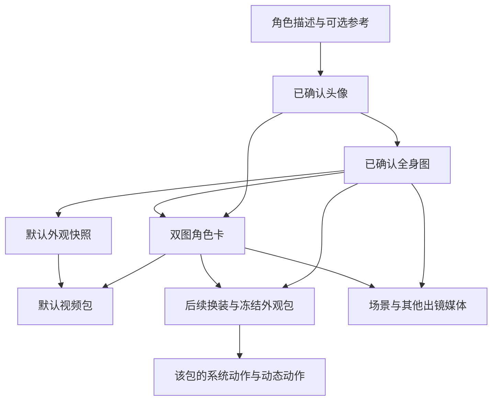
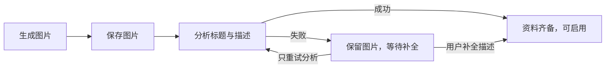

# 形象生成能力链

本文维护参考来源、生成编排、供应商能力、产物与失败恢复。产品呈现见 [DESIGN](DESIGN.md)，跨端状态与启用契约见 [PROTOCOL](PROTOCOL.md)。

## 资产依赖

- 图中的箭头表示资料依赖；角色卡就绪前，换装、场景与出镜媒体均不能生成。生成、用户采纳、资产激活与实际播放分别处理；完成生成不代表已经呈现。

## 身份、造型与参考输入

### 固定身份与可变造型

| 输入或产物 | 必须保持的语义 |
|---|---|
| 头像种子 | 角色描述与可选图像生成，锚定身份；关系定位不作为外貌属性 |
| 全身种子图 | 由头像、角色资料和可选身体参考补全结构与比例，纯白背景、完整入画、稳定的性格化 idle 姿态 |
| 默认外观 | 全身确认时复制为独立外观图片快照，默认视频直接从该快照生成 |
| 换装草稿 | 全量重绘以全身种子锚定身份与结构；视觉模型判断可穿戴部位、材质与姿态，不添加原本没有的器官 |

- 确认头像与当前已采纳全身图是身份权威；角色卡只补充相容描述。生成、身体判断、脚本、校准和评分均以图中的面容、五官关系、比例、结构与细节为准，文字冲突或空白不授权重塑、补造或删除部位。
- 仅用户重绘并明确采纳全身候选可改变身体身份；头像的面容与物种仍固定。换装、文字编辑和日常媒体均无此权限。

- 服装、发型、发色、妆容与配饰属于可变造型，由外观描述承载。
- 用户服装参考图先与文字整合为着装描述，不直接作为换装生图的身份参考；整合失败可按纯文字生成。
- 场景和出镜媒体必须取得可读的全身种子图，缺失时停止并提示修复。

### 头像与全身

视觉 LLM 按实际参考、外貌、性格与反馈判断身体、材质及待机姿态；缺少视觉模型明确失败。不设物种、骨骼或性格枚举，性格标签依据角色资料，不由身体结构推断。

头像结合本次要求与物种、性别、性格；有参考图时只改明确特征，不另注入物种和性别。统一追加白底、正面、光照和留白；纯文字头像默认写实，用户明确的画风要求优先。全身扩展用确认头像、本次要求及可选身体参考，视觉指导不覆盖明确要求或头像身份；绘图要求不写入人设或角色卡。

### 换装与连续反馈

- 重新生成时，身体判断与最终生图都接收原设计、按时间排列的已接受反馈及本次反馈；新反馈仅覆盖涉及维度，其余修改与基础身份保留。微调以上一版草稿为底图，只传本次反馈，不做身体判断。
- 反馈历史随成功草稿保存。已记录全身来源的草稿若来源变化，须按新全身图重生成，不能继续微调。
- 全身重绘同时消费已有身体资料与当前着装；身体资料只作未修改部分默认，明确调整及兼容第二参考优先，头像特征不变。
- 命名后的造型描述供后续桌面、视频与出镜媒体使用，保留主要衣物、颜色、轮廓、发型与辨识配饰，不只概括风格。描述有独立状态，失败由用户选择手动补全，不自动重复付费；默认动作脚本首次调用前有界等待并冻结描述，开始制作后不实时回填；失败或超时按参考图兜底，等待与恢复见[生成服务](../backend/services/application/generation/README.md)。

### 场景创建与描述

`notes` 承载环境和活动。造型由代码选择：非空白 `outfit_description` 整段采用，否则取衣柜启用外观描述，均缺失则省略；不隐式继承当前场景或第二参考的穿着。

- `outfit_description` 是含服装、配色、发型发色、妆容、鞋履和配饰的完整造型；局部修改由上游按有依据的基础合并，资料不足不补造。选定造型冻结于任务和提示词，重试不重读，模型不接收来源与回退规则。
- 图 1 负责固定身份（面容、物种、身体比例、固有材质与标志结构）；服装、发型发色、妆容、鞋履和配饰按文字造型安排，文字未指定的部分沿用图 1 可见造型。图 2 只负责环境、场景元素与构图，其中人物不进入成品，穿着不作为默认造型。明确文字修改优先，单图不装配图 2 条款。
- 场景不反改外观、不随换装重建，场景装配器不附加固定陈设或房间光线。初始场景以默认房间描述为基础（含柔和光线与基本家具，见 `scene_service.py` 的 `_INITIAL_SCENE_DEFAULT_NOTES`），只附加人设性格作为氛围与活动线索；说话风格、关系与用户资料不是画面信息，不进入场景要求，关系还可能引出第二个人物。不从外貌、物种或衣着推断兴趣、职业和经历。引导素材不沿用到其他入口，最终要求随任务保存。

成品标题与描述客观记录实际图片，使用第三人称，不照抄生成要求或补造遮挡细节；用于浏览检索，并在启用后回灌环境、活动与穿着。生成要求和提示词独立保存。分析失败不重复付费生图或改写历史描述；齐备后是否自动启用由[启用契约](PROTOCOL.md#场景启用与授权)决定。

### 场景图片重绘

- 场景重绘与创建共用 [场景装配器](../backend/services/application/generation/scene_prompt.py)。
- 任务冻结最近已保存的描述和当前有效的全身身份图，将描述作为完整环境、活动与造型要求，不附加旧创建要求、旧场景图或衣柜当前造型。
- 图片仍经共用身份评分及场景画幅门禁；重绘不重新分析标题与描述。
- 供应商进度随冻结输入持久化，重启恢复沿用原输入，未知提交结果不自动重新付费。
- 任务状态与原位换图契约见 [场景任务与原位换图](PROTOCOL.md#场景任务与原位换图)。

### 出镜图片与视频首帧

衣柜启用外观是默认造型，场景穿着来自成品描述，本次造型冻结在生成任务中。`outfit_override` 仅作用于本次媒体；沿用场景穿着时从实际描述提取，资料不足不虚构或宣称完全一致。覆盖后不复用冲突的衣柜图。

聊天与动态共用图片装配入口，以当前全身图锚定身份，角色卡辅助；衣柜图仅供造型，不因角色卡文字修订而弃用。

| 输入情况 | 选择与处理 |
|---|---|
| 图片有第二张衣柜图 | 造型以该图为准，成品转写文字只补充相容信息 |
| 无衣柜图 | 用选定描述；两者都无才沿用身份图可见造型 |
| 视频无显式首帧 | 按视频的环境、镜头和起始姿态先生成图片 |
| 有显式首帧 | 保持取景与可见造型，只校准身份；`outfit_override` 可明确改变造型 |
| 原样动画化图片 | 不传覆盖并省略 `subject`，保持原图语义 |

首帧校准须向生图模型同时传图 1 全身身份、图 2 原首帧；图 2 负责构图、环境、姿态与造型，要求原生双图能力，不能只在评分时传身份图。只有身份底图时可直接编辑。画幅取最近支持比例，模板与请求一致；非标准比例只调整边缘背景，不改已有主体、关键物体或补造未展示身体。

造型调整在图片/首帧阶段完成，运动阶段保持实际首帧，不另以文字改造造型。重试不重读造型，恢复不重做已有首帧、只续原视频任务。动态可选的 `narration` 是独立音轨，不保证口型同步。

显式首帧无法读取，以及起始画面在图片链内的下载或转存失败，都发生在视频提交之前，按确定失败返回，不当作视频提交结果未知；视频任务提交后才适用结果未知规则。

### 提示词与供应商输入

- 带角色参考的图像与视频提示词（含生成、编辑与自备图）共用 [CHARACTER_VISUAL_STYLE](../backend/prompts/generation.py)：画风、材质与细节沿用参考，光照随本次画面安排；只有纯文字头像没有参考，改用 `DEFAULT_VISUAL_STYLE`；提示词只写比例，像素尺寸由请求与供应商处理。
- 按头像扩展、换装、场景、编辑区分参考职责。头像呈现参考只在固定画面要求之内调整光线、色调和构图，冲突时固定要求优先；双图保持原生顺序，不拼成一个角色参考。头像呈现参考、全身第二参考、场景环境参考与首帧校准缺少双图能力即失败；出镜图片的衣柜图在无双图供应商或有造型覆盖时省略，改用文字造型。
- 通用图片按单个可见瞬间描述动作和接触；画面文字单独引用并定位，限制语句不进入画面。服装重绘合并连续反馈，新衣替换对应旧衣；首帧只画起始瞬间。
- 供应商接收完整提示词及有序参考；千问带图或首尾帧视频关闭额外扩写，纯文本保留扩写。
- 供应商声明的能力与上限在付费生成前按链过滤：生图看参考图（含编辑与多参考）与提示词字符上限（如 MiniMax），视频看首帧、时长与分辨率；放不下的供应商被跳过，全部放不下时明确报错，不裁切提示词，出镜与带首帧的视频也不会在付费生成首帧之后才发现无供应商可接。透明输出不作过滤条件，见[能力筛选](#能力筛选)。
- 审核拒绝后的改写保留身份、参考职责与画面硬约束；无法安全保留即失败，不换角色。

## 编辑、上传与身份采纳

### 微调与重新生成

操作由必传的 `mode` 选择，无默认值：

| 操作 | 参考与前置条件 | 失败语义 |
|---|---|---|
| `regenerate` | 按点位固定参考全量重绘 | 按生成链报告失败 |
| `edit` | 以上一版产物为底图；反馈非空、旧图可读、未附加参考图，供应商声明并实现编辑能力 | 任一条件不满足即失败，不静默改为全量重绘 |

身份条件化参考不等于图像编辑能力；能力位由[供应商基类](../backend/services/infrastructure/llm/providers/base.py)声明，图片链按能力筛选见 [image_generation.py](../backend/services/application/generation/image_generation.py) 的 `resolve_image_gen_chain`。

- 编辑提示词区分局部属性修改与姿态、朝向、轮廓修改：后者允许完成目标所需的身体位置、接触、遮挡、衣物褶皱及局部光影联动，仍受点位的固定身份、造型与构图约束。
- 场景与出镜图片按新活动安排姿态和取景，不继承身份图的白底与待机姿态；动作姿态图保留固定相机，但展开姿态时完整入画优先于原主体大小。

换装微调可按明确反馈调整稳定的静态姿势与朝向；不允许通过姿势调整改变身材或增减器官。局部改色等未涉及姿态的反馈保留输入图的姿态和朝向。

换装重新生成至少需要草稿原设计（文字或参考图设计稿，设计稿缺失时先补一次整合）、已接受反馈或本次反馈之一；三者皆空时在提示词整理与付费生图前拒绝，不产出身份图的默认造型。外部提示词入口按同一条件拒绝。

### 用户自备图

自备图入口与按需获取制作资料的体验见 [DESIGN](DESIGN.md#形象获取与确认)。外部提示词与内部生图共用参考来源及画面要求，必需参考缺失或不可读时同样失败；提示词不引用产品内部概念或供应商专有参数。采纳跳过生图，进入对应点位的存储与确认流程，不区分微调与重新生成，也不宣称程序完成身份验证。上传图按实际字节校验，要求与错误码见 [PROTOCOL](PROTOCOL.md#头像全身与确认)。

外观确认接口不携带图片载荷：确认把草稿立绘转正为持久参考图（`ready`），只表示参考图就绪，不触发任何生成，也不自动穿着；穿着由用户启用对应动作包显式完成（见 [DESIGN](DESIGN.md#浏览设计与穿着)），夜间换装由计划执行。设计草稿阶段即可获取自备图提示词。

场景获取提示词时创建等待上传的记录，不启动生图；直接上传可跳过制作资料。采纳保存图片并启动描述分析，不自动启用；取消不清除当前环境。

等待上传的场景不提交生图；已提交任务按[持久化与恢复](#持久化与恢复)处理。

### 全身候选采纳

- 已确认角色的全身生成、微调和自备图采纳先保存为候选图，身体特征分析完成后由用户预览并明确采纳。
- 候选只基于就绪的角色卡：分析成功会递增修订，分析中或失败时产生的候选必然无法采纳，因此生成、自备图采纳和提示词入口在调用模型或供应商前拒绝，须先在角色卡完成分析；已有候选在角色卡离开就绪后同样无法采纳，须重新生成。
- 采纳允许改变身体比例与结构，原子替换当前全身参考和角色卡的身体字段，清除旧身体覆盖值；头像提取的面容字段不变。
- 候选分析失败可单独重试，采纳前不改变当前身份。
- 旧外观和视频仍可展示，旧视频持续播放至新包就绪；新生成不得把旧外观立绘当作身体身份参考，也不自动付费重建既有资产。采纳前制作的场景与视频包不能再启用，当前已启用的继续使用至更换。

### 角色卡与并发写入

全身确认登记持久化分析任务：头像提取头部，全身图提取身体，定义见[模型](../backend/modules/companion/character_card.py)与 [CHARACTER_CARD_EXTRACTION](../backend/prompts/generation.py)。

- 两部分成功后原子发布并启动初始资产；来源未变只补失败部分，重启恢复中断任务。模型等待有超时且不持事务，回写核对身份、源路径及批次。
- 重提取保留已发布资料，成功合并最新用户覆盖；下游只消费生效特征。普通媒体与换装不反写角色卡，全身采纳只更新身体。
- 保存文字不重绘资产。全身/外观重绘写入与草稿确认核对修订，拒绝过期结果；场景、视频旧任务可留历史但不自动激活。已就绪的场景与视频包仍可手动启用：只有头像或已采纳全身图变化后才拒绝（场景按记录的全身图，视频包按冻结的全身身份图），角色卡文字修订与重新提取不影响。聊天与动态出镜媒体在生成期间角色卡修订变化时丢弃结果，不交付。
- 外观记录生成/确认时的全身来源；仅文字修订不触发视频参考重绘，全身图改变或缺少来源标记时建包前按当前身份图校准，冻结外观图保留造型。
- 自备图替换草稿清除旧来源，确认记录当前身份图；这代表用户采纳，不代表程序验证身份。

## 供应商选择与失败恢复

### 能力筛选

- 身份保持生成按配置的能力链顺序择优：图片使用 `image_gen`，视频使用 `video_gen`，先按本次参考图、编辑、首尾帧、时长与分辨率要求过滤；原生透明参数只发给声明 `supports_transparent_background` 的供应商。
- 动作姿态图按原生透明能力分组择优，组内保留配置顺序；透明供应商优先，其余供应商作为回退。原生透明请求按实际 alpha 校验透明背景和可见前景。

#### 本地 ComfyUI

- `local` 的部署与配置见 [Backend 本地供应商](../backend/README.md#本地供应商)。
- 支持文生图、多参考图与原生透明 PNG；批量上限见 [供应商实现](../backend/services/infrastructure/llm/providers/local/image.py)。
- 增量编辑（`image_edit`）采样画布随第一张参考图；身份/造型条件化生成按请求 size/aspect 出图。
- 生成图使用 ComfyUI 临时预览目录，参考图上传到 ComfyUI 的 `input` 目录；部署方负责保护并管理参考图存留。

### 质量选择

- 身份保持图片与视频共用可见身份评分，覆盖换装、场景创建与重绘、出镜图片与视频首帧、身份校准图、动作姿态图，以及聊天、动态与动作视频；头像与全身候选不评分，由用户预览确认。每输出位置在每家供应商只尝试一轮质量，达到[门槛](../backend/services/application/generation/media_chain.py)即停止，全部低分保留最高分，同分取较早候选。
- 启用画幅机械门禁的功能（`size_enforced`，目前仅生活空间场景）按请求 `size`/`aspect_ratio` 核对候选宽高比；不合格结果在转存前丢弃并尝试下一供应商，全部不合格时明确失败。
- 当前调用方均按单个输出位置调用质量链；聊天一次请求多张图时逐张独立择优。质量链支持多位置时只继续生成未达标的位置，并按供应商单次输出上限拆分请求。
- 初次创建身份、明确修改身份的全身候选与自备图上传沿用预览采纳流程。

| 本次结果 | 后续行为 |
|---|---|
| 达到质量门槛 | 选定该位置的候选并停止；多图仅继续未达标位置 |
| 已完成评分但低分 | 按同一供应商游标前进，不回到已尝试的链头 |
| 生成异常 | 仅在 [media_failure_reason](../backend/services/application/generation/media_chain.py) 判定允许回退时前进；否则停止追加生成 |
| 下载失败或付费提交结果未知 | 不按生成错误切换供应商；分别按[持久化与恢复](#持久化与恢复)续下载或停止后续生成 |
| 无产物且明确被审核拒绝 | 头像、全身与换装允许一次合规改写，其他链不改写；不重新调用已产出低分候选的供应商 |
| 评分服务不可用 | 停止追加付费，保留已评分最佳候选或首个可用结果 |
| 聊天或动态视频成品无法解码 | 出镜与非出镜视频入选前都做可解码核查；成品本身损坏且仍有未尝试的供应商、此前最佳未达标时换下一家，否则明确失败或保留此前最佳。本机文件缺失或探测工具不可用不是成品问题：不追加付费，按质量核查失败收尾（非出镜视频在工具不可用时照常交付） |
| 无任何可用产物 | 明确失败；身份评分不能绕过技术产物门禁 |

安全网络重试遵循 [Backend 网络约束](../backend/README.md#供应商与网络错误)。

### 身份评分与发布复核

- 评分使用该点位冻结的身份图，编辑底图与派生图不替代全身身份参考，角色卡文字不能改变评分基准。
- 达到门槛须有可见证据支持同一身份；明确面容、物种、比例或结构冲突，以及完全不出镜或证据不足以识别身份时，评分须低于门槛。
- 不能因符合相同概括文字而忽略图像差异，也不能因忠于参考图而与文字不符就扣分。
- 局部遮挡、合理透视与可变造型本身不是身份冲突。
- 中间图片链耗尽时使用最佳候选继续后续生成。
- 视频切换供应商复用已选首帧，单动作独立择优；整包发布前抽取必需动作的首、中、末帧与冻结参考做严格身份复核；可见冲突、证据不足或分析失败时保留素材供预览但不自动启用，用户可明确核对后启用。就绪包上单独制作的动作（动态动作、探身补齐、系统动作原位重做）逐段复核，疑点经复核项采纳前不进入播放目录。
- 整包复核不重新生成整包。

### 持久化与恢复

设计意图：沿已取得的句柄、结果和选择决定续跑，避免恢复过程重复付费。

- 任务冻结供应商顺序、模型、端点、身份资料、造型和参考输入，以及透明输出模式、动作时长与播放方式；凭据从配置解析，端点改变后不向新端点查询旧句柄。
- 每次付费提交前保存供应商游标与阶段；返回后保存句柄、结果地址或本地候选；评分后保存选择决定。
- 图片候选与动作视频源使用预登记的确定性路径和原子写入。场景保存第二参考图，动作包独立保存固定身份图。

| 已有进度或故障 | 恢复动作与边界 |
|---|---|
| 图片结果地址或内联图片 | 编排层先保存再下载；传输与可恢复 HTTP 故障有界退避重试，坏格式、超限、过期地址与磁盘错误不重试，下载失败不重新生图或换供应商 |
| 已知聊天视频或动作视频下载地址 | 续下载；已落盘产物可复用 |
| 已有句柄的任务查询失败 | 在轮询时限内退避续查，不终结已付费任务；鉴权或计费失败立即结束 |
| 聊天或动态视频轮询超出时限 | 记为结果未知并保留供应商句柄，不自动重试或自动下载迟到成品，动态发布按结果未知占用额度；用户显式查询原视频动态可取回成品并选择采纳或放弃，见 [动态契约](PROTOCOL.md#动态与日记)；有最佳候选时按最佳收尾。动作视频保留句柄，重试续查原任务 |
| 已保存评分决定 | 复用选择，不重复评估 |
| 聊天视频下载失败 | 只对传输错误与服务端 5xx 退避重试，4xx、过期地址与超限立即失败；仍失败时有最佳候选则保底，否则保留下载阶段与原因，不追加付费 |
| 尚未提交的下一供应商 | 沿原游标与冻结输入继续 |
| 付费提交结果未知 | 立即停止后续生成；有最佳候选则保留并记录原因，否则明确结果未知 |
| 最终选择已提交，或聊天、动态视频以失败、结果未知收尾 | 清理落选素材与不再交付的已下载成品；共享参考和恢复所需资产仍由任务所有者管理 |
| 从备份恢复 | 不凭运行进度重新启动付费任务 |

恢复按上表消费已有进度，不重新读取身份、造型或供应商顺序。

## 动作资产制作

### 资产与外观包

动作资产与视频作品分离：`action_design` 是冻结外观包中可反复使用的表现能力（固定镜头、完整入画、透明背景、无音轨）；`video_generate` 是一次性交付内容。二者只共享素材生成基础设施。

一个动作只属于一个冻结 pack（头像、角色卡修订、参考图与哈希、外观描述、画布）。动态动作与就绪包上的单动作原位重做只推进目录版本（CAS）；身份或造型参考改变、强制整包重生成、失败包上的单动作请求及合并重试都会建新 pack 版本；有包在构建中时拒绝单动作请求；就绪包上该动作仍在排队、制作中或该包仍有生成任务时拒绝原位重做。同一创意可在另一外观重新评估生成，不直接引用原视频。

### 系统动作与动态动作

系统槽位与必需项见 [动作定义](../backend/modules/companion/actions.py)，时长与循环规格见[视频编排](../backend/services/application/generation/video/service.py)，各槽位的动作语义见 [video/script.py](../backend/services/application/generation/video/script.py) 的 `SYSTEM_ACTION_SEMANTICS`。新整包只制作必需槽位（待机、拖拽）；左右行走经单动作请求补齐，左右探身在栖息需要时经探身补齐接口补齐。系统槽位不经提案与评审。动态动作有稳定 `action_id`，名称与用途开放，不占系统槽位，由 LLM 提案并经独立评审后生成。

系统动作以 2 秒为设计起点，动态动作保留提案中的预计时长。制作前按配置的 `video_gen` 链顺序，选择首个满足帧输入、声明最高原生分辨率且能提供不短于设计时长的模型，取其最小可用整秒档；随后只保留支持该确定时长的后续模型。每家模型按实际首尾帧、附加参考与片长取最高可用档，不以兼容别名判断清晰度，不为提高分辨率省略循环或身份参考输入。目标时长、供应商链及各家分辨率在脚本生成前冻结到动作任务，脚本与提交共用。

左右探身分别制作，保留两侧外观差异；完整透明角色从首帧保持侧倾，只做轻微自然活动。视觉模型用成品首、中、末帧校准遮挡线和识别区域，alpha 遮罩提供内容轮廓；校准失败时素材照常进入目录但不带 `peek_geometry`，客户端不启用遮挡，需显式单动作重做。客户端对缺少定位或轮廓字段的处理见[动作契约](PROTOCOL.md#动作目录与播放)。

拖拽动作从首帧起持续表现躯干上部被提起、其余身体随重力松弛下垂的悬空姿态，按角色已有结构适配；提拉处与躯干主体稳定，仅下垂末端轻微随动。姿态与衣物均不承地，不以站姿左右摇摆表达拖拽。

### 评审与制作

#### 提案与评审

- 受理时冻结 pack 与设计资料，做语义去重并检查时长、整秒、拒绝抑制（自拒绝时刻起 7 天）、自主创建开关与抠像模型。同名动作的成品仍待用户确认时直接返回，复核已结束仍未采纳的按未采纳处理并重做；同一创意最近一次评审为复用且所指动作仍可播放时直接复用；已批准或已复用而动作已删除或不可用时新建提案重新评审，历史提案保留，每次批准都计入额度。
- 独立 LLM 在后台评审（approve / reuse / defer / reject），重启时 pending 与 deferred 提案的恢复窗口见[动作编排](../backend/services/application/actions/README.md#提案处理)；输入含冻结参考图、包内角色快照与人设、着装快照及同包表达动作（超过 10 个时只取词面最相近的 10 个，见[动作编排](../backend/services/application/actions/README.md#评审输入与额度)），着装用于判断可行性。同包已有同名动作时不调用模型：该动作就绪即按复用结案，否则暂缓并写明原因；批准只新建动作行，不覆盖或重排其他提案的动作。
- 评审不设日限额；approve 后占用制作额度并冻结规格到动作行；同名独立重做另占一次制作额度。窗口与来源归 [PROTOCOL](PROTOCOL.md#动作目录与播放)。

#### 脚本与关键帧

- 视觉 LLM 按冻结参考、角色资料与规格生成起始姿态和运动描述；系统与动态动作都以自然、符合角色性格的表现为目标，只描述完成动作所需的神态与运动。两者都传 `description`，`system_slot` 只供服务端使用；适用/避免条件只影响表演分寸。
- 姿态图只画起始时刻，运动描述从该姿态接续，并保留动作规格中明确的频率与单次动作时长；按需标注阶段或近似时间，不为保持姿态的动作新增表演或分镜。
- 视频请求包含关键帧（loop 另以同一关键帧作末帧）、由运动描述与画面骨架组成的提示词及外形文字，供应商支持时附冻结参考图；首帧是身份与造型的唯一依据，外形文字（视频专用的精简条款，不含以参考图为准或造型由本次要求决定的图像任务条款）与参考图只补充相容信息，冲突时以首帧为准；脚本输入与姿态描述不传入，文字不得依赖未传入资料。单动作反馈按动作键隔离（`action_feedback`），本次提交替换、空串清除，整包反馈保留；结构重试带校验错误，时长与播放方式取冻结规格。

| 类型 | 关键帧与视频 | 后处理 |
|---|---|---|
| 系统 idle | 经图像编辑准备透明关键帧，沿用冻结参考中的基本待机姿态 | 按播放方式处理 |
| 其他动作 | 经图像编辑派生透明起始姿态图 | 按播放方式处理 |
| loop | 供应商须支持首末帧且同锚，首尾连续 | 保留完整片段，只过机械门禁，不选段或重造接点 |
| once | 约束身份与起始，自然收束 | 保留完整片段，只过机械门禁 |

#### 视频与交付

- 参考图仅在供应商声明支持时附带，关键帧落盘后再提交视频；使用按首帧/首尾帧与片长筛选并分别冻结最高可用分辨率的 `video_gen` 链。建整包前先检查视频链、视觉链、图像编辑链与抠像模型；就绪包原位重做、失败包续跑、探身补齐与动态动作受理也先检查抠像模型；后台制作（评审后启动与重启恢复）在参考校准、脚本、姿态图与每次视频提交前再次检查，缺失时在付费前失败并保留进度，已有句柄的任务照常续查下载，已有可用候选时按最佳收尾。
- [关键帧准备](../backend/services/infrastructure/video_processing/frames.py)保留有效 alpha，仅对不透明图抠像；抠像后无有效透明背景或可见角色时拒绝提交视频。前景按边距要求等比缩放并居中，不补造源图裁掉的身体；提示词与图像处理共用边距定义。原始候选与透明关键帧分别保存，准备中断可复用候选。
- 视频接口不保证保留 PNG alpha，提交时将关键帧合成纯白底，透明原图独立保留；循环动作首尾帧使用同一准备结果。
- 提示词固定首帧身份与造型、镜头、全身余量、原地动作与纯净背景，画面无台词或音效。设计与提交时长按供应商能力取整秒档；后处理完整保留模型产物，不检查成品时长上下限或与目标时长的偏差，也不自动裁剪。目录、播放计时与命中遮罩使用成品实际时长和帧数。
- 下载后按实际 alpha 决定保留透明通道或执行抠像，再经过[透明化与一致性](#透明化与一致性)检查；不拆分动作或倒放伪造。
- 同包统一逻辑画布比例、根锚点与帧率；生成片段按源视频像素扩出同宽高比的最小偶数画布，仅补透明边，不缩小或放大主体，再编码无音轨的透明 VP9/WebM。片段实际宽高随结果和目录保存；封面与命中遮罩从成品独立落盘。上传导入沿用请求的像素画布。
- 门禁通过后回写素材参数并合并新目录快照；动态动作失败不回退现有目录。

### 透明化与一致性

- [matting](../backend/services/infrastructure/video_processing/matting.py)负责透明视频解码与 ISNet 抠像；视频供应商未承诺原生 alpha，模型缺失时拒绝付费生成。
- 画面门禁见 [quality](../backend/services/infrastructure/video_processing/quality.py)（可解码性、alpha、覆盖率、轮廓、贴边）。
- 发布前身份复核见[身份评分与发布复核](#身份评分与发布复核)；复核不背书动作语义，也不能保证未抽样帧完全无走样。
- WebM alpha 须用 `libvpx-vp9` 显式解码，容器声明不能代替像素校验。

同包约束：固定镜头、主体完整入画、身份与着装一致、无环境与他人。留白在关键帧阶段处理；生成视频贴边时拒绝，不通过缩放绕过裁切检查。

### 目录发布与并发

生成在事务外进行。完成后聚合已采纳素材 → 构建 manifest（`spiritagent.action.pack`，即当前视频包可播清单）→ CAS 推进版本并写 outbox。必需槽位不齐跳过发布。并发以 CAS 收敛：每次发布写路径唯一的 manifest 文件，落败方删除本次文件并按最新动作行重建重试，已发布文件不被覆盖；发布失败只重试发布。

manifest 只含素材、画布与播放技术参数；动作语义（`motion_description`、`use_when`、`avoid_when`）不进入目录、不下发客户端，只经动作快照、`action_search` 等模型上下文提供。实现见 [publishing](../backend/services/domains/actions/publishing.py)。

### 恢复与历史包

任务状态与阶段分开：恢复沿用冻结规格，有句柄续轮询，有源视频续后处理，有已审素材续发布；明确重做时准备独立生成尝试，旧已采纳素材继续可播，候选拒绝不撤销旧版本；确定性素材门禁拒绝不可对同一素材反复继续，需明确重做，暂时下载与工具故障仍可恢复。既有成品不自动重新生成。用户在复核中拒绝的成品即作废，之后的重做不会再复核同一素材。未知付费结果遵循[统一恢复规则](#持久化与恢复)。数据库采用短读 → 事务外等待 → 短写。

新包激活后删除同外观的旧版本包（构建中、仍有可续跑任务或动作排队、制作中的包保留）；删除前把同血缘旧包上不可续跑的失败记录与新包缺少的成功结果迁入新包。身份失效后只允许收敛已有句柄与落盘素材，阻止新的付费评审、脚本、姿态图、视频提交或评分。保留的历史包的晚到成果留在原包，不自动启用、不抢穿着；对其重试会与同血缘的新包合并为新版本发布，之后清理时其独有的成功结果迁入当前包。正在制作的旧包在其制作收尾后，若同外观已有更新的激活包，再按同一规则清理；动作排队或制作中的包不能手动删除。目录发布失败的包仍记为就绪，但不广播目录变更、不自动启用，原激活包保留。[manifest](../backend/services/domains/actions/publishing.py)交付后由客户端双播放器淡切，命中按播放时间采样。

删除非穿着外观会清理关联动作包，激活或仍有制作中的包拒绝删除。旧目录、失败尝试与替换素材登记回收，宽限期后按实际引用复核；复核结论保留，已结束复核素材按保留期释放。受限扫描只处理可证明属于动作链的历史孤儿，无法证明归属的通用图片不删除。实现与保留期见 [动作回收](../backend/services/domains/actions/asset_retirement.py)。

上传导入包（`create_pack_from_clips`）的片段须自带透明通道；没有冻结参考与生成上下文，不做身份复核也不自动激活，重启、用户维护或停机中断的导入都标记失败，只能重新提交。

## 渲染与传输

桌面消费视频包 manifest 与透明片段。签名轮换不代表内容变化，资产访问、缓存和恢复遵循 [PROTOCOL](PROTOCOL.md#资产访问与缓存)。显示降级顺序只在 [DESIGN](DESIGN.md#呈现与降级) 定义。

## 验证

### 完整提示词链检查入口

以实际请求为单位检查，服务端装配后还须核对供应商原生请求；角色资料、用户反馈、模型中间输出与图片均不扩大对应任务的权限。各链固定身份及造型优先级定义见[身份、造型与参考输入](#身份造型与参考输入)，以下表格只列导航与分支。

| 功能 | 输入 → 中间模型 → 最终消费 | 必查分支 |
|---|---|---|
| 头像 | 角色资料 → [头像提示词整理](../backend/services/application/generation/appearance_prompts.py) → [头像生成](../backend/services/application/generation/avatar_service.py) → 预览确认 | 纯文字、身份单图、身份＋呈现双图、微调、外部提示词、直接自备图 |
| 全身形象 | 头像、可选身体参考、身体默认资料与造型 → 身体判断 → [全身提示词](../backend/services/application/generation/fullbody_reference_prompt.py) → 候选分析及采纳 | 首次补全、已确认重绘、编辑当前图或候选图、外部制作、上传；只有明确采纳更新身体身份 |
| 角色卡 | [分析任务](../backend/services/application/generation/character_card.py)将头像与全身分别送入视觉提取（`avatar_service.extract_card_features`，与全身候选分析共用）→ 严格字段校验 → 自动值与用户覆盖合并 → [任务快照与渲染](../backend/services/domains/companion/character_card.py) | 部分分析失败重试、空白字段、覆盖恢复、头部／身体分工、旧任务修订校验 |
| 换装 | 文字＋可选服装图 → 着装转写 → 原设计与连续反馈 → 身体判断 → [换装生成](../backend/services/application/generation/outfit_service.py) → 成品转写和命名 → 后续造型 | 新建、重绘、微调、参考转写失败、外部提示词、自备图、双语成品描述 |
| 生活场景 | 初始引导／手动／聊天工具／夜间的环境要求与选定造型 → [场景装配](../backend/services/application/generation/scene_prompt.py) → 身份单图或环境双图生成 → 成品描述 → 当前环境；已保存场景按最新描述重绘并原位换图 | 有无造型、有无环境参考、文图冲突、外部制作、分析失败、重绘中继续使用旧图、身份变化、重启冻结输入与未知提交 |
| 出镜图片 | [聊天工具说明](../backend/prompts/tools.py)经 [chat_images.py](../backend/services/application/generation/chat_images.py) 冻结每张图的计划，或[动态发布](../backend/services/application/posts/publication.py) → [共用身份与造型装配](../backend/services/application/generation/visual_identity.py) → 图片评分选择 → 对话／动态；聊天另有验图与一次带修正资料的重做 | 默认造型、仅造型图、显式覆盖、缺图、生成前后身份修订、单／双参考、验图与重做 |
| 出镜视频 | [视频工具](../backend/services/adapters/tools/builtin/video_generation_tool.py)或[动态发布](../backend/services/application/posts/publication.py) → 造型选择与首帧校准 → [视频任务](../backend/services/application/generation/video_jobs.py) → 身份抽帧评分 → 对话／动态 | 默认首帧、显式首帧、造型覆盖、原样动画化省略 subject、后台恢复 |
| 动态发布与评论 | 发布意图、伙伴背景、当前环境与近期动态 → [独立创作](../backend/services/application/posts/publication.py) → 正文与媒体制作计划 → 发布；本动态、目标评论、截至目标的线程资料及共享伙伴背景 → [回复](../backend/services/application/posts/replies.py) → 原线程评论 | 三类发布入口、四种内容类型、主对话隔离、连续评论、删除与重试 |
| 动作视频 | 动态动作：提案与冻结身份／着装 → [独立评审](../backend/services/application/actions/review.py)；系统槽位由建包、原位重做或探身补齐直接排入 → [逐动作脚本](../backend/services/application/generation/video/script.py) → 姿态图 → 视频 → 机械门禁与严格身份复核 → 动作目录 | idle／drag／左右行走／左右探身／动态动作、loop／once、单动作反馈、结构重试、附加参考能力、旧包快照 |
| 公共回退 | 完整提示词 → [审核改写](../backend/services/application/generation/avatar_service.py)（仅头像、全身与换装）、[图片质量链](../backend/services/application/generation/character_images.py)与[身份评分](../backend/services/application/generation/identity_review.py) → 保存最佳候选或明确失败 | 安全改写空值、可见身份冲突、证据不足、低分、评分不可用、未知付费结果、恢复冻结输入 |

### 验收范围

参考与提示词变更检查双图提取分工、身份与造型边界、用户覆盖优先级、输入顺序及派生失效；覆盖部分失败重试、并发编辑、来源变化、重启与旧视频快照。编辑与自备图变更检查前置守卫和采纳后的状态一致性。视频处理变更检查真实透明片段（编码、完整时间轴、上传导入的显式切分、遮罩），不能仅凭能力声明通过验收；抠像与循环生成变更须检查浅色主体、透明背景、首尾衔接和真实供应商样本；交付产物还须检查 Chromium 实际透明合成。

恢复变更覆盖提交未落库、轮询中断、下载失败、未知结果及迟到结果。可加载性、视觉质量、模拟结果和真实供应商结果分别报告。

提示词 A/B 保留完整请求、参考图顺序与哈希、模型、随机种子、采样参数、实际输出尺寸及失败图；上游文本模型改写参与对照时也保存其输入与原始输出。身份评分不衡量姿势、服装、环境或文字是否完成，须按本次画面要求另外检查，不能用身份分数代替任务验收。画幅门禁验收覆盖启用功能的合格/不合格候选与全部不合格路径；增量编辑仍允许画布贴近编辑底图。

仅修改文档时核对事实与链接，不要求重新触发付费生成。验证入口见 [Scripts](../scripts/README.md)。

## 实现入口

[生成模块](../backend/services/application/generation/README.md)
