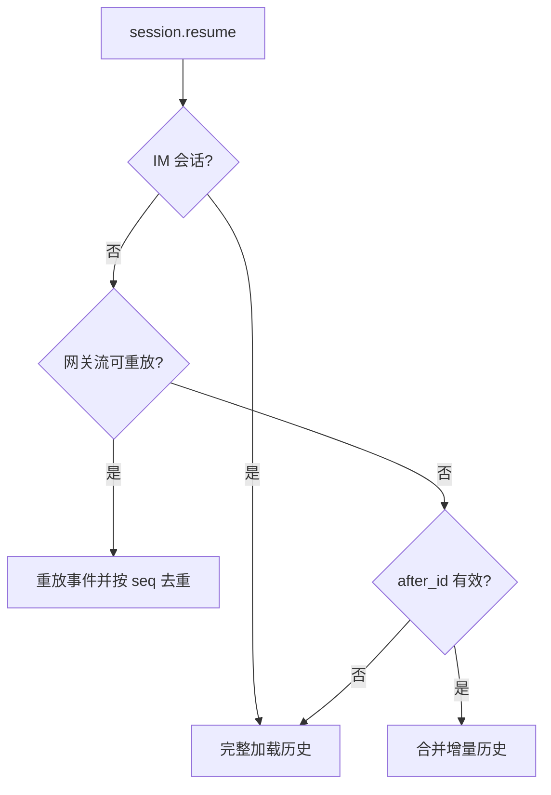
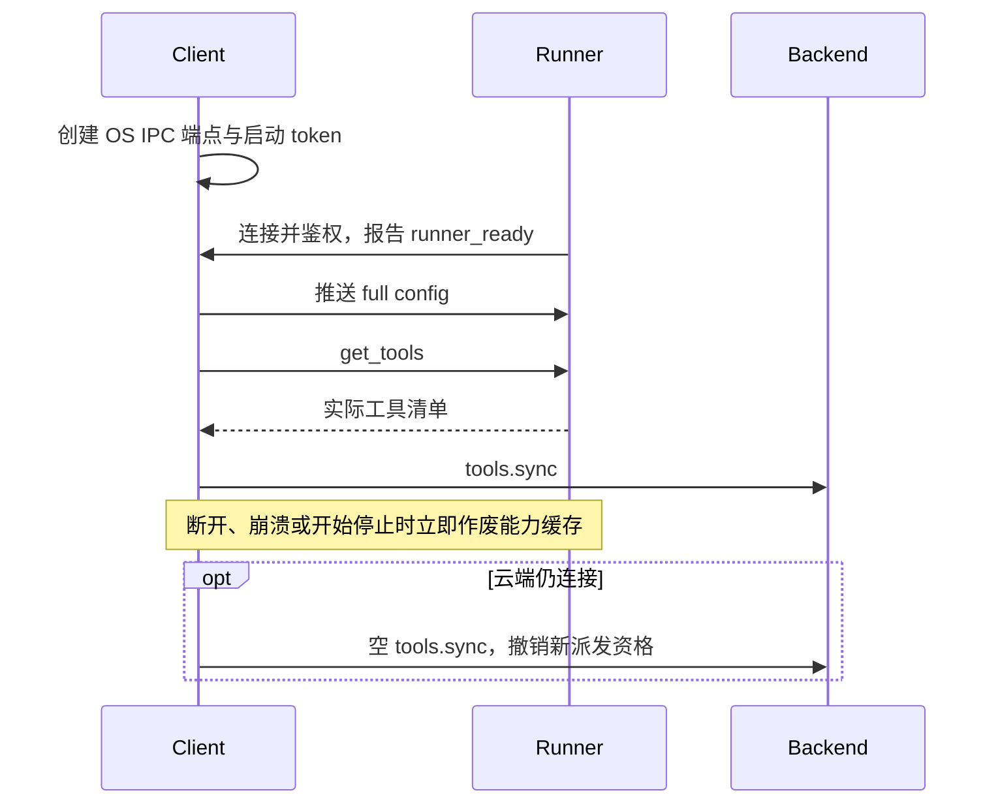
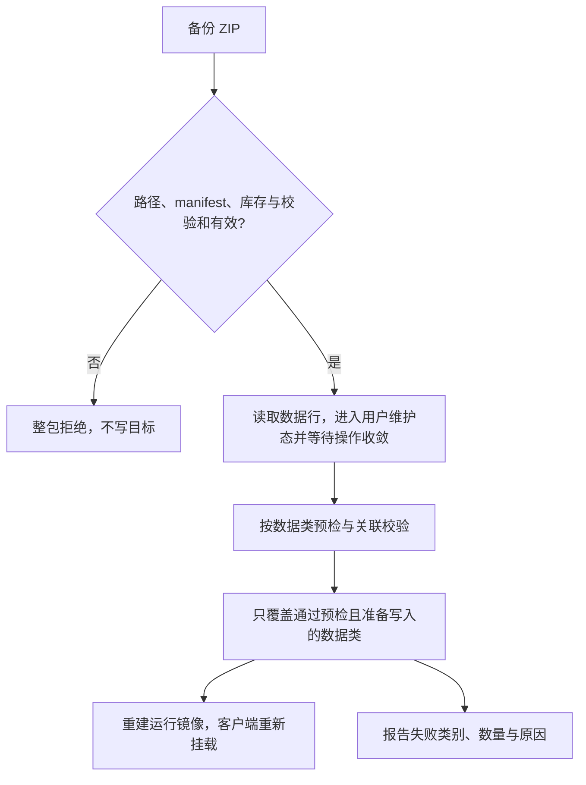

# 跨模块协议契约

本文维护 Backend、Client、Runner 与 Installer 共同遵守的通信、状态、交付和安全语义。字段和注册清单链接源码；产品体验见 [DESIGN](DESIGN.md)，生成链见 [PIPELINE](PIPELINE.md)。

## 通信与连接身份

### 传输与信封

| 链路 | 传输与鉴权 |
|---|---|
| Backend ↔ Client | `/api/chat/ws`，连接前以 Bearer JWT 请求 `POST /api/user/ws-ticket`，使用短时、`purpose=ws` 的 ticket 握手；签发与有效期见 [user.py](../backend/api/v1/user.py) |
| Client ↔ Runner | Windows 命名管道 / macOS UDS 承载 WebSocket 帧，以本次启动 token 鉴权 |
| Runner → Client → Backend | `request_llm` 经 Client 代理至 `/api/llm/completion`，后端身份由 Client 提供 |

WS 和本地 IPC 使用 JSON-RPC 2.0；REST、上传及下载不套 RPC 信封。请求带 `id`，响应以相同 `id` 返回 `result` 或 `error`；通知不带 `id`，不应被响应。Backend WS 的心跳与 `session.ack` 均使用普通 RPC 请求；Client 与 Runner 的本地连接以 WebSocket 协议层 ping/pong 探活。

### 登录、握手与心跳

ticket 关联登录记录；握手及入站处理核对用户与登录有效性。正常刷新不撤销登录，注销、另一端激活或管理员停用则清理连接、在途回合与工具等待。长效凭据不进 WS URL，握手只接受 `?ticket=`。

关闭码 `1008` 停止自动重连，表示策略拒绝，维护状态也可能使用，不能据此断言令牌失效。心跳用 `session.ping`，无入站帧超时以 `4000/heartbeat` 重连；探测间隔和超时见 [JsonRpcGatewayClient](../client/renderer/shared/lib/gateway-protocol/json-rpc-gateway.ts)。

### 通道分工

依赖持续会话、进程内运行上下文和流式交付的操作走 WS；独立资源操作与较大载荷走 REST。REST 不要求聊天在线，但仍独立校验身份、权限与资源归属，不能因此视为可任意重试。

不持有 WS 的界面需要已有 RPC 能力时，REST 镜像须复用同一服务逻辑。聊天流走会话 emitter；需和业务状态共同提交的异步通知走 outbox，两者不能混称。

Client 决定完整入口互斥、精灵显隐及窗口位置。Backend 提供资源和语义，不下发窗口像素指令，也不生成独立工作台背景。普通聊天生图只交付媒体，更换场景必须走场景资源或专属工具。

## 会话与消息

### 会话种类与历史修改

`kind` 与 `system_preset_id` 是不同维度，不能互相推断；自动化标记与 `system_preset_id='automation'` 由数据库约束等价。每条会话持久化 `kind` 与非空 `system_preset_id`，预设创建后不可更改，换记忆域须切换或新建会话：固定系统对话为 special，普通及任务会话为 standard，渠道会话为 im。

每用户每预设最多一条固定 special，不可删除或改名。`session.create` 接受目录内任一预设，省略时默认 developer、不回落陪伴域；工作台新建入口只列专业预设。`system.list_presets` 只向客户端返回展示元数据，不下发提示词正文。目录见 [presets](../backend/services/domains/conversation/presets.py)。

| 操作 | 普通会话 | 固定系统对话 | IM |
|---|---|---|---|
| 编辑最后一条用户消息（`prompt.submit` 带 `edit_message_id`） | 允许 | 允许 | 拒绝 |
| 撤回（`session.undo_to_message`）、派生（`session.fork`） | 允许 | 拒绝 | 拒绝 |
| 桌面提交消息（`prompt.submit`） | 允许 | 允许 | 拒绝 |
| 清空（`/clear`）、手动压缩（`/compress`、`session.compress_context`） | 允许 | 允许 | 拒绝 |
| 改名（`PATCH /api/sessions/{id}` 的 `title`） | 允许 | 拒绝 | 拒绝 |

编辑、撤回、清空和手动压缩遵守会话锁、权限及在途回合检查。编辑只接受新文本，保留原附件，与 batch / attachments 互斥；删除旧尾部与写入修订行在同一事务，校验失败不改历史。编辑广播完整历史，修订行使用新 ID；应用广播时保留本地未提交或待确认的消息与附件，RPC 响应不二次覆盖已开始的回复。任何历史修改都不撤销已执行工具的外部副作用。

派生继承源预设、自动化归属与历史工具链、媒体和时间等信息，排除界面状态行并清零用量、耗时；复制历史不同时填入输入框。

派生会话是独立的普通会话，以 `forked_from_id` 记录来源，照常出现在会话列表与搜索中；删除来源只清空该记录。委派产生的子 Agent 会话以 `parent_id` 挂在发起会话下并随其级联删除，不出现在未归档会话列表与搜索中。字段见 [models](../backend/modules/conversation/models.py)。

### 预设记忆与学习作用域

长期记忆及模型可读派生事实归属 `(user_id, system_preset_id)`，用户来自认证，会话决定固定预设；未知、缺失或越权作用域拒绝访问。跨预设不共享检索、摘要、反思或学习技能，automation 不装配这些能力。

人工 `memory.list/update/delete` 必须且只能提供 `session_id`、`system_preset_id` 之一；跨域 ID 与不存在统一视为未找到。列表、数量、状态和证据属于同域，切换预设后丢弃旧请求结果。用户资料固定属于陪伴域，删除后可补填，不重启引导。

模型记忆工具只能使用服务端验证的原始证据；更新携当前 ID 与版本，并发冲突整批拒绝。候选、失效、过期和已遗忘内容不得作为有效事实召回。模型不得指定身份、作用域或来源；具体决策结构见 [memory_policy](../backend/services/domains/memory/memory_policy.py)。

学习技能工具随 `tools.sync` 同步开放。Backend 派发时将 `skill_scope` 放在模型参数之外，Client 转发 `execute_scoped_tool`，Runner 在调用期间固定用户与预设目录。异步和委派继承该域，不读取界面当前选择。Runner 的 [SkillScope](../runner/utils/memory_scope.py) 只接受固定的预设 id 集合，新增或改名预设须同步，否则该预设的带域调用均被拒绝。

### 事件路由

Backend 事件统一使用 `method=event`，`type`、`payload`、`seq` 位于 `params`。会话事件的路由字段是 `params.session_id`，不是 JSON-RPC 顶层字段。

| 事件组 | 消费语义 |
|---|---|
| `message.start/delta/break/complete` | 开始、正文、分气泡和完成；完成帧补元数据，不重复追加全文 |
| `message.persisted` | 将服务端用户消息 ID 绑定到活路径气泡；助手 ID 随完成帧返回 |
| `message.voice` | 更新已保存语音气泡的音频，并使对应历史快照失效 |
| `message.media` | 按消息 ID、媒体标识更新原位视频气泡，并使对应历史快照失效 |
| `message.reasoning.delta` | 独立推理展示，不进入正文或下一轮模型输入 |
| `message.edited/deleted`、`command.result`、`compress.completed` | 按各自契约替换历史、插入状态或更新消息，不统一当普通气泡追加 |
| `tool.start/complete`、`error` | 按会话路由的过程与错误 |
| `tool.call` / `tool.cancel` | 用户级设备指令，按 `call_id` 派发或撤回，不受当前可见会话过滤 |
| `companion.message/mood` | 分别交付已持久化主动台词与独立心情 |
| 形象、外观、场景、片刻、日记、视频与通道事件 | 更新对应资源或触发重新读取；不一律写入聊天历史 |
| `companion.video.progress/ready/failed/activated` | 载荷含 `packId`、`outfitId`；进度另含 `stage`，客户端按资源归属展示并重新读取状态 |
| `companion.action.catalog_changed` / `job_updated` / `play_requested` | 动作目录变更、生成进度与播放指令；目录变更带 `packId`、`catalogVersion`、`appearanceEpoch`，播放指令结构为 [ActionPlayCommand](../backend/modules/companion/schemas_actions.py)（过期时刻 `expires_at`），语义见[动作目录与播放](#动作目录与播放) |
| `system.notification` | 自动化结果通知，完整内容留在任务会话 |

- 业务通知面向该用户的桌面交付，不能因目标会话未打开而丢弃。
- 载荷中的 `session_id` 可用于落卡或跳转，不必然代表会话路由闸门。
- 回合帧（`message.start/delta/break/complete/persisted`、`message.reasoning.delta`、`tool.start/complete`、`error`、`compress.completed`）的转换见 [emitter](../backend/services/adapters/desktop/emitter.py)；`message.edited/deleted`、`command.result`、`avatar.regenerated` 由 [handlers](../backend/services/adapters/desktop/handlers.py) 直接推送，`tool.call/cancel` 由 [ipc](../backend/services/infrastructure/desktop/ipc.py) 发出；`message.voice/media` 等业务事件经 `emit_ws_event` 写 outbox，载荷由各发射点定义。客户端分派见[事件路由](../client/renderer/app/runtime/gateway-event-router.ts)，解码在 [handlers/](../client/renderer/app/runtime/handlers/)，场景与片刻日记事件由 modules/scene、modules/memory 处理。

`tool.call` 不带 `params.session_id`，但其 `payload` 含 `name`、`args`、`call_id`、信息性 `session_id`、`headless` 与 `skill_scope`（仅学习技能工具非空，见[预设记忆与学习作用域](#预设记忆与学习作用域)）。`headless=true` 照常执行，不显示桌面工作态；IM、后台自动化和其他无头回合须由调用方显式传入，子 Agent 回合沿用父回合的标志，Client 不得靠会话类型猜测这一行为。`tool.cancel` 的 `payload` 只含 `call_id`，语义见[调用日志与未知结果](#调用日志与未知结果)。

### 序号与恢复

- `seq` 是同用户网关重放流位置，跨聊天 Session 共享；宽限期重连可复用。网关销毁、登录记录更换或服务重启后可重新开始，不是数据库消息 ID 或永久递增编号。
- Client 按 `seq` 去重并用 `session.ack` 确认消费。ACK 只裁剪重放缓冲，不证明业务提交或工具执行；RPC 响应不属于该事件流。
- 重放、增量合并与全量替换分别处理，不能混用旧流游标；IM 始终完整加载以更新 queued 状态。
- 历史携持久化消息 ID 与毫秒级创建时间。全量恢复达到防御上限时返回 `truncated` 与 `next_cursor`（本页首条 ID，未截断为 null）；当前没有按游标读取更早历史的接口。
- 握手后所有事件帧（含回合帧与 `tool.call`）先暂存，直到挂载类 RPC（`session.resume`、`session.get_main`、`session.create`、`session.fork`）或约 10 秒超时后才冲刷；重放缓冲容量与时限见 [buffer](../backend/services/infrastructure/desktop/buffer.py)，恢复结果字段见 [runtime](../backend/services/adapters/desktop/runtime.py) 的 `SessionResumeResult`。

### 表达通道

正文只承载可读台词；`companion.mood` 更新身份区，不创建消息；视觉表达只经 `companion.action.play_requested` 派发；`companion.should_act` 返回空间意图，由 Client 计算位置。动作受当前形象能力限制，控制字段不得编码进聊天文本。

当前心情由桌面用户陪伴回合独立更新，不由工作、IM、自动化或主动回合顺带生成。自主视觉表达与空间咨询须通过档位、可见性与锁屏闸门，空闲视觉表达还需满足空闲条件。可见性以桌面精灵窗实际显示（表面快照 `spriteVisible`：窗口存在、未隐藏且未最小化）且未被完整入口或轻语收起为准；Client 发出 `companion.should_act` / `companion.idle_expression` 前检查，`should_act` 结果返回后再次核对。

### 结构化回复与终端交付

固定陪伴会话（`kind=special` 且预设为 companion）的回复采用[结构化气泡](../backend/modules/conversation/replies.py)，模型最终输出顶层 JSON 数组，每个对象是一个气泡。日常聊天中，回应后另起的补充或追问使用新对象，连贯多句可留在同一对象；故事、列表、代码等单条交付内容的段落也留在该对象。空行本身不作为切分依据，历史回灌保留数组边界。由模型逐泡选择 `text / voice / image / video` 并排列顺序，纯媒体回复有效，不设气泡数量上限；仅语音携带 `speech` 演绎，按实际 MiMo / MiniMax 能力校验。`companion.response_preference` 保存偏好，`prompt.submit.response_preference` 携带本轮快照；客户端不据此转换消息或自动播放。

| 消费方 | 回复内容 |
|---|---|
| 数据库 | `content_type=companion_reply` 标识结构化回复；`content` 原样保存模型输出的数组；`reply_json` 保存同组气泡的演绎、语音绑定、音频及服务端绑定的媒体资产与真实状态；整轮为同一条 `Message`，媒体不重复写入 `media_json` |
| 对话上下文 | 回灌 `content` 中的气泡数组，补入媒体真实状态，排除供应商绑定、资产路径和时长 |
| 客户端 | 历史与实时下发同序逐泡视图；文字／语音保留台词与音频，媒体携标识、状态及服务端资产地址；不解释演绎 |
| 内容消费 | 记忆、摘要、标题与心情逐泡读取台词和媒体真实状态，未完成媒体不能总结为已发送成功；TTS 只读取语音台词，搜索只匹配台词；`text` 正文不按 JSON 外形推断气泡或附件 |

陪伴回合非流式取得最终回复，确认无工具调用后校验格式；格式错误、取消或异常不交付未确认正文。每回合至多保存一条可见终端消息，工具中间行只保留调用结构。工作台、IM 与自动化继续使用各自文本契约。

缓冲回合只发一次 `message.start`；`message.complete.bubbles` 替换等待气泡，历史使用相同视图。客户端按消息 ID 与气泡索引去重，媒体在自身位置渲染；用量使用终端值，不累加工具循环各轮计数。

### 媒体引用、验图与原位交付

模型只输出 `{type: "image" | "video", media_id: "工具产物标识"}`。执行层生成标识，校验当前用户、会话内已知工具产物、类型及就绪文件；视频可引用已受理任务。未知标识、类型错误、重复引用、遗漏本轮成功图片或已受理视频均进入一次格式恢复，恢复不执行工具。模型不能填写 URL、路径或状态。

`image_generate.requests` 一次提交本轮完整清单，每项指定内容、生成参数和数量；初次生成合计最多 16 张，这是生成预算，不限制回复气泡数。派发前登记整批目标；清单受理后再次调用只返回已有状态，改变 prompt 或 call ID 不重新生成。`media_inspect(media_id)` 读取真实图片，检查原请求并复用身份评分，返回绑定具体版本的检查标识与问题。`image_regenerate(media_id, inspection_id, correction)` 只接受当前版本的有效问题检查，每目标最多重做一次。原图保留，修订版本有新标识但属于同一目标，最终只交付一个版本；文本渠道附加最新成功版本，重做失败保留原图。图片失败不能作为就绪产物发送，结果未知不重复提交。代码入口：批次、验图与重做见 [chat_images.py](../backend/services/application/generation/chat_images.py)，回合媒体状态 `MediaTurnState` 见 [contracts/media.py](../backend/services/contracts/media.py)，单个引用的校验与视频绑定见 [reply_media.py](../backend/services/domains/conversation/reply_media.py)，逐目标唯一与遗漏校验见 [reply_delivery.py](../backend/services/application/chat/reply_delivery.py)，工具定义在 [image_generation_tool.py](../backend/services/adapters/tools/builtin/image_generation_tool.py) 与 [video_generation_tool.py](../backend/services/adapters/tools/builtin/video_generation_tool.py)。

视频每回合最多受理一个初次请求，已有 pending 任务只能查询。生活空间通过媒体气泡交付等待卡片，其他气泡正常发送。任务绑定消息与媒体标识，终态以 `message.media` 携 `message_id / media_id / bubble_index / bubble` 更新原卡片。落库与后台完成通过任务行锁协调；先完成后绑定读取真实终态，消息删除后不补建。重复更新幂等，终态不回退；缓存与重连恢复见 [Client](../client/README.md#历史同步)。其他文本会话使用附件及后台媒体送达机制。

备份收集嵌套媒体资产并重写恢复后的用户路径；恢复与派生会话解除任务绑定，未完成视频标记为失败，不声称恢复了生成任务。图片原版与修订资产保留；未采纳质量候选仍按各生成链清理。

### 语音保存与重试

- 后端先保存回复，再有界合成并保存音频，之后才发送 `message.complete`；失败保留语音类型、台词和演绎，音频为空。
- 客户端点播或按独立的 `companion.autoplay_voice` 偏好顺序播放，并[缓存音频](../client/README.md#资产与历史缓存)；该偏好仅控制客户端播放，文本没有 TTS 入口。
- 缺失音频经 `POST /api/sessions/messages/{message_id}/voice/{bubble_index}` 重试，已有音频幂等复用，不重新生成台词或演绎；请求等待覆盖合成预算。
- 成功写入后以 `message.voice` 更新对应气泡并使历史快照失效。
- 收听状态由本机主进程按账户、会话、消息 ID 与气泡索引持久化，通过独立 IPC 读取、更新、删除及广播；`listened` 只在播放正常结束后置为真且不回退，`positionSeconds` 保存断点，播完归零。记录不上云，不进入消息正文或模型上下文；类型见 [IPC 契约](../client/shared/ipc/contracts.ts)。
- 新语音只从首次接收的终端回复与主动消息入队，历史水合、音频更新及偏好修改不触发补播。缺失音频或播放失败保留未听并跳过，用户点播才触发合成重试。暂停、中断与其他声音抢占不算播放失败。
- 取消不回滚已保存回复，未提交音频必须清理；合成与并发控制见[对话编排](../backend/services/application/chat/README.md#回合执行与交付)。

主动回合使用同一结构，`[]` 表示沉默、不写空消息，常规档仅提供文字能力。音频准备后重新检查用户活动、租约和档位；接受时原子保存消息与 `companion.message`，拒绝或取消清理未交付音频。

### 模型失败与重试预算

- 供应商流收到首个事件或非流式响应返回后，不再切换供应商。
- 未交付正文、非内容过滤的不完整终态可在同供应商同参数重试；陪伴最终数组格式失败在同供应商以失败草稿和校验错误为资料，在工具历史之后装配完整气泡协议、实际语音能力与输入 schema，仅生成最终回复。
- 格式恢复请求不提供工具，并发送 `tool_choice=none`；供应商可能忽略此参数，返回工具调用时仍由代码拒绝。失败草稿不是已执行操作，修复资料与指令不写入聊天历史。恢复仍失败时报告回复格式错误，与供应商不可用区分。
- 恢复请求将历史原生工具调用与结果按原顺序转为只读资料，不携带中间推理或继续工具执行的协议帧；原始历史保持不变。
- 这两类恢复共用一次重试预算，不复用半截正文或工具草稿，不重跑已完成工具。
- 模型取消或异常不交付未确认正文；失败的模型回合不写终端正文行。

### Slash 命令

Slash 元动作走 `command.dispatch`，不交给 LLM。`command.list` 返回名称、别名、说明和确认标记；clear、compress、remember 的注册与实现见 [handlers](../backend/services/adapters/desktop/handlers.py) 和 [slash_commands](../backend/services/application/chat/slash_commands.py)。

`//` 或不符合命令起始规则的输入视为普通文本；符合命令形式但未识别时提示错误，不退回 `prompt.submit`。编辑消息时的斜杠按正文处理。需要确认的命令由服务端再次校验 `confirmed=true`；影响历史的命令另检查在途状态。clear 需确认，compress 无需确认；清空保留会话并写清理状态行，不等于删除长期记忆或撤销工具。remember 只写当前认证记忆域，自动化无记忆域。

响应与 `command.result` 可能同时到达，Client 幂等消费；`hydrate=true` 替换历史，否则展示状态。自动压缩的 `compress.completed` 插入压缩状态，不与手动压缩的全量替换混用。摘要检查点（含每日摘要）在历史与事件中以消息 `subtype`（`compress_summary` / `daily_summary`）标识，正文格式不作识别依据。

## 伙伴与资产

### 接口入口

| 修改范围 | 定义入口 |
|---|---|
| 对话、引导、工具同步、记忆管理、命令 | [桌面 handlers](../backend/services/adapters/desktop/handlers.py) |
| 会话 REST 与传输结构 | [会话端点](../backend/api/v1/sessions.py)、[schema](../backend/modules/conversation/schemas.py) |
| 伙伴资料、头像与全身、角色卡、衣柜、视频包、媒体复核与资产读取 | [伙伴端点](../backend/api/v1/companion.py)、[伙伴 schema](../backend/modules/companion/schemas.py)、[视频包 schema](../backend/modules/companion/schemas_video.py) |
| 场景 | [场景端点](../backend/api/v1/companion_scenes.py)、[场景 schema](../backend/modules/companion/schemas_scene.py) |
| 片刻与日记 | [片刻与日记端点](../backend/api/v1/companion_journal.py)、[schema](../backend/modules/companion/schemas_journal.py) |
| 动作目录、设计、启停、额度与回执 | [动作端点](../backend/api/v1/companion_actions.py)、[schema](../backend/modules/companion/schemas_actions.py) |

引导恢复依据服务端状态及已有资产；完成条件与身份锁定范围见 [DESIGN](DESIGN.md#认识伙伴)。

### 头像、全身与确认

字段与限长见[伙伴 schema](../backend/modules/companion/schemas.py)。头像 POST 接受可选 feedback，空请求仍可生成；POST 与 `avatar.regenerate` 都不能因断连或空结果自动重发，应读当前头像恢复预览。

| 操作 | 并发与生效条件 |
|---|---|
| `portrait/confirm` | 用户锁内核对 `expected_avatar_id`，冲突返回 409 |
| `fullbody/confirm` | 核对 `expected_url`；首次引导确认不等待分析或派生生成，分析进度归角色卡，视频启动失败归外观状态 |
| 确认后的 `/fullbody/reference`、`/reference/adopt` | 只返回待采纳候选，不替换种子；`/fullbody/candidate` 恢复最近有效候选 |
| 候选 `/analyze`、`/accept` | 前者重试身体分析；后者核对预期原图和角色卡修订，只更新身体并清旧覆盖，不重建已有外观/视频 |

完整路由见[伙伴端点](../backend/api/v1/companion.py)。初始资产与重复启动守卫见[生成服务](../backend/services/application/generation/README.md#后台任务与初始资产)，编辑上传见 [PIPELINE](PIPELINE.md#编辑上传与身份采纳)。

### 角色卡编辑

角色卡 GET/PATCH 读取与局部编辑，extract 发起重新提取/失败重试，见[结构](../backend/modules/companion/character_card.py)与[伙伴端点](../backend/api/v1/companion.py)。写入校验预期形象和修订，冲突 409 且 Client 保留草稿；changes 未传不变，null 恢复自动值，空字符串显式清空。

分析状态独立于已发布内容，重分析失败不撤销旧资料；`companion.character_card.updated` 与状态同事务写 outbox，客户端重读但不覆盖草稿。

### 场景任务与原位换图

路由与字段见 [场景 API](../backend/api/v1/companion_scenes.py) 和 [schema](../backend/modules/companion/schemas_scene.py)。生成要求与提示词不作为成品描述，创建来源不因启用改写。着装选择、衣柜独立性与描述恢复见 [场景创建与描述](PIPELINE.md#场景创建与描述)。

| 操作或查询 | 状态与返回语义 |
|---|---|
| `GET /api/companion/scenes` / `/scenes/state` | 分别提供资产列表与当前状态；资产和当前环境独立 |
| `POST /api/companion/scenes/{scene_id}/regenerate` | 对已有可用场景重生成图片，返回 `202` 和原场景响应，不新建场景 |
| `SceneResponse.regeneration` | 最近一次重生成任务状态 |
| `SceneStateResponse.regenerating` | 仅进行中任务提供目标场景；`pending` 保持创建／分析语义 |
| `POST /api/companion/scenes/{scene_id}/discard` | 可取消任一类进行中场景任务；取消重生成保留成品 |

- 创建、上传准备、分析与重生成共用用户级单任务限制；重生成期间原状态与图片保持可用。
- 完成只替换该场景图片、来源与身份快照，并发送 `companion.scene.updated`；不改变 `active_scene_id` 或 `scene_switch_version`。
- 异步提交校验任务标识、角色卡快照与全身图来源。身份变化、失败或取消保留旧图；备份恢复清除重生成运行状态。
- 输入冻结与供应商恢复见 [PIPELINE](PIPELINE.md#场景图片重绘)。

### 场景启用与授权

状态与 outbox 同事务提交。`companion.scene.updated` 通知资产/任务/政策变化，`companion.scene.activated` 才表示切换成功；两者携单调 version，Client 忽略旧事件及迟到读取。

`switch_version` 在新自动意图、任一来源的启用成功、用户再次选择当前环境、取消与当前版本一致的待处理创建任务（无论是否申请自动启用）、自动启用的创建因已有任务被拒、政策更新（含重选同值）及备份恢复时递增；后台兑现已有自动启用意图不递增。后台仅在版本、身份、政策仍有效时自动启用，否则只留资产；重复启用当前场景幂等，但用户再次选择当前环境会撤销旧意图。

陪伴、IM、自主回合使用 `scene_list/get/create/activate`；[对话编排](../backend/services/application/chat/README.md#提示词与运行时数据)每轮刷新环境。

| 发起方 | 授权与默认行为 |
|---|---|
| 客户端 REST | 用户显式创建/切换；页面创建与上传默认只保存 |
| 聊天工具 | LLM 自主决定，不从用户消息推断手动授权；create 默认 auto_activate=false，申请切换才传 true；activate 同样受自主政策约束 |
| 引导与夜间 | 调用方显式声明是否自动启用 |

- 每回合最多受理一次创建、一次切换，优先复用；创建并申请自动启用同时占切换额度。代码校验身份、归属、锁定、档位、额度和版本；身份按场景记录的头像与全身图判断，角色卡文字修订不阻止启用已有场景，创建任务完成时角色卡修订已变化则只保存、不自动启用。
- 工具结果区分资产状态、自动启用申请、已启用及 `environment.current`；未启用不返回已到达。
- 在线自主新增按滚动 24 小时提交计额，删除不返还，复用不占。夜间使用 `scene.create/activate` 与计划预算，不依赖换装；仅启用完成才入生活事实，场景操作不自动发片刻。

### 媒体复核与激活

视频包按核查状态自动激活，疑点保留预览与手动启用，准备期间继续播放旧包；评分见 [PIPELINE](PIPELINE.md#供应商选择与失败恢复)。

就绪包上单独制作的动作（动态动作、探身补齐、系统动作原位重做）复核存疑时建复核项，经 `/api/companion/media-reviews` 列表、单项 GET、accept/reject 管理，用户采纳后才入可播目录；拒绝即作废该次生成，之后的同名重做为独立的新生成。日常聊天、场景、片刻、夜间媒体不建人工复核项。视频下载、评估与重生成凭句柄/落盘资产恢复，未知提交不重发。

### 片刻与日记

片刻与日记均由伙伴创建：片刻用户只能评论或删除本人评论；日记后台只能追加已编辑内容。生活空间工具只向陪伴预设开放，装配与派发两层均校验，不能仅隐藏界面入口。

生成正文须完整保存，超出消费方容量时明确失败，不静默裁切后报告成功；日记补记容量不足不改变既有正文。具体字段上限见[日记与片刻服务](../backend/services/domains/journal/journal_service.py)及[聊天工具 schema](../backend/services/adapters/tools/builtin/journal_tool.py)，中英文均按字符计数。

### 资产访问与缓存

归属资产支持有效 Bearer JWT 或短时 URL 签名鉴权，签名当前有效期为五分钟。可续传资产支持 Range、ETag 与不可变缓存。Client 磁盘缓存以去除签名参数的资源路径为键（资产文件名按生成唯一，目录文件名含包与目录版本），ETag 用于复验；签名变化不等于内容变化，规则见 [Client 缓存](../client/README.md#资产与历史缓存)。

新包版本须重新读取描述符和相关资源；登出或换号清空本机资产缓存与历史快照，在途旧用户结果不得回写。对话生成图片和视频保存为永久资产并在交付时生成访问路径，不沿用临时文件过期语义。

动作目录的 `video_ref`、`hitmask_ref` 保存 `companion-assets/<user_id>/<filename>` 裸路径；客户端动作加载器将其转换为 `/api/companion/asset/<user_id>/<filename>`，经携带当前身份的资产桥下载。目录本身的签名 URL 直接交给资产桥，短时签名不写入持久化目录。

图片附件可随 `prompt.submit` 以内联 data URL 或 HTTP(S) URL 提交，URL 由供应商拉取。视频先经 `POST /api/media/videos` 上传，再提交本会话附件 URL；视频拒绝 data URL、跨会话引用和第三方绝对 URL（公网模式须带 `public_base_url` 前缀）。公开读取端点 `/api/media/videos/...` 与临时媒体 `/api/media/files/...` 使用不可猜测文件标识，属于供供应商读取的例外，不应描述为所有媒体都要求 Bearer。

视频按会话滚动配额与历史生命周期清理，删除时同步将消息中的引用改为清理占位，不留下死链。公网 URL 与内联模式、大小限制和供应商能力筛选见 [对话编排](../backend/services/application/chat/README.md)。

## 动作目录与播放

`action_design` 制作冻结外观包内的可复用能力，`video_generate` 交付一次性作品。接口与字段见 [actions API](../backend/api/v1/companion_actions.py)、[schema](../backend/modules/companion/schemas_actions.py)。

- LLM 使用 `action_search` / `action_design` / `action_inspect` / `action_play`；source、用户、预算日、系统槽位和目标包由服务端绑定，`expected_pack_id` 只作并发守卫。聊天工具与 REST 设计按用户请求（user_requested）计额，夜间提案按自主（autonomous）计额。提案立即返回受理，不等评审/视频，也不进入聊天视频送达链。
- 制作额度按用户本地日、approve 时强制，不设评审日限额；额度数值不进入模型上下文，超限转 deferred 的理由经动作快照与 `action_inspect` 可见，用户可经 `GET /api/companion/actions/budget` 查看。无手动播放入口；陪伴预设每次调用模型前刷新动作快照（就绪、在途和近期拒绝信息），见[动作编排](../backend/services/application/actions/README.md#模块入口)。
- 所有动态呈现汇入 `companion.action.play_requested`，目录和任务事件仅更新资源。Client 按 `play_id` 去重，按 `pack_id` 与 `appearance_epoch` 校验归属和代次，遵守 TTL / `repeat_count`。
- `appearance_epoch` 是服务端维护的视频包激活代次：每次激活（含换装后再穿回同一包）写入该用户已有最大代次加一；目录接口与 `catalog_changed` 携带包的当前代次，播放指令与账本记录受理时的代次。制作中保存的意图在动作就绪后，仅当意图未过期、所属包仍激活且代次未变才补发并重新计算即时有效期；未过期但包或代次失效记 rejected；已过期（不论包是否失效）或动作已停用、未就绪时保持 queued、不补发。补发只针对本轮制作完成的动作，不重发其他动作未执行的即时请求。
- Client 比较指令与本地目录代次：同包旧代次说明该包已重新激活，直接认领并回执 rejected；其他不能直接播放的指令先强制刷新目录（覆盖恢复保留备份中的代次，新包代次可能低于本地旧包）。刷新后指令仍较新则不认领，交由已加载新代次的舞台或 TTL 收尾；较旧或包不同则认领后回执 rejected。本地快照未记录代次时，网络校准前不受理；换包或代次变化时作废旧播放实例。
- 播放回执按 `play_id` 幂等，同一请求只由一台可见设备执行；queued 不算完成，认领后不能播放报 rejected，抢占报 interrupted，表演事实只来自播放器回执。
- Client 主进程按 `play_id` 在本机可见舞台之间唯一认领，认领记录保留到请求过期；完整入口侧边伙伴可接收播放。收起、最小化、最大化、切窗或锁屏时中断播放并作废在途加载，恢复后回到待机，不补播旧请求。持续可见时换侧不中断；同包目录刷新不替换已受理实例的素材版本，迟到媒体事件不得生成第二种终态回执。
- 动作 REST 管目录、设计、启停、删除、额度与回执。系统动作重做走 `POST /api/companion/video-packs/generate`（`source_pack_id` + `action`）：就绪包原位重做、同包推进素材版本，失败包生成复用冻结参考的新包版本。失败、取消或用户未采纳的动态动作以同名设计原位重做，未采纳的成品已作废，重做为独立的新生成；成品待用户确认时同名设计只返回等待状态。动作目录即当前包可播清单，换装随包切换，不跨包引用。
- clip 可选携带 `peek_geometry`（遮挡线及需保留的识别区域）和 `content_rect`（内容轮廓），坐标归一化到最终视频画布；clip 与目录结构见 [publishing](../backend/services/domains/actions/publishing.py) 的 `ActionClipSpec` / `ActionCatalogManifest`（客户端镜像为 [action-types.ts](../client/renderer/modules/character/actions/action-types.ts)），`PeekGeometry` 与 `content_rect` 解析见 [schema](../backend/modules/companion/schemas_actions.py)。缺少有效探身定位时不启用遮挡；完整入口的侧边伙伴缺少内容轮廓时优先从 alpha 遮罩推导，仍缺失按完整画布适配。桌面精灵缺少内容轮廓时按完整画布落位。
- `hitmask_ref` 指向的 JSON 为逐帧行位数组（`[frame][row]`，行整数按位表示列占用），网格与采样帧率由目录 `hitmask_grid`、`hitmask_fps` 提供，生成见 [build_hitmask](../backend/services/infrastructure/video_processing/process.py)。
- [探身补齐接口](../backend/api/v1/companion.py)的输入见 [schema](../backend/modules/companion/schemas_video.py)。仅当前激活且具有可读冻结参考的包可补齐；按包和槽位复用任务，素材成功但目录缺失时只重试发布。失败或未知结果不自动重新付费，由衣柜显式处理；无冻结参考的导入包不自动重建。
- 窗口快照与仪式目标换算见 [IPC 类型](../client/shared/ipc/contracts.ts)：仅精灵宿主可读取快照、换算目标和请求跟随目标跨屏；主进程将 Runner 原生几何转换为 DIP，快照提供精灵视口原点由渲染层换算视口内位置，目标换算直接返回视口内坐标。绑定包含窗口标识、进程身份和 Runner 实例标识，重启使旧绑定失效；这些本机数据不进入云端自主上下文。

## 本机工具

### IPC 准入

Client 创建本地端点并生成每次启动的 256-bit token，Runner 主动连接，upgrade 鉴权失败返回 `401`。Runner 收到拒绝后丢弃缓存端点和 token，重连前重读端点文件。POSIX 套接字在 umask `077` 下创建，端点文件写入后设为 `0600`，均只允许当前用户访问。

Windows 命名管道可被本机进程枚举，token 是实际准入边界；不能因使用本地 IPC 就省略鉴权。该 token 不是 Backend 凭据。

### 握手与工具同步

| 方法组 | 用途 |
|---|---|
| `runner_ready`、`spiritagent.info` | 握手与运行快照 |
| `get_tools` | Runner 实际工具清单 |
| `execute_tool`、`execute_scoped_tool` | 普通及带学习域的执行 |
| `spiritagent.call_result`、`spiritagent.cancel` | 查询已派发结果与取消请求 |
| `spiritagent.config.update`、`request_llm` | 完整配置与反向模型请求 |

启动和 Runner 重启均执行上述同步。`get_tools` 的工具说明按 Runner 当前配置生成（如终端说明随 `terminal.env_type`）；运行中配置推送成功后 Client 重新读取清单，有变化时按重连同样发布并由宿主重新 `tools.sync`，读取失败保留原清单。未同步或清单为空时，本机工具不可见、不可派发；撤销资格后，已派发调用仍按结果与超时收尾。Runner 握手、配置推送与 `get_tools` 由 Client 主进程的 [bridge](../client/main/runner/bridge.ts) 完成；`tools.sync` 与撤销由精灵宿主的 [host-runtime](../client/renderer/app/runtime/host-runtime.ts) 按 Runner 状态发起；Backend 侧注册见 [registry](../backend/services/infrastructure/tool_runtime/registry.py)，派发见 [tool_dispatch](../backend/services/application/chat/tool_dispatch.py)。

工具禁用在注册和派发边界生效。新增或删除工具集 id 时同步 [Client 索引](../client/main/shared/lib/toolset-index.ts)、[Runner 源头过滤](../runner/tools/toolsets/catalog.py)、[Backend 过滤](../backend/services/infrastructure/tool_runtime/toolsets.py)和[显示图标](../client/renderer/shared/lib/toolset-catalog.ts)，不能只改界面清单。

### 能力与进程代次

`capabilities` 表达能力，`capabilities_health` 表达可用性和原因；`run_generation` 每次 Runner 进程启动更新，进程内重连不更新。连续重连计数与生命周期累计计数含义不同，不混用。

当前 Client 只保存握手时的能力快照而无消费方，不读取 `run_generation`，也不处理 `runner_capabilities_changed`；本机工具门控只看桥状态、WS 连接与 `get_tools` / `tools.sync` 结果。不能将通知存在写成“运行期能力已自动更新”；接入时须同时校验连接、握手、代次和工具同步。

### 调用日志与未知结果

`call_id` 由 Backend 为每个模型工具调用生成并写入历史，不沿用供应商标识（可能缺失或跨回合重复）。Client 必须按 `call_id` 去重设备指令，并将同一标识透传 Runner；RPC `id` 不代替它。Runner 日志按设备而非用户隔离，在实际执行前查询日志并原子认领，同一标识不同工具、参数或学习域不得执行或重放。

| 查询结果 | 恢复行为 |
|---|---|
| completed | 复用已保存结果，不重新执行 |
| claimed | 仍有执行者持有，不并发重复执行 |
| failed | 返回已记录失败，不用相同标识重新执行 |
| unknown | 结果不确定，保留核对信息；不能当作失败自动重试 |
| not_found | 没有记录；也可能已清理或未成功记日志，不能单独证明从未执行 |

认领刷盘后执行，终态落盘后回复。取消、持有进程死亡或记录损坏且无可信终态时按 unknown 处理，迟到执行者不得覆盖终态。认领未获执行权时拒绝并在 `data.disposition` 标明：`unknown` 回复 `-32011`；`failed`、`claimed_elsewhere`、`conflict`（同标识不同工具、参数或学习域，即使原记录已 completed）与 `invalid_call_id` 回复 `-32000`。工具报错、参数校验失败或工具集已禁用同样回复 `-32000` 并标明 `failed`；本次执行被取消回复 `-32000 cancelled`，不带 `disposition`。Client 把 `failed`、`conflict`、`invalid_call_id` 连同 Runner 给出的原因作为明确失败回传，请求发出前 Runner 未连接回传未执行，其余（取消、超时、断连、`claimed_elsewhere`、`unknown`）回传结果未知，见 [ipc/runner.ts](../client/main/ipc/runner.ts)。`spiritagent.call_result {call_id}` 可查询日志，当前 Client 与 Backend 均未调用，结果核对依赖模型检查外部效果或询问用户。

`spiritagent.cancel` 可用 RPC `req_id` 定位请求，省略时取消全部带 `call_id` 的在途调用（Client 的窗口轮询等直调不受影响）。回合被中断（对话停止、IM 回合中止、主动回合让位等）而仍在等待设备结果时，Backend 逐个下发 `tool.cancel`；宿主对尚未交给 Runner 的调用不予执行，对已在执行的按该调用的 `req_id` 取消，两种情况都不回传结果。超时与断连不下发取消，其他会话、IM 与定时任务的在途调用不受影响。请求取消不证明工作线程或外部副作用已经停止。

当前终态日志保留七天；无 `call_id` 的直调不记日志，日志不可写时仍可能继续执行。因此去重是有限保障，不是任意副作用恰好执行一次的承诺。恢复、取消或更换调用标识都不能被当作已撤销外部操作。

### 后端等待与取消

等待表按 `(user_id, call_id)` 寻址，身份来自认证。派发前检查桌面和工具，发送失败快速返回；结果只兑现同用户未完成的等待，重复或迟到结果不重新启动回合。等待随回合取消时下发 `tool.cancel`，超时按结果未知回传模型。

断连宽限结束后以可处理错误收尾未决等待，使 IM 等无头回合仍能说明失败。丢弃等待不等于撤销本机执行；等待登记、超时与释放见 [ipc](../backend/services/infrastructure/desktop/ipc.py)，派发前检查见 [tool_dispatch](../backend/services/application/chat/tool_dispatch.py)，恢复决策见[调用日志与未知结果](#调用日志与未知结果)。

### 反向模型请求

Runner 保留 `request_llm` 通道请求 Client 代理模型（经 Backend `/api/llm/completion`），不获取 Backend JWT 或供应商密钥；当前内置工具不发起该请求。Client 校验消息数量和载荷，累计预算随每次桥启动新建、WS 重连不清零；Runner 另有单连接预算，重连清零；文字与带图请求使用不同大小边界。具体限制见 [reverse-rpc](../client/main/runner/reverse-rpc.ts) 与 [server.py](../runner/server.py)。

### 图片工具结果

截图等图片结果以 `{"_multimodal": true, "content": [...]}` 交付主回合；可附 `text_summary`，Backend 脱敏后只保留 `content`，摘要不进入模型或历史。`content` 使用 Responses 部件：`{"type": "input_text", "text": ...}` 与 `{"type": "input_image", "image_url": "data:..."}`（`image_url` 为字符串）。Backend 的脱敏、循环提示、上下文压缩和供应商输入只识别这两种部件；识别入口见 [tool_dispatch_helpers](../backend/services/infrastructure/tool_runtime/tool_dispatch_helpers.py)。

### Skills 平台过滤

技能使用 `platforms` 声明系统，规范值为 macos / windows，接受 darwin / win32 别名；未声明或空列表不额外限制平台。Client 索引与 Runner 执行入口分别过滤，Installer 与 Client 随包同步都保留完整技能文件。

平台过滤与用户 / 预设隔离分别生效，不扩大产品支持平台。解析入口见 [Client 索引](../client/main/shared/lib/skill-index.ts) 与 [Runner 技能入口](../runner/tools/skills/skills_tool.py)。

## 配置与环境

### 配置所有权与云同步

Backend `user_settings` 是可同步偏好的真源，Client 保存带用户归属的镜像并作为 Runner 唯一配置推送方。同步采用明确白名单，未知节、机密和仅本机字段不上云，定义见 [config-sync](../client/main/shared/lib/config-sync.ts)。

保存先原子写本地镜像、推 Runner，再防抖写云端；登录与恢复时 GET 水合，云端同名键覆盖镜像，云端缺失的允许同步本地键补传。云端按点键 upsert、不删除已有键，采用最后保存覆盖，不提供版本化离线冲突合并；不能承诺冲突时所有离线修改都保留。本地删除的键或清空的节不会上云，下次水合会被云端旧值补回，清除须写入显式值。镜像按本机账户标识隔离：归属不匹配时清理本地同步节，不上传其中的设置。本地写入落盘失败时回滚内存镜像并报告失败，不推 Runner、不上云；账户隔离清理即使落盘失败也在内存生效，磁盘残留的旧归属在下次启动或换号时再次清理；云端水合落盘失败时内存保留已取得的云端值，不恢复本地旧值。

Runner 仅内存持有配置，工具调用与 `get_tools` 时读取当前值；终端执行环境按创建参数与当前配置比对：一致则复用，不一致且空闲时停止旧环境并按新配置重建，执行目标已变而旧环境仍在使用时拒绝该次调用，见 [Runner 终端与子进程](../runner/README.md#终端与子进程)。握手后、首个执行前推送 full config，重启后重新推送。用户打扰偏好可恢复，旧设备计算的生效档位不能直接当作新设备现状。

普通 standard 会话继承用户 `agent.* / chat.*` 默认，special 使用预设默认，IM 使用陪伴场景默认，再叠加各会话覆盖。`session.set_settings` 只接受规定的温度、压缩阈值和推理强度；null 删除覆盖，空 patch 只读取生效值。先提交再更新运行时，“恢复默认”删除覆盖而非固化当前默认数值。推理强度按供应商支持集向下取不高于请求的最高档，档位与降档定义见 [providers/base.py](../backend/services/infrastructure/llm/providers/base.py)。

### 语言与时区

语言是可同步用户偏好，Client 切换后即时更新界面与默认媒体语言，Backend 从下一次装配起使用，不中途改写已锁定回合；未知语言回落默认中文。两端语言目录须一致，入口见 [Backend constants](../backend/components/constants.py) 与 [Client locales](../client/renderer/shared/strings/locales.ts)。

时区由 Client 每次连接上报 IANA 值，用于本地日、历史展示和夜间整理；缺失时相关时间解析回落 UTC，夜间流水线跳过。时区是环境配置，不能复用语言偏好的生效语义。

## 调度与渠道

### Cron 双轨

special 触发陪伴主会话的无头回合；意图只是运行资料，不写伪用户消息。回复与沉默遵循[结构化回复与终端交付](#结构化回复与终端交付)；终端回复、下一次等待与 `companion.message` outbox 共同提交。用户发言优先取消未提交主动回合，迟到结果不能覆盖取消或修改。

standard 使用独立 automation 任务会话，可离线运行云端部分；结果和过程留在任务历史，完成或失败交付系统通知。不装配陪伴人格、长期记忆和生活空间工具，本机执行仍要求桌面在线。

`companion_wait` 保存时间或情境条件；并存时任一满足即可成为候选，仍须通过在线和档位闸门。主动续等不能延长原有效期。Client 的 `companion.signal` 只上报可用性及允许的事件类别，不上传窗口标题、应用名称或屏幕；信号过期、断连或不可用时停止认领，不可用同时取消在途主动回合。

修改或主动删除源任务须同步撤销旧意图；调度后自动删除一次性任务不撤销已交接意图。认领、租约与提交隔离迟到结果；运行中崩溃或工具结果未知时保留待核对提示，不自动重放副作用。结构与恢复窗口见 [schemas_loop](../backend/modules/companion/schemas_loop.py) 和 [Backend](../backend/README.md#陪伴调度与恢复)。

夜间活动每项执行前重读政策，仅成功结果进入后续叙事；相关片刻、陪伴消息与 outbox 保持事务一致。等待意图参与备份，恢复清除租约和旧事件标记，重映射源任务；运行中状态按结果未知处理，不能当作新任务直接重跑。

### IM 通道

每用户每渠道绑定独立 `kind=im` 会话，长期记忆使用陪伴域；桌面可读历史，提交、清空、手动压缩与改名均由服务端拒绝，见[会话种类与历史修改](#会话种类与历史修改)。云端回合不依赖桌面，本机工具同时要求桌面 WS 和已同步的 Runner 工具。

默认拒绝陌生对端，首次提示配对并等待主人审批，blocked 静默丢弃。当前白名单对端可操作本机，没有额外逐次授权层；审批界面必须明确说明这一权限。

每绑定单回合运行。已接收排队消息先持久化，按渠道消息标识去重，没有标识时不按文本去重；容量不足须明确拒收，不能确认后静默丢弃。超出每分钟入站限流的消息在落库前丢弃，不通知对端。停止判定先于普通限流，仅允许发起对端停止当前回合；停止向在途本机调用请求取消，不撤销已执行的步骤，已持久化未消费消息留待后续处理。

未送达文字与媒体保存待补发状态，补发只继续投递，不重新执行任务。当前微信为 reply-only、不支持群聊，需新来信刷新回复上下文后才能继续送达。绑定退出或重建时取消并等待所属任务，旧实例不得继续派发。

端点、能力与具体限制见 [Backend IM 说明](../backend/README.md#im-渠道)。

## 安全、更新与备份

### 服务端保留参数

身份、配置、记忆与技能作用域、来源证据由服务端捕获并注入；模型同名参数先丢弃，不能覆盖运行上下文。保留集合见 [registry](../backend/services/infrastructure/tool_runtime/registry.py)。新增字段须覆盖装配、异步传递和消费者，不能只在提示词里禁止修改。

### 不可信工具资料

外部工具结果的资料标记仅帮助模型区分内容与指令，不赋予内容权限，也不代替用户隔离、路径、网络或工具授权检查。具体包装见 [tool_dispatch_helpers](../backend/services/infrastructure/tool_runtime/tool_dispatch_helpers.py)。

### 凭据落盘

本机按账户保存激活码、后端地址、用户 ID 与用户名，其中激活码经 Electron safeStorage 加密，其余明文；safeStorage 不可用时拒绝激活与保存。仅一个账户运行会话，JWT 只在内存。账户操作归主进程，不向渲染层或 Runner 暴露激活码；桥接能力另行准入。

| 生命周期 | 必须保持的语义 |
|---|---|
| 首次读取会话 | 等待凭据恢复 |
| 会话过期 | 保留本机账户缓存供重新激活；主动登出或身份变化时清理 |
| 换号 | 先验证目标凭据；失败保留当前会话，成功后重建连接 |
| 旧会话鉴权失败 | 不得注销当前账户 |

Runner 只持工具所需本机配置。终端、SSH 密码及凭据文件不上云。IM token 与供应商密钥在后端数据库明文保存，REST 不回显；管理员备份包含用户级供应商密钥（不含 IM 授权），数据库与备份均属于凭据边界。

### AI 配置与密钥

AI 配置仅经管理入口维护。能力链按用户配置整体覆盖或继承系统配置，同名供应商字段按既有规则继承；原始密钥不经 REST 回显；用户级密钥随管理员用户备份导出，系统级密钥不导出。管理列表只返回配置状态，空值保存不意外清空既有密钥，显式清除恢复上级继承。

### 自更新签名

Electron 使用自身更新与平台校验链，不等同于 Runner 清单验签。Runner wheel 校验 ECDSA P-256 签名和 SHA-512；签名只覆盖 wheel 的 `path|sha512`，`version` 与 `server.py` 的 SHA-256 是清单中未签名的字段，`server.py` 只对照该字段校验。内置技能不单独下载，随桌面安装包交付：Installer 首装时释放；桌面端版本变化后首次启动时，Client 在 Runner 自动启动前按同一规则同步到 `$SPIRITAGENT_HOME/skills`（同名文件覆盖、保留用户自装内容，存在 `.no-bundled-skills` 时跳过），全部复制成功才记录已同步版本，失败下次启动重试。

桌面更新由用户推进：

- 检查只报告可用版本；下载须用户触发，退出时不自动安装。更新源取当前保存的后端地址，换号改写地址后先按新地址重新检查再下载。
- 安装包下载后，从同一更新源预取同版本 Runner 资产并校验，全部通过才进入可重启状态；预取或校验失败按下载失败上报、不提供重启，重新下载复用已缓存的安装包。失败事件标明检查、下载或安装阶段。
- 重启安装只接受生活空间请求，且须处于已校验状态；更新退出确实开始（`before-quit-for-update`）时置退出标志，使窗口关闭不被拦截，再沿用退出时有界等待 Runner 的收尾。安装器未能启动时不退出，托盘常驻不受影响。
- macOS 发布只产出 DMG，没有更新清单；检查如实报告失败，不视为已是最新。

Runner 资产先预取并校验，再停止 Runner、检查现有 venv、安装并启动；校验失败不进入安装。待装资产只在版本一致的新桌面进程启动时安装，未经更新重启、仍是旧版时保留暂存。venv 路径保持不变，安装失败只做有限重试，不承诺原子切换或自动回滚；环境损坏由安装器修复。Installer 与更新器使用一致健康探针，不能只看完成标记。

实现见 [update IPC](../client/main/ipc/update.ts)、[auto-updater](../client/main/lifecycle/auto-updater.ts) 与 [updater](../client/main/runner/updater.ts)；更新源服务端见 [update.py](../backend/api/v1/update.py)：管理端上传更新 ZIP，按库存版本生成 `latest.yml` / `latest-mac.yml`（缺少对应平台资产时 404），原样提供构建时签名的 `latest-runner.yml`。密钥管理见 [release-keys](../scripts/release-keys/README.md)。

### 备份校验与覆盖恢复

备份当前没有独立格式版本；整包校验通过后才允许按兼容数据类部分恢复。导入默认覆盖模式，另有 `merge` 模式：按唯一键、固定槽位记忆或特殊会话预设匹配已有行并保留，目标已有激活项时降级备份中的激活标记；特殊会话任一侧带上下文水位时整次导入回滚并返回 400；入口见 [serializers](../backend/services/domains/backup/serializers.py)。以下规则针对覆盖模式。

对话摘要的覆盖消息引用须随消息 ID 重映射，缺少原消息或跨会话引用时拒绝相关类别恢复。IM 消费排序位置也须映射到新消息序列，保持接收与消费次序的区别；摘要读取见[对话上下文约束](../backend/services/application/chat/README.md#上下文与记忆)。

覆盖只清理本次通过预检且准备写入的数据类，旧包未声明内容保留；会破坏未恢复关联数据的类别不得先清空。会话与消息成对恢复，特殊会话按预设去重，普通会话独立映射，无法映射的附件单独报告。派生来源无法映射时置空，子 Agent 会话则须映射到同域发起会话。

文件恢复按目标相对路径处理：目标文件已存在时跳过复制，并将备份中的引用映射到该文件；导入不会覆盖同名文件或另建冲突副本。

视频包与动作记录成对备份、预检及覆盖，重映射身份、外观、生成上下文及参考指纹；就绪包按新 ID 和资源路径重建播放清单与哈希。成功素材保留，未完成及待人工复核的任务转为待手动处理的失败状态，保留供应商句柄、未知提交标记及已有产物，不触发付费生成。缺少必需动作的包恢复为未启用的失败状态，成功片段可在手动重做时复用。

覆盖前检查路径归属、可播文件及视频哈希。视频数据不兼容、缺少动作记录或引用的身份、外观无法安全覆盖时，报告失败并保留目标已有视频包及其引用的头像、外观；仅有磁盘视频不代表可播状态已恢复。

导入前进入用户维护态，拒绝新操作并等待已进入操作、可中断任务及已提交付费任务按规则收敛，再写入数据。结束后清理旧运行镜像并从数据库恢复，Client 重新挂载会话，不能继续使用已删除 ID。细节见 [Backend](../backend/README.md#数据与运行可靠性)。

角色卡随所属头像备份，恢复时重映射身份引用并保留自动值、用户覆盖及已发布来源指纹；候选分析内容与在途执行状态不恢复为运行任务。未完成初次分析的卡恢复为可重试失败，已有有效资料的卡恢复为就绪。场景快照中的形象引用同样重映射，场景与衣柜无依赖；恢复的在途场景关闭自动启用并转为可手动处理的状态，供应商临时结果地址、能力链执行进度与额外生成参考不恢复。在线生图提交账本不导出、不恢复，不因资产覆盖重置已用额度。

## 错误与标识

### 错误信封

REST 错误多为 `{"detail": …}`，`detail` 可为文本、校验错误列表或 `{error, reason?, status}` 对象（供应商分类与缺少配置见 [_http_errors](../backend/api/v1/_http_errors.py)）；限流 429 与未处理 500 在顶层使用 `{error, reason, status}`，其中 `error` 为消息、`reason` 为分类。RPC 错误使用 `error:{code,message,data?}`。JSON-RPC 标准错误与业务错误并存：前者处理报文与方法调用错误，后者表达确认、忙碌和执行状态等语义。

错误码以 [Backend constants](../backend/components/constants.py) 与 [Runner 派发](../runner/server.py)为准；未知执行结果的恢复语义见[调用日志](#调用日志与未知结果)，不能合并成普通失败。

错误离开边界前必须脱敏，不包含凭据、数据库连接或服务端本地路径。恢复策略由错误类别和操作语义决定：超时、断连和取消均不能单独证明副作用未发生。

### ID 语义

| 标识 | 范围与用途 |
|---|---|
| RPC `id` | 一次传输请求与响应的关联，不表示工具业务身份 |
| `conversation_id` / `session_id` | 数据库会话 ID 及其字符串形式，跨连接保持 |
| `message_id` | 持久化消息身份，用于历史操作与业务去重 |
| `seq` | 当前用户网关重放流位置，跨聊天会话共享，可随网关生命周期重置 |
| `call_id` | 一次工具业务调用，由 Backend 生成，贯穿历史、派发、等待和日志；Backend 等待表按用户隔离，Runner 日志按设备隔离 |
| `task_id` | 异步供应商任务，需结合用户与供应商解释 |
| `run_generation` | Runner 进程代次，重连不等于新代次 |

传输去重、业务消息去重与副作用去重分别使用适当标识，不能互相替代。

## 维护与验证

跨端变更核对生产方、消费方、持久化与恢复，覆盖重复事件、断线、未知结果、取消后迟到回写、换号和越权。新增可选字段仍须检查旧消费者的枚举与默认行为；破坏性变更明确受影响版本和迁移方式。通用验证要求见 [RULES](../RULES.md#代码验证规范)。
