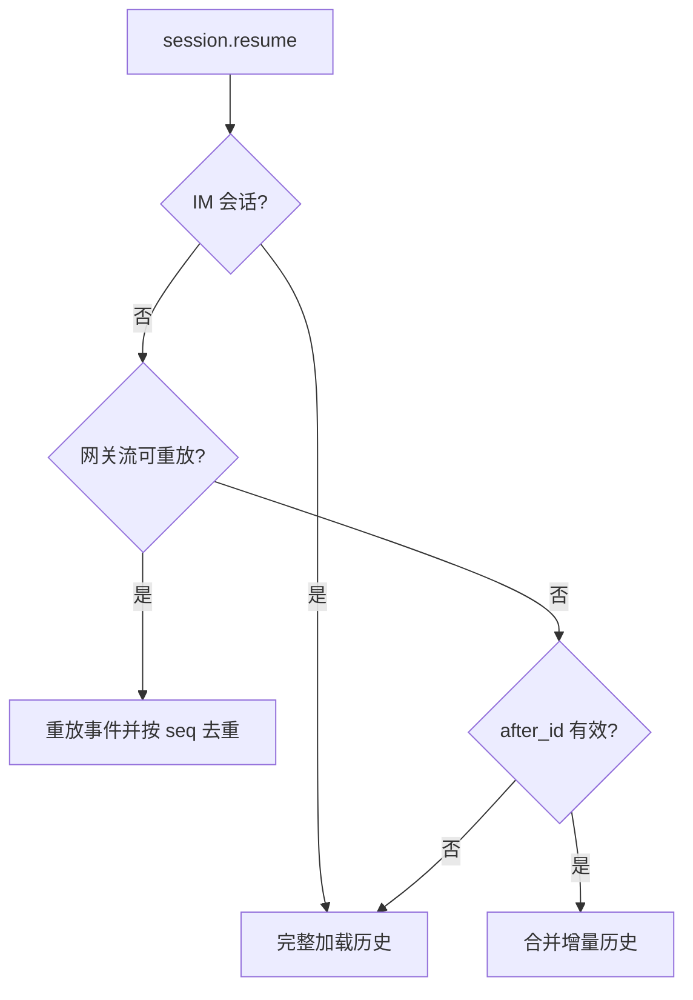
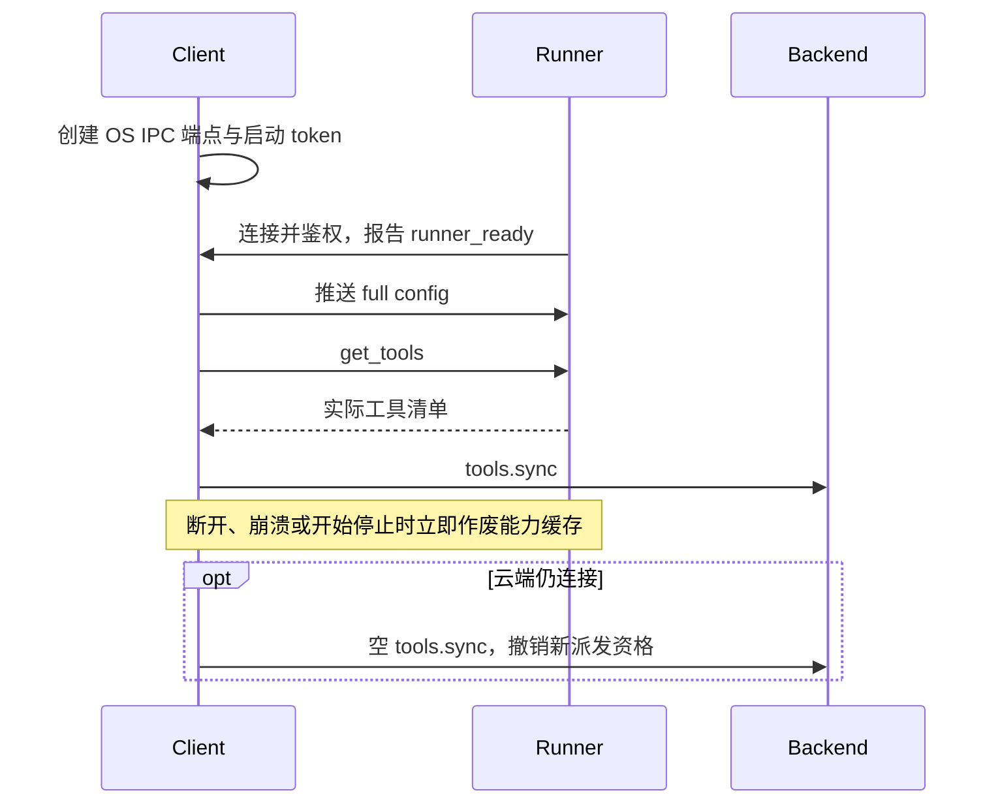
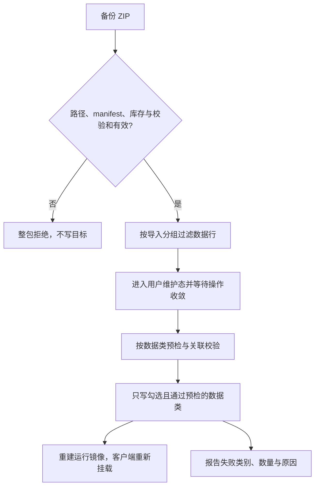

# 跨模块协议契约

本文维护 Backend、Client、Runner 与 Installer 共同遵守的通信、状态、交付和安全语义。字段和注册清单链接源码；产品体验见 [DESIGN](DESIGN.md)，生成链见 [PIPELINE](PIPELINE.md)。

## 通信与连接身份

### 传输与信封

| 链路 | 传输与鉴权 |
|---|---|
| Backend ↔ Client | `/api/chat/ws`，连接前以 Bearer JWT 请求 `POST /api/user/ws-ticket`，使用短时、`purpose=ws` 的 ticket 握手；签发与有效期见 [user.py](../backend/api/v1/user.py) |
| Client ↔ Runner | Windows 命名管道 / macOS UDS 承载 WebSocket 帧，以本次启动 token 鉴权 |
| Runner → Client → Backend | `request_llm` 经 Client 代理至 `/api/llm/completion`，后端身份由 Client 提供 |

WS 和本地 IPC 使用 JSON-RPC 2.0；REST、上传及下载不套 RPC 信封。请求带 `id`，响应以相同 `id` 返回 `result` 或 `error`；通知不带 `id`，不应被响应。Backend WS 的心跳与 `session.ack` 均使用普通 RPC 请求；Client 与 Runner 的本地连接以 WebSocket 协议层 ping/pong 探活。

### 登录、握手与心跳

ticket 关联登录记录，60 秒内仅可消费一次；首次握手尝试即消费，后续初始化失败或后端重启后须重新取得。每登录记录新签发会撤销此前未消费的票据，重连须重新取得。HTTP 与 WS 常规日志隐藏票据及资产签名参数。握手及入站处理核对用户与登录有效性。正常刷新不撤销登录，注销、另一端激活或管理员停用则清理连接、在途回合与工具等待。长效凭据不进 WS URL，握手只接受 `?ticket=`。

关闭码 `1008` 停止自动重连，表示策略拒绝，维护状态也可能使用，不能据此断言令牌失效。心跳用 `session.ping`，无入站帧超时以 `4000/heartbeat` 重连；探测间隔和超时见 [JsonRpcGatewayClient](../client/renderer/shared/lib/gateway-protocol/json-rpc-gateway.ts)。

### 通道分工

依赖持续会话、进程内运行上下文和流式交付的操作走 WS；独立资源操作与较大载荷走 REST。REST 不要求聊天在线，但仍独立校验身份、权限与资源归属，不能因此视为可任意重试。

不持有 WS 的界面需要已有 RPC 能力时，REST 镜像须复用同一服务逻辑。聊天流走会话 emitter；需和业务状态共同提交的异步通知走 outbox，两者不能混称。

Client 决定完整入口互斥、精灵显隐及窗口位置。Backend 提供资源和语义，不下发窗口像素指令，也不生成独立工作台背景。普通聊天生图只交付媒体，更换场景必须走场景资源或专属工具。

## 会话与消息

### 会话种类与历史修改

`kind` 与 `system_preset_id` 是不同维度，不能互相推断；自动化标记与 `system_preset_id='automation'` 由数据库约束等价。每条会话持久化 `kind` 与非空 `system_preset_id`，预设创建后不可更改，换记忆域须切换或新建会话：固定系统对话为 special，普通及任务会话为 standard，渠道会话为 im。

每用户每预设最多一条固定 special，不可删除或改名。`session.create` 必须显式提供目录内有效的 `system_preset_id` 字符串，缺失、空值、非字符串或未知预设返回参数错误；工作台新建入口只列文案秘书和语言老师。`system.list_presets` 只向客户端返回展示元数据，不下发提示词正文。目录见 [presets](../backend/services/domains/conversation/presets.py)。

会话挂载结果的 `info.system_preset_id` 给出服务端确认的预设归属，工作台据此判断会话展示；列表分页或归档不改变已选会话的归属。

| 操作 | 普通会话 | 固定系统对话 | 任务会话 | IM |
|---|---|---|---|---|
| 编辑最后一条用户消息（`prompt.submit` 带 `edit_message_id`） | 允许 | 允许 | 拒绝 | 拒绝 |
| 重试最后一条未回复消息（`prompt.submit` 带 `retry_message_id`） | 允许 | 允许 | 拒绝 | 拒绝 |
| 撤回（`session.undo_to_message`）、派生（`session.fork`） | 允许 | 拒绝 | 拒绝 | 拒绝 |
| 桌面提交消息（`prompt.submit`） | 允许 | 允许 | 拒绝 | 拒绝 |
| 清空（`/clear`）、手动压缩（`/compress`、`session.compress_context`） | 允许 | 允许 | 拒绝 | 拒绝 |
| 改名（`PATCH /api/sessions/{id}` 的 `title`） | 允许 | 拒绝 | 允许 | 拒绝 |

任务会话的历史由自动化入口独占写入，桌面可读历史并管理任务。桌面、IM、Cron、主动与子 Agent 回合共用会话互斥；删除会话时核对整棵子任务树，仍在运行时返回 409，须先停止。停止不撤销已发生的外部副作用。

编辑、撤回、清空和手动压缩遵守会话锁、权限及在途回合检查。编辑只接受新文本，保留原附件，与 batch / attachments 互斥；删除旧尾部与写入修订行在同一事务，校验失败不改历史。编辑广播完整历史，修订行使用新 ID；应用广播时保留本地未提交或待确认的消息与附件，RPC 响应不二次覆盖已开始的回复。撤回删除锚点及其后的全部消息，并把锚点用户消息的正文与内联图片作为输入框草稿退回：RPC 响应与 `message.deleted` 事件的 `anchor` 为 `{text, attachments}`（定义见 [schemas](../backend/modules/conversation/schemas.py)），`attachments` 只含可重新附加的 data URL 图片；视频随撤回清理，不恢复。任何历史修改都不撤销已执行工具的外部副作用。

回复生成失败的 `error.retry_message_id` 指向已保存的用户消息，客户端在当前失败气泡提供重试按钮。`prompt.submit.retry_message_id` 与 text / batch / attachments / edit_message_id 互斥；服务端在会话锁内校验归属、最新用户行、上下文边界与未保存终端回复，复用原消息、附件和工具结果，只重新生成最终回复，不重复执行工具。新消息、已保存回复或历史修改使旧重试入口失效。`error.message` 面向用户：按会话语言本地化，不含失败原因枚举与内部名称，脱敏后才离开服务端；供应商错误消息经分类与脱敏后附在引导语之后。

派生继承源预设、自动化归属与历史工具链、媒体和时间等信息，排除界面状态行并清零用量、耗时；复制历史不同时填入输入框。历史中的上传视频随派生复制到新会话自己的附件目录并改写引用，之后源会话的清理、撤回、清空或删除不影响派生历史；源文件已被清理的引用写为清理占位。附件复制失败或请求被取消时，整个派生请求失败，不保留半成品会话。

派生会话是独立的普通会话，以 `forked_from_id` 记录来源，照常出现在会话列表与搜索中；删除来源只清空该记录。委派产生的子 Agent 会话以 `parent_id` 挂在发起会话下并随其级联删除，不出现在未归档会话列表与搜索中。字段见 [models](../backend/modules/conversation/models.py)。

### 预设记忆与学习作用域

长期记忆及模型可读派生事实归属 `(user_id, system_preset_id)`，用户来自认证，会话决定固定预设；未知、缺失或越权作用域拒绝访问。跨预设不共享检索、摘要、反思或学习技能，automation 不装配这些能力。

人工 `memory.list/update/delete` 必须且只能提供 `session_id`、`system_preset_id` 之一；跨域 ID 与不存在统一视为未找到。列表、数量、状态和证据属于同域，切换预设后丢弃旧请求结果。用户资料固定属于陪伴域，删除后可补填，不重启引导。

模型记忆工具只能使用服务端验证的原始证据，证据消息须来自用户本人的对话：自动化会话与子 Agent 会话（其“用户”消息由父 Agent 撰写）不能作证；用户手写或手改的记录只有在更新的用户消息作证时才可改动；系统写入的伙伴自身记录（basis system，如夜间活动）不进入审阅；人工纠正仍保留伙伴记录归属，不转成用户明确表达。更新携当前 ID 与版本，并发冲突整批拒绝。候选、失效、过期和已遗忘内容不得作为有效事实召回。模型不得指定身份、作用域或来源；具体决策结构见 [memory_policy](../backend/services/domains/memory/memory_policy.py)。

学习技能工具随 `tools.sync` 同步开放。Backend 派发时将 `skill_scope` 放在模型参数之外，Client 转发 `execute_scoped_tool`，Runner 在调用期间固定用户与预设目录。异步和委派继承该域，不读取界面当前选择。Runner 的 [SkillScope](../runner/utils/memory_scope.py) 只接受固定的预设 id 集合，新增或改名预设须同步，否则该预设的带域调用均被拒绝。

### 事件路由

Backend 事件统一使用 `method=event`，`type`、`payload`、`seq` 位于 `params`。会话事件的路由字段是 `params.session_id`，不是 JSON-RPC 顶层字段。

| 事件组 | 消费语义 |
|---|---|
| `message.start/delta/break/complete` | 开始、正文、分气泡和完成；完成帧补元数据，不重复追加全文 |
| `message.bubble` | 结构化回复逐泡交付：按气泡原顺序携带 `message_id`、`bubble_index` 与气泡，语音气泡到达时音频已保存（失败则音频为空） |
| `message.persisted` | 将服务端用户消息 ID 绑定到活路径气泡；助手 ID 随完成帧返回 |
| `message.voice` | 更新已保存语音气泡的音频，并使对应历史快照失效 |
| `message.media` | 按消息 ID、媒体标识更新原位视频气泡，并使对应历史快照失效 |
| `message.reasoning.delta` | 独立推理展示，不进入正文或下一轮模型输入 |
| `message.edited/deleted`、`command.result`、`compress.completed` | 按各自契约替换历史、插入状态或更新消息，不统一当普通气泡追加 |
| `tool.start/complete`、`error` | 按会话路由的过程与错误 |
| `tool.call` / `tool.cancel` | 用户级设备指令，按 `call_id` 派发或撤回，不受当前可见会话过滤 |
| `companion.message/mood` | 分别交付已持久化主动台词与独立心情 |
| 形象、外观、场景、动态、日记、视频与通道事件 | 更新对应资源或触发重新读取；不一律写入聊天历史 |
| `companion.video.progress/ready/failed/activated` | 载荷含 `packId`、`outfitId`；进度另含 `stage`，客户端按资源归属展示并重新读取状态 |
| `companion.action.catalog_changed` / `job_updated` / `play_requested` | 动作目录变更、生成进度与播放指令；目录变更带 `packId`、`catalogVersion`、`appearanceEpoch`，播放指令结构为 [ActionPlayCommand](../backend/modules/companion/schemas_actions.py)（过期时刻 `expires_at`），语义见[动作目录与播放](#动作目录与播放) |
| `system.notification` | 自动化结果通知，完整内容留在任务会话 |

- 业务通知面向该用户的桌面交付，不能因目标会话未打开而丢弃。
- 载荷中的 `session_id` 可用于落卡或跳转，不必然代表会话路由闸门。
- 回合帧（`message.start/delta/break/complete/persisted`、`message.bubble`、`message.reasoning.delta`、`tool.start/complete`、`error`、`compress.completed`）的转换见 [emitter](../backend/services/adapters/desktop/emitter.py)；`message.edited/deleted`、`command.result`、`avatar.regenerated` 由 [handlers](../backend/services/adapters/desktop/handlers.py) 直接推送，`tool.call/cancel` 由 [ipc](../backend/services/infrastructure/desktop/ipc.py) 发出；`message.voice/media` 等业务事件经 `emit_ws_event` 写 outbox，载荷由各发射点定义，并与 REST 响应一样按 JSON 模式序列化，时间字段同为 ISO 8601 文本（UTC 以 `Z` 结尾）。客户端分派与消费入口见[渲染层事件路由](../client/renderer/README.md#事件与异步生命周期)。

`tool.call` 不带 `params.session_id`，但其 `payload` 含 `name`、`args`、`call_id`、信息性 `session_id`、`headless` 与 `skill_scope`（仅学习技能工具非空，见[预设记忆与学习作用域](#预设记忆与学习作用域)）。`headless=true` 照常执行，不显示桌面工作态；IM、后台自动化和其他无头回合须由调用方显式传入，子 Agent 回合沿用父回合的标志，Client 不得靠会话类型猜测这一行为。`tool.cancel` 的 `payload` 只含 `call_id`，语义见[调用日志与未知结果](#调用日志与未知结果)。

### 序号与恢复

- `seq` 是同用户网关重放流位置，跨聊天 Session 共享；宽限期重连可复用。网关销毁、登录记录更换或服务重启后可重新开始，不是数据库消息 ID 或永久递增编号。
- Client 按 `seq` 去重并用 `session.ack` 确认消费。ACK 只裁剪重放缓冲，不证明业务提交或工具执行；RPC 响应不属于该事件流。
- 重放、增量合并与全量替换分别处理，不能混用旧流游标；IM 始终完整加载以更新 queued 状态。
- 历史同步复用已有会话运行时，不取消在途回合；停止回复须显式调用 `session.interrupt`。
- 历史携持久化消息 ID 与毫秒级创建时间。全量恢复达到防御上限时返回 `truncated` 与 `next_cursor`（本页首条 ID，未截断为 null）；当前没有按游标读取更早历史的接口。
- 握手后所有事件帧（含回合帧与 `tool.call`）先暂存，直到挂载类 RPC（`session.resume`、`session.get_main`、`session.create`、`session.fork`）或约 10 秒超时后才冲刷；重放缓冲容量与时限见 [buffer](../backend/services/infrastructure/desktop/buffer.py)，恢复结果字段见 [runtime](../backend/services/adapters/desktop/runtime.py) 的 `SessionResumeResult`。

### 表达通道

正文只承载可读台词；`companion.mood` 更新身份区，不创建消息；视觉表达只经 `companion.action.play_requested` 派发；`companion.should_act` 返回空间意图，由 Client 计算位置。动作受当前形象能力限制，控制字段不得编码进聊天文本。

当前心情由桌面用户陪伴回合独立更新，不由工作、IM、自动化或主动回合顺带生成。自主视觉表达与空间咨询须通过档位、可见性与锁屏闸门，空闲视觉表达还需满足空闲条件。可见性以桌面精灵窗实际显示（表面快照 `spriteVisible`：窗口存在、未隐藏且未最小化）且未被完整入口或轻语收起为准；Client 发出 `companion.should_act` / `companion.idle_expression` 前检查，`should_act` 结果返回后再次核对。

### 结构化回复与终端交付

固定陪伴会话（`kind=special` 且预设为 companion）的回复采用[结构化气泡](../backend/modules/conversation/replies.py)。模型输出内部对象 `{kind, bubbles}`：日常交流与情景互动用 `kind=dialogue`；只有本轮明确要求的书面故事、剧本、译文或引用使用 `kind=written`，完整正文与必要排版保存在一个文字气泡。所有供应商、模型共用后端格式处理器：日常台词按明确句末标点分泡，保留原文与顺序，不按逗号拆分；小数、常见缩写、省略号和句尾 emoji 保留。旁白不由代码删除，语义转换由模型完成；书面分支只合并文字气泡，保留正文、标点与已有排版。处理后统一校验换行、旁白标记、演绎与媒体，去除内部类型标记并保存、回灌气泡数组；客户端不再分句。由模型选择 `text / voice / image / video` 与顺序，纯媒体回复有效，不设气泡数量上限。`companion.response_preference` 保存偏好，`prompt.submit.response_preference` 携带本轮快照；客户端不据此转换消息或自动播放。

仅语音携带 `speech`，空对象表示按已选音色常态朗读。MiMo 的可选 `instruction` 是整句自然语言朗读指令，放入 TTS 的 user 消息；`styles` 是台词开头的整体风格标签；MiniMax 使用可选 `emotion` 与 `speed`。两者都可用 `segments` 表达段内控制：空数组或省略时直接朗读本泡 `text`；非空时各段 `text` 按序拼接须逐字等于本泡台词，`tag` 与 MiniMax `pause` 在所属段文字之前生效。分句前校验分段结构，未知字段与无效标记不能被重组过程丢弃。空文本段可携开头、段间或句尾声音，不能在分句时丢失；句间空白处的标记进入后一句，全文末尾的标记留在末句，跨句段在句界切开。拼接不一致进入一次模型修正，TTS 装配也校验原文一致性。整句与局部控制按实际供应商、模型能力校验，客户端不解释演绎。音色设计模型的固定音色描述与逐泡 `instruction` 合并进入 user 消息，台词不做供应商自动润色。

| 消费方 | 回复内容 |
|---|---|
| 数据库 | `content_type=companion_reply` 标识结构化回复；`content` 保存最终交付的气泡数组，内部 `kind` 不保存；`reply_json` 保存同组气泡的演绎、语音绑定、音频及服务端绑定的媒体资产与真实状态；整轮为同一条 `Message`，媒体不重复写入 `media_json` |
| 对话上下文 | 回灌 `content` 中的气泡数组，补入媒体真实状态，排除供应商绑定、资产路径和时长 |
| 客户端 | 历史与实时下发同序逐泡视图；文字／语音保留台词与音频，媒体携标识、状态及服务端资产地址；不解释演绎 |
| 内容消费 | 记忆、摘要、标题与心情逐泡读取台词和媒体真实状态，未完成媒体不能总结为已发送成功；TTS 只读取语音台词，搜索只匹配台词（多模态消息只匹配文本部分，附件地址不参与会话搜索与记忆证据检索）；`text` 正文不按 JSON 外形推断气泡或附件 |

陪伴回合非流式取得最终回复，确认无工具调用后处理、校验；完整响应的单层 JSON 围栏会移除，缺失的内部闭合符只在字符串原样保留、可完整解析时补齐，不抽取其他正文中的 JSON，不消费不完整终态。不能把接收 schema 参数或偶然合法 JSON 当成服务端约束生效。格式错误、取消或异常不交付未确认正文。每回合至多保存一条可见终端消息，工具中间行只保留调用结构。工作台、IM 与自动化继续使用各自文本契约。

缓冲回合只发一次 `message.start`；结构化回复以 `message.bubble` 按气泡原顺序逐泡交付并替换等待气泡，语音气泡在音频保存后交付，`message.complete` 收尾并以 `message.complete.bubbles` 携带完整气泡对账，历史使用相同视图。客户端按消息 ID 与气泡索引去重，媒体在自身位置渲染；用量使用终端值，不累加工具循环各轮计数。

### 媒体引用、验图与原位交付

媒体选择先满足本轮明确要求：听说、朗读与声音表达使用可用的 `voice`，静态画面使用图片生成，短片与连续动作画面使用视频生成；文字／语音偏好只影响台词，不替代图片或视频。陪伴预设默认提供本轮允许的基础媒体工具，其他能力按需解锁，具体集合与边界见[工具披露](../backend/services/application/chat/README.md#工具披露与记忆访问)。工具可用、生成与终端交付分开：没有产物时先使用本轮允许的工具，取得产物后才提供媒体气泡；无工具或失败时如实说明。已有产物优先交付，已受理任务先查状态，不能因用户催问重复提交。

模型只输出 `{type: "image" | "video", media_id: "工具产物标识"}`。执行层生成标识，校验当前用户、会话内已知工具产物、类型及就绪文件；视频可引用已受理任务。未知标识、类型错误、重复引用、遗漏本轮成功图片或已受理视频均进入一次格式恢复，恢复不执行工具。模型不能填写 URL、路径或状态。

终端对象在分句前检查 `text` 和 `voice.text`：常见媒体文件地址（含查询串与 URL 编码）、媒体 data/blob/file 地址及内部资产路径必须原样来自本次上下文中的用户文字或工具返回，助手历史、工具参数和摘要不提供来源。台词中的内部资产路径、Markdown 图片和 HTML 媒体嵌入不能代替媒体气泡；用户明确要求的书面引用可保留资料中已有的地址或完整媒体语法。普通网页链接不受媒体地址检查；来源匹配只证明可引用，不证明生成成功。地址内部标点不参与分句。失败沿用一次格式恢复，纠正伪造地址及完成宣称；仍不合法则不落库、不交付，不通过语音降级绕过。代码见 [reply_links.py](../backend/services/application/chat/reply_links.py)；该检查不判定任意自然语言的真实性或所有无扩展名外链的用途。

`image_generate.requests` 一次提交本轮完整清单，每项指定内容、生成参数和数量；初次生成合计最多 16 张，这是生成预算，不限制回复气泡数。派发前登记整批目标；清单受理后再次调用只返回已有状态，改变 prompt 或 call ID 不重新生成。`media_inspect(media_id)` 读取真实图片，检查原请求并复用身份评分，返回绑定具体版本的检查标识与问题。`image_regenerate(media_id, inspection_id, correction)` 只接受当前版本的有效问题检查，每目标最多重做一次。原图保留，修订版本有新标识但属于同一目标，最终只交付一个版本；文本渠道附加最新成功版本，重做失败保留原图。图片失败不能作为就绪产物发送，结果未知不重复提交。代码入口：批次、验图与重做见 [chat_images.py](../backend/services/application/generation/chat_images.py)，回合媒体状态 `MediaTurnState` 见 [contracts/media.py](../backend/services/contracts/media.py)，单个引用的校验与视频绑定见 [reply_media.py](../backend/services/domains/conversation/reply_media.py)，逐目标唯一与遗漏校验见 [reply_delivery.py](../backend/services/application/chat/reply_delivery.py)，工具定义在 [image_generation_tool.py](../backend/services/adapters/tools/builtin/image_generation_tool.py) 与 [video_generation_tool.py](../backend/services/adapters/tools/builtin/video_generation_tool.py)。

视频每回合最多受理一个初次请求，已有 pending 任务只能查询。生活空间通过媒体气泡交付等待卡片，其他气泡正常发送。任务绑定消息与媒体标识，终态以 `message.media` 携 `message_id / media_id / bubble_index / bubble` 更新原卡片。落库与后台完成通过任务行锁协调；先完成后绑定读取真实终态，消息删除后不补建。重复更新幂等，终态不回退；缓存与重连恢复见 [Client](../client/README.md#历史同步)。其他文本会话使用附件及后台媒体送达机制；视频失败保存可见系统状态行，实时事件携同一消息 ID，刷新或重复事件不生成第二条失败状态。

视频工具的 `reference_image` 与 `subject` 参数见[工具定义](../backend/services/adapters/tools/builtin/video_generation_tool.py)；参考优先级及与动作包的分工见 [出镜图片与视频](PIPELINE.md#出镜图片与视频)。

备份收集嵌套媒体资产并重写恢复后的用户路径；恢复与派生会话解除任务绑定，未完成视频标记为失败，不声称恢复了生成任务。图片原版与修订资产保留；未采纳质量候选仍按各生成链清理。

### 语音保存与重试

- 后端先保存回复，再有界并行合成并保存音频；气泡保持原顺序逐个经 `message.bubble` 交付，语音气泡在音频保存后交付，失败保留语音类型、台词和演绎，音频为空照常交付；`message.complete` 收尾并携带完整气泡，客户端按消息 ID 与气泡索引对账补建缺失气泡。合成中断（取消或消息被改删）时已交付气泡保留，未提交音频清理。
- 音频为空的语音气泡在客户端直接显示原台词，不呈现失败语音条或整轮错误；历史与实时交付使用相同降级，后续音频更新到达时恢复语音呈现。
- 客户端点播或按独立的 `companion.autoplay_voice` 偏好顺序播放，并[缓存音频](../client/README.md#资产与历史缓存)；该偏好仅控制客户端播放，文本没有 TTS 入口。
- 缺失音频经 `POST /api/sessions/messages/{message_id}/voice/{bubble_index}` 重试，已有音频幂等复用，不重新生成台词或演绎；请求等待覆盖合成预算。
- 成功写入后以 `message.voice` 更新对应气泡并使历史快照失效。
- 收听状态由本机主进程按账户、会话、消息 ID 与气泡索引持久化，通过独立 IPC 读取、更新、删除及广播；`listened` 只在播放正常结束后置为真且不回退，`positionSeconds` 保存断点，播完归零。记录不上云，不进入消息正文或模型上下文；类型见 [IPC 契约](../client/shared/ipc/contracts.ts)。
- 新语音只从首次接收的终端回复与主动消息入队，历史水合、音频更新及偏好修改不触发补播。缺失音频或播放失败保留未听并跳过，用户点播才触发合成重试。暂停、中断与其他声音抢占不算播放失败。
- 取消不回滚已保存回复，未提交音频必须清理；合成与并发控制见[对话编排](../backend/services/application/chat/README.md#回合执行与交付)。

主动回合使用同一结构，`kind=dialogue` 与空 `bubbles` 表示沉默、不写空消息，格式恢复同样允许沉默；常规档仅提供文字能力，不提供语音与视觉表达工具。音频准备后重新检查用户活动、租约和档位；接受时原子保存消息与 `companion.message`，拒绝或取消清理未交付音频。

### 模型失败与重试预算

- 供应商流收到首个事件或非流式响应返回后，不再切换供应商。
- 未交付正文、非内容过滤的不完整终态可在同供应商同参数重试；所有供应商的陪伴回复在结构、日常分句、演绎或媒体校验失败时，都在同供应商进行独立格式修正。
- 首次请求与恢复请求共用按当前音色和可引用媒体生成的气泡 schema，无媒体时不提供媒体气泡类型；格式修正额外允许空数组表示无可恢复内容，用户回合按现有空回复校验报告格式失败，主动回合可保持沉默，均不能遗漏应交付媒体。通用语音结构中其他供应商字段的 null 或空列表不表达演绎，绑定时忽略，非空的不支持字段仍拒绝。段内演绎遵循上文 `segments` 原文与位置契约；MiniMax 停顿须跟在已说出的词之后。校验错误定位到具体气泡的 speech 字段，持久化一致性检查使用相同绑定规则。
- 格式恢复请求不提供工具，返回工具调用时仍由代码拒绝。失败草稿不是已执行操作，修复资料与指令不写入聊天历史。恢复仍失败时报告回复格式错误，与供应商不可用区分。
- 格式修正以完整的未交付助手响应为唯一编辑正文，只附只读人设、校验错误、实际语音能力与可信媒体清单，不携带用户原话、历史、工具调用及结果正文或中间推理；人设只帮助保持原说话者与语气，不提供新台词。媒体地址的原始来源仍由代码核对，不作为对话传给修正模型。温度使用供应商允许的最低值。手动重试最终回复属于重新生成，仍保留历史，并将原生工具调用与结果按顺序转换为只读资料；原始历史不变。
- 格式修正统一尝试 Chat Completions 的 schema 参数，仅在接口明确拒绝格式能力时依次降为 JSON 模式或普通请求，入口缺失时使用 Responses；不按模型名称或供应商选择校验路径。参数拒绝不产生模型结果，成功返回后不再切换入口或追加修正；鉴权、限流、内容过滤等失败不触发参数降级。
- 这两类恢复共用一次重试预算，不复用半截正文或工具草稿，不重跑已完成工具。
- 模型保留草稿的说话者、受话者、内容、顺序及有效交付类型，不重新解读用户意图或续写回答：日常台词逐句成泡，旁白的情绪与情景转为台词或可用的语音演绎；书面文字与标点保持，只调整必要排版。缺少类型时按草稿正文恢复对话或书面形式，未指定通道的台词用文字；语音不可用时保留原台词转文字。有效媒体引用与顺序保留，错误地址及完成宣称、遗漏引用按可信产物修正。无可恢复正文及应交付媒体时返回空数组，不根据用户输入另写回答。修正使用同一输出结构与交付校验，不执行工具、不再次修正；预算耗尽不增加调用，仍不合格时报告格式错误。
- 预算耗尽后，若错误仅在语音演绎字段，将相应气泡转为原台词文字再完整校验并保存；其他气泡、媒体与顺序保留。正文、气泡结构或媒体仍无效时才报告回复格式错误。
- 模型取消或异常不交付未确认正文；失败的模型回合不写终端正文行。

### Slash 命令

Slash 元动作走 `command.dispatch`，不交给 LLM。`command.list` 返回名称、别名、说明和确认标记；clear、compress、remember 的注册与实现见 [handlers](../backend/services/adapters/desktop/handlers.py) 和 [slash_commands](../backend/services/adapters/desktop/slash_commands.py)。

`//` 或不符合命令起始规则的输入视为普通文本；符合命令形式但未识别时提示错误，不退回 `prompt.submit`。编辑消息时的斜杠按正文处理。需要确认的命令由服务端再次校验 `confirmed=true`；影响历史的命令另检查在途状态。clear 需确认，compress 无需确认；清空保留会话并写清理状态行，不等于删除长期记忆或撤销工具。remember 只写当前认证记忆域，自动化无记忆域。

响应与 `command.result` 可能同时到达，Client 幂等消费；`hydrate=true` 替换历史，否则展示状态。自动压缩的 `compress.completed` 插入压缩状态，不与手动压缩的全量替换混用。摘要检查点（含每日摘要）在历史与事件中以消息 `subtype`（`compress_summary` / `daily_summary`）标识，正文格式不作识别依据。主动回合也保存压缩检查点，临时意图不进入摘要；无头检查点与 `compress.completed` 通知同事务写入 outbox，客户端按消息 ID 去重。管理端自动压缩开关是总闸门，用户不能覆盖关闭；阈值使用会话覆盖或系统默认，固定与 IM 会话不继承工作台的聊天偏好。

## 伙伴与资产

### 接口入口

| 修改范围 | 定义入口 |
|---|---|
| 对话、引导、工具同步、记忆管理、命令 | [桌面 handlers](../backend/services/adapters/desktop/handlers.py) |
| 会话 REST 与传输结构 | [会话端点](../backend/api/v1/sessions.py)、[schema](../backend/modules/conversation/schemas.py) |
| 伙伴资料、头像与全身、角色卡、衣柜、动作包、媒体复核与资产读取 | [伙伴端点](../backend/api/v1/companion.py)、[伙伴 schema](../backend/modules/companion/schemas.py)、[动作包 schema](../backend/modules/companion/schemas_video.py) |
| 场景 | [场景端点](../backend/api/v1/companion_scenes.py)、[场景 schema](../backend/modules/companion/schemas_scene.py) |
| 动态 | [动态端点](../backend/api/v1/companion_posts.py)、[schema](../backend/modules/companion/schemas_posts.py) |
| 日记 | [日记端点](../backend/api/v1/companion_journal.py)、[schema](../backend/modules/companion/schemas_journal.py) |
| 动作目录、设计、启停、额度与回执 | [动作端点](../backend/api/v1/companion_actions.py)、[schema](../backend/modules/companion/schemas_actions.py) |

引导恢复依据服务端状态及已有资产；完成条件与身份锁定范围见 [DESIGN](DESIGN.md#认识伙伴)。

### 头像、全身与确认

字段与限长见[伙伴 schema](../backend/modules/companion/schemas.py)。头像 POST 接受可选 feedback，空请求仍可生成；POST 与 `avatar.regenerate` 都不能因断连或空结果自动重发，应读当前头像恢复预览。头像、全身、外观及服装参考的上传图按实际字节校验：须是体积在限内、可完整解码的 PNG / JPEG / WebP / GIF，类型以图片内容为准，不采信客户端声明；GIF、MPO 与其他多帧图片取第一帧归一为 PNG。无法读取或超限返回 400，格式不支持返回 415。

全身和外观的生成、自备图与微调成品均为真实透明 PNG，实际 MIME 和扩展名与内容一致；上传无需预先透明，服务端校验后必要时抠图。确认及全身候选采纳只安装通过透明验收的图片，失败保留原草稿与正式状态。透明处理、背景请求及失败边界见 [PIPELINE](PIPELINE.md#全身与着装透明成品)。

| 操作 | 并发与生效条件 |
|---|---|
| `portrait/confirm` | 用户锁内核对 `expected_avatar_id`，冲突返回 409 |
| `fullbody/confirm` | 核对 `expected_url`；首次引导确认不等待分析或派生生成，分析进度归角色卡，视频启动失败归外观状态 |
| 确认后的 `/fullbody/reference`、`/reference/prompt`、`/reference/adopt` | 角色卡未就绪（分析中或失败）时返回 409，不发起生成、不产出提示词、不采纳；就绪时 `/reference`、`/reference/adopt` 只返回待采纳候选、不替换种子，`/reference/prompt` 只返回提示词；`/fullbody/candidate` 恢复最近有效候选 |
| 候选 `/analyze`、`/accept` | 前者重试身体分析；后者要求角色卡就绪（未就绪返回 409），并核对预期原图和角色卡修订（已变化返回 400），只更新身体并清旧覆盖，不重建已有外观/视频 |

完整路由见[伙伴端点](../backend/api/v1/companion.py)。初始资产与重复启动守卫见[生成服务](../backend/services/application/generation/README.md#后台任务与初始资产)，编辑上传见 [PIPELINE](PIPELINE.md#编辑上传与身份采纳)。

### 角色卡编辑

角色卡 GET/PATCH 读取与局部编辑，extract 发起重新提取/失败重试，见[结构](../backend/modules/companion/character_card.py)与[伙伴端点](../backend/api/v1/companion.py)。写入校验预期形象和修订，冲突 409 且 Client 保留草稿；changes 未传不变，null 恢复自动值，空字符串显式清空。

分析状态独立于已发布内容，重分析失败不撤销旧资料；`companion.character_card.updated` 与状态同事务写 outbox，客户端重读但不覆盖草稿。

### 场景任务与原位换图

路由与字段见 [场景 API](../backend/api/v1/companion_scenes.py) 和 [schema](../backend/modules/companion/schemas_scene.py)。生成要求与提示词不作为成品描述，创建来源不因启用改写。内容边界、参考用途与描述恢复见 [场景创建与描述](PIPELINE.md#场景创建与描述)。

| 操作或查询 | 状态与返回语义 |
|---|---|
| `GET /api/companion/scenes` / `/scenes/state` | 分别提供资产列表与当前状态；资产和当前环境独立 |
| `PUT /api/companion/scenes/display-target` | 保存当前账户最近有效的壁纸目标物理尺寸，供无客户端请求的创建入口使用 |
| `POST /api/companion/scenes/{scene_id}/regenerate` | 对已有可用场景重生成图片，返回 `202` 和原场景响应，不新建场景 |
| `SceneResponse.regeneration` | 最近一次重生成任务状态 |
| `SceneStateResponse.regenerating` | 仅进行中任务提供目标场景；`pending` 保持创建／分析语义 |
| `POST /api/companion/scenes/{scene_id}/discard` | 可取消任一类进行中场景任务；取消重生成保留成品 |

- 创建、上传准备、分析与重生成共用用户级单任务限制；重生成期间原状态与图片保持可用。
- 创建、获取提示词与重生成支持可选 `target_size`；本次有效请求优先，其次账户最近一次有效快照，均缺少时采用 `1920×1080`。受理时冻结目标，显示器变化只同步快照，不自动生图。
- Client 主进程用显示器逻辑边界乘缩放因子计算物理像素，不使用窗口大小或扣除任务栏的工作区；桌面模式取实际交互屏，窗口模式取已选屏，失效时回落主屏。登录、重连、显示器与交互屏变化时同步；一张壁纸供所有屏幕等比铺满。
- 响应分别提供 `target_size`、`source_size`、`image_size`，分别表示目标、原始生成与最终像素尺寸，上传原图按实际尺寸记录。设备尺寸快照不进入备份。
- 重生成完成同事务替换该场景图片、环境描述、来源与尺寸，保留标题，并发送 `companion.scene.updated`；不改变 `active_scene_id` 或 `scene_switch_version`。分析失败保留候选，重试只继续分析，不重复生图。
- `POST /scenes/{scene_id}/analyze` 可继续失败的重复伙伴检查或描述分析；编辑已保存信息会撤销失败的重生成候选，避免旧结果覆盖新描述。
- 异步提交校验任务标识与账户归属，角色身份变化不影响壁纸。失败或取消保留旧成品；备份恢复清除重生成运行状态。
- 输入冻结与供应商恢复见 [PIPELINE](PIPELINE.md#场景图片重绘)。

### 场景启用与授权

状态与 outbox 同事务提交。`companion.scene.updated` 通知资产/任务/政策变化，`companion.scene.activated` 才表示切换成功；两者携单调 version，Client 忽略旧事件及迟到读取。

`switch_version` 在新自动意图、任一来源的启用成功、用户再次选择当前环境、取消与当前版本一致的待处理创建任务（无论是否申请自动启用）、自动启用的创建因已有任务被拒、政策更新（含重选同值）及备份恢复时递增；后台兑现已有自动启用意图不递增。后台仅在版本、政策仍有效时自动启用，否则只留资产；重复启用当前场景幂等，但用户再次选择当前环境会撤销旧意图。

陪伴、IM、自主回合使用 `scene_list/get/create/activate`；[对话编排](../backend/services/application/chat/README.md#提示词与运行时数据)每轮刷新环境。

| 发起方 | 授权与默认行为 |
|---|---|
| 客户端 REST | 用户显式创建/切换；页面创建与上传默认只保存 |
| 聊天工具 | LLM 自主决定，不从用户消息推断手动授权；create 默认 auto_activate=false，申请切换才传 true；activate 同样受自主政策约束 |
| 引导与夜间 | 调用方显式声明是否自动启用 |

- 每回合最多受理一次创建、一次切换，优先复用；创建并申请自动启用同时占切换额度。代码校验账户归属、锁定、额度和版本，场景变化不受打扰档位限制（见 [DESIGN](DESIGN.md#自主变化与锁定)），也不绑定角色身份或角色卡修订。
- 工具结果区分资产状态、自动启用申请、已启用及 `environment.current`；未启用不返回已到达。
- 在线自主新增按滚动 24 小时提交计额，删除不返还，复用不占。夜间使用 `scene.create/activate` 与计划预算，不依赖换装；仅启用完成才入生活事实，场景操作不自动发动态。

### 媒体复核与激活

动作包按核查状态自动激活，疑点保留预览与手动启用，准备期间继续播放旧包；评分见 [PIPELINE](PIPELINE.md#供应商选择与失败恢复)。

就绪包上单独制作的动作（动态动作、探身补齐、系统动作原位重做）复核存疑时建复核项，经 `/api/companion/media-reviews` 列表、单项 GET、accept/reject 管理。采纳在同一事务更新所属就绪包的目录；包未激活也更新自身目录而不激活，仅当前激活包广播目录变更。拒绝作废该次生成，之后的同名重做为独立的新生成。

复核项只作用于生成它的成品；当前成品仍在收尾保存时，采纳和拒绝均保持 `pending` 并提示稍后重试。系统动作原位重做结束仍待确认的旧复核项；素材已被替换时，采纳失败并结束该项，拒绝只结束该项、不改动作。响应中动态动作以设计名称作 `title`，系统动作以 `system_slot` 供客户端本地化；`media_type` 决定图片或视频预览。日常聊天、场景、动态、夜间媒体不建人工复核项。下载、评估与重生成凭句柄/落盘资产恢复，未知提交不重发。

### 动态与日记

动态与日记由伙伴创作。动态工具只向陪伴预设开放，装配与派发均校验；用户可请求发布动态、评论和删除本人评论，不能编辑动态或删除伙伴回复。日记只由夜间流水线自主判断并发布，没有聊天写入工具或发布次数额度；当天已有日记时恢复复用原文，不追加、不覆盖，也不重新变为未读。日记、召回索引与发布事件在同一事务提交，主动不写与已发布结论持久化在夜间日志中供恢复。

视频动态超时记为结果未知，不自动补发。动态页可查询原任务并预览成品，查询只续原句柄、下载及本地核查，不新增制作或评分；取得成品后私有视频任务停在 `review_pending`，重启不自动推进。用户明确采纳时重查账户、身份、自主开关与滚动额度，发布冻结计划；放弃由任务所有者释放未被其他内容引用的资产。未知状态在夜间账本仍为结果未知，不记成确定失败。

`post_publish` 提交意图，`post_status` 查询原任务，两者只返回任务 ID、状态、动态 ID 和错误信息。正文、媒体与评论独立保存，不进入主会话或其历史摘要；评论回复只装配本线程及共享人设、有效记忆和心情。动态上下文保存发布意图、媒体制作说明与语音文稿，用于回复和夜间回顾：意图说明分享主题与目的，制作说明描述预期画面，文稿提供语音表达内容；预期画面不保证成品细节，作品描绘的情节不证明现实经历。

文字、图片、视频和语音共用发布服务，发布来源不影响展示或评论。自主发布不依赖桌面连接，受统一创作开关 `companion.posts_enabled` 控制，默认值与能力筛选见[发布入口](../backend/services/application/posts/publication.py)。正文须通过校验，媒体动态还须取得主媒体才能发布；可选旁白失败保留主媒体，主媒体失败不产生动态。媒体须为本账户的正式资产。

日间、夜间和主动陪伴共用自主额度；明确用户请求不受自主开关限制，使用独立请求额度。滚动 24 小时按动态条数在事务内预留：排队和在途任务占额，未知结果按原预留时间计入窗口，明确未发布的终态释放；未知请求不重复提交。额度上限与计数条件见 [Settings](../backend/components/config.py) 和[领域存储](../backend/services/domains/posts/store.py)。夜间规划发现自主额度已满时不提供动态发布；规划后开关、请求类型或额度变化使受理被拦截，夜间账本记为阻止而非失败。

回复状态绑定触发评论，同一动态按评论顺序生成回复；失败重试原任务，删除触发评论后不写入迟到回复，已生成的伙伴回复保留。发布通过 `companion.post.created`、评论与回复状态通过 `companion.post.comment`、删除通过 `companion.post.comment.deleted` 刷新，事件与业务状态同事务提交，不发送 `companion.message`。

动态与日记的未读状态由后端逐条保存，新发布默认未读。列表加载前捕获当前账户全部未读 ID，Client 在页面成功展示且生活空间可见、聚焦、未锁屏时确认该快照；确认只更新本账户指定记录，重复提交幂等，不能按确认时刻批量清空。进入后新发布的内容在正文实际展示时单独确认，读取或确认失败保留提醒。发布、已读和遗忘事件驱动重新查询，登录、开窗、重连、聚焦与解锁补查；账户与请求生命周期守卫隔离迟到结果。

动态未读与评论无关。`GET /api/companion/posts/unread` 查询 `has_unread`，首屏列表返回 `unread_post_ids`，翻页返回空快照；`POST /api/companion/posts/read` 提交 `post_ids`。已读更新与 `companion.posts.read` 事件同事务提交；字段见[动态 schema](../backend/modules/companion/schemas_posts.py)。

日记使用 `GET /api/companion/diary/unread` 查询、`POST /api/companion/diary/read` 提交 `diary_ids`，列表返回 `unread_diary_ids`。快照涵盖全部日期，Client 只在进入页面或重载后确认；月份翻阅不重新确认全账户快照。`companion.diary.created/read/deleted` 分别通知发布、已读与遗忘，事件与业务更新同事务提交；字段见[日记 schema](../backend/modules/companion/schemas_journal.py)。

日记原文是权威内容，`diary:<日期>` 是标题及完整正文的派生记忆索引，固定属于陪伴域；按日期读取使用 `memory_recall.diary_date`，普通话题沿用向量和关键词召回。索引不能通过普通记忆编辑改写，人工遗忘索引时同事务清除日记原文及索引内容。反思保存为 `reflection:current` 的最新相处理解快照，在后续陪伴对话中自动装配；更新由全天原始交互、有效记忆及先前理解生成，纠正或撤回旧误解也须替换快照，`content:null` 仅表示无需改写。日记和反思均标为伙伴自身记录并保留所属日期，不独立证明用户事实；用户当前明确表达优先于先前理解，不改变固定人设和行为授权。正文及召回入口见[记忆模块](../backend/services/domains/memory/README.md)。

发布时间为实际完成时刻，活动归属日由发布任务记录；夜间规划、反思和日记按动态 ID 去重归集发布事实，资料中的发布与评论时间均转换为带时区偏移的用户本地时间。评论按自身发生的本地日期归集，包括较早动态上的新评论。备份规则见[覆盖恢复](#备份校验与覆盖恢复)。

生成正文完整保存，超出容量时明确失败，不静默裁切。字段上限见[动态 schema](../backend/modules/companion/schemas_posts.py)与[日记 schema](../backend/modules/companion/schemas_journal.py)，中英文均按字符计数；反思的正文及输出预算由 [Settings](../backend/components/config.py) 的 `reflection_max_content_chars`、`nightly_reflection_max_tokens` 控制。

### 资产访问与缓存

归属资产支持有效 Bearer JWT 或短时 URL 签名鉴权，签名当前有效期为五分钟。可续传资产支持 Range、ETag 与不可变缓存。Client 磁盘缓存以去除签名参数的资源路径为键（资产文件名按生成唯一，目录文件名含包与目录版本），ETag 用于复验；签名变化不等于内容变化，规则见 [Client 缓存](../client/README.md#资产与历史缓存)。

新包版本须重新读取描述符和相关资源；本机缓存按后端与用户隔离，登出和换号保留，明确移除账户才清理该账户的数据。换号后的迟到结果不得写入新账户，移除后的旧写入不得恢复已删除缓存，具体生命周期见 [Client 缓存](../client/README.md#资产与历史缓存)。对话生成媒体作为正式资产保存；只要仍有有效业务引用就保留，不沿用临时文件过期语义。

动作目录的 `media_ref`、`hitmask_ref` 保存 `companion-assets/<user_id>/<relative_path>` 裸路径；客户端动作加载器将其转换为 `/api/companion/asset/<user_id>/<relative_path>`，经携带当前身份的资产桥下载。完整相对路径参与签名；所有读写入口拒绝点段、编码穿越、跨账户路径和符号链接越界。目录本身的签名 URL 直接交给资产桥，短时签名不写入持久化目录。

正式资产按数据库归属分层，目录标识不随展示名称改变：

| 用户资产根目录下的位置 | 内容 |
|---|---|
| 根目录 | 头像、全身种子等身份固定资产 |
| `outfit{id}/` | 外观立绘和专属参考 |
| `outfit{id}/pack{id}/` | 动作包的冻结参考、源素材、候选、成品、封面、遮罩和目录；没有外观的导入包使用 `pack{id}/` |
| `scene{id}/` | 场景壁纸与制作资源 |
| `YYYYMMDD/` | 聊天、动态等生成文件；按用户时区和所属消息或任务创建日冻结，跨日重试不换目录 |

编辑、撤回、清空及删除会话时，在删除引用的同一事务登记回收，并标记旧消息独占的视频任务失效；原附件由修订消息继续持有。提交后停止对应语音和媒体任务，复查消息、派生会话、身份、外观、动作、场景、动态、有效生成任务及待投递消息，再立即回收无引用文件。已送达通知不独立持有资产；共享资源只在最后一个有效引用消失后回收。文件写入至引用提交期间有任务保护，回收与新引用建立须遵守账户资产锁。

失效任务不再提交生成、评分、下载或交付，迟到结果不能重建历史；可取消的供应商任务按原句柄撤销。远端不支持取消或已开始不可撤销时，只保证停止本地后续步骤，不声称远端已停或费用已退。清理失败保留待办，启动及每分钟补偿，每小时扫描磁盘遗漏；可重试候选、待采纳结果和必要的计额、去重记录继续保留，已发布动作版本保护 24 小时，已结束媒体复核保留 7 天，到期且无引用才删除。实现归 [资产领域](../backend/services/domains/assets/README.md)。

图片附件可随 `prompt.submit` 以内联 data URL 或 HTTP(S) URL 提交，URL 由供应商拉取。视频先经 `POST /api/media/videos` 上传，再提交本会话附件 URL；视频拒绝 data URL、跨会话引用和第三方绝对 URL（公网模式须带 `public_base_url` 前缀）；文件已被配额剔除或清理的附件 URL 同样拒绝，须重新上传。公开读取端点 `/api/media/videos/...` 与临时媒体 `/api/media/files/...` 使用不可猜测文件标识，属于供供应商读取的例外，不应描述为所有媒体都要求 Bearer。

视频按会话滚动配额与历史生命周期清理，删除时同步将消息中的引用改为清理占位，不留下死链。公网 URL 与内联模式、大小限制和供应商能力筛选见 [对话编排](../backend/services/application/chat/README.md)。

## 动作目录与播放

`action_design` 制作冻结外观包内的可复用能力，`video_generate` 交付一次性作品。接口与字段见 [actions API](../backend/api/v1/companion_actions.py)、[schema](../backend/modules/companion/schemas_actions.py)。

- 合法系统槽位可上传透明图片或视频；自动制作按动作规格选择类型，drag 与左右探身为图片。图片是单张静态成品，没有时长、帧数、帧率、循环或重复规格，由基础状态决定显示与切换；动态表达当前仅接受视频。共享处理结果见 [schema](../backend/modules/companion/schemas_video.py) 的 `ActionResult`。
- LLM 使用 `action_search` / `action_design` / `action_inspect` / `action_play`；source、用户、额度窗口、系统槽位和目标包由服务端绑定，`expected_pack_id` 只作并发守卫。用户聊天工具与 REST 设计按用户请求（user_requested）计额，主动回合及夜间提案按自主（autonomous）计额，并受自主创建开关约束。提案立即返回受理，不等评审/制作，也不进入聊天视频送达链。
- 动态动作制作额度按滚动 24 小时由独立账本记录，批准新制作及受理同名独立重做时强制，续查询、下载与发布不重复计额，删除包不返额；不设评审日限额；额度数值不进入模型上下文，超限转 deferred 的理由经动作快照与 `action_inspect` 可见，用户可经 `GET /api/companion/actions/budget` 查看。无手动播放入口；陪伴预设每次调用模型前刷新动作快照（就绪、在途和近期拒绝信息），见[动作编排](../backend/services/application/actions/README.md#模块入口)。
- 所有动态呈现汇入 `companion.action.play_requested`，目录和任务事件仅更新资源。Client 按 `play_id` 去重，按 `pack_id` 与 `appearance_epoch` 校验归属和代次，遵守 TTL / `repeat_count`。
- `appearance_epoch` 是服务端维护的动作包激活代次：每次激活（含换装后再穿回同一包）写入该用户已有最大代次加一；目录接口与 `catalog_changed` 携带包的当前代次，播放指令与账本记录受理时的代次。制作中保存的意图在动作就绪后（含复核项经用户采纳后就绪），仅当意图未过期、所属包仍激活且代次未变才补发并重新计算即时有效期；未过期但包或代次失效记 rejected；已过期（不论包是否失效）或动作已停用、未就绪时保持 queued、不补发。补发只针对本轮制作完成的动作，不重发其他动作未执行的即时请求。
- Client 比较指令与本地目录代次：同包旧代次说明该包已重新激活，直接认领并回执 rejected；其他不能直接播放的指令先强制刷新目录（覆盖恢复保留备份中的代次，新包代次可能低于本地旧包）。刷新后指令仍较新则不认领，交由已加载新代次的舞台或 TTL 收尾；较旧或包不同则认领后回执 rejected。本地快照未记录代次时，网络校准前不受理；换包或代次变化时作废旧播放实例。
- 播放回执按 `play_id` 幂等，同一请求只由一台可见设备执行；queued 不算完成，认领后不能播放报 rejected，抢占报 interrupted，表演事实只来自播放器回执。
- Client 主进程按 `play_id` 在本机可见舞台之间唯一认领，认领记录保留到请求过期；完整入口侧边伙伴可接收播放。收起、最小化、最大化、切窗或锁屏时中断播放并作废在途加载，恢复后回到待机，不补播旧请求。持续可见时换侧不中断；同包目录刷新不替换已受理实例的素材版本，迟到媒体事件不得生成第二种终态回执。
- 动作 REST 管目录、设计、启停、删除、额度与回执。系统动作重做走 `POST /api/companion/video-packs/generate`（`source_pack_id` + `action`）：就绪包原位重做、同包推进素材版本，失败包生成复用冻结参考的新包版本。失败、取消或用户未采纳的动态动作以同名设计原位重做，未采纳的成品已作废，重做为独立的新生成；成品待用户确认时同名设计只返回等待状态。动作目录即当前包可播清单，换装随包切换，不跨包引用。已采纳素材与制作尝试分开保存，重做中、待复核及拒绝新候选时旧素材持续可播，通过检查或明确采纳后原子切换。单动作反馈按本次提交替换并回显，空串或省略反馈字段均清除。动态动作衣柜页仅显示状态，重做沿用同名设计入口。
- manifest 的 `catalog_version` 标识已发布目录快照，每次发布推进，并用于目录响应、变更事件与资源缓存校验；`canvas` 只定义包统一的逻辑宽高比。clip 通过 `media_type` 区分图片与视频，共享 `media_ref`、实际像素 `width` / `height` 及命中信息。同包素材像素尺寸可不同，宽高比一致，布局以媒体解码尺寸为准；`duration_ms`、`frames`、`loopable`、`hitmask_fps` 只属于视频条目。
- clip 可选携带 `peek_geometry`（遮挡线及需保留的识别区域）和 `content_rect`（内容轮廓），坐标归一化到最终媒体画布；clip 与目录结构见 [publishing](../backend/services/domains/actions/publishing.py) 的 `ActionClipSpec` / `ActionCatalogManifest`（客户端镜像为 [action-types.ts](../client/renderer/modules/character/actions/action-types.ts)），`PeekGeometry` 与 `content_rect` 解析见 [schema](../backend/modules/companion/schemas_actions.py)。缺少有效探身定位时不启用遮挡；侧边伙伴与桌面精灵缺少内容轮廓时优先从 alpha 遮罩推导，仍缺失按完整画布适配与落位。
- `hitmask_ref` 指向行整数按位表示列占用的 JSON，网格由 `hitmask_grid` 提供：图片是静态 `[row]`，视频是逐帧 `[frame][row]`，视频另带 `hitmask_fps`。生成见 [图片处理](../backend/services/infrastructure/video_processing/image.py)与 [视频处理](../backend/services/infrastructure/video_processing/process.py)。drag 图片在拖拽结束时切回当前基础动作，不进入播放计时或媒体结束事件逻辑；有限播放请求若指向图片须拒绝。
- [探身补齐接口](../backend/api/v1/companion.py)的输入见 [schema](../backend/modules/companion/schemas_video.py)。仅当前激活且具有可读冻结参考的包可补齐；按包和槽位复用任务，素材成功但目录缺失时只重试发布。失败或未知结果不自动重新付费，由衣柜显式处理；无冻结参考的导入包不自动重建。
- 窗口快照与仪式目标换算见 [IPC 类型](../client/shared/ipc/contracts.ts)：仅精灵宿主可读取快照、换算目标和请求跟随目标跨屏；主进程将 Runner 原生几何转换为 DIP，快照提供精灵视口原点由渲染层换算视口内位置，目标换算直接返回视口内坐标。绑定包含窗口标识、进程身份和 Runner 实例标识，重启使旧绑定失效；这些本机数据不进入云端自主上下文。

## 本机工具

### IPC 准入

Client 创建本地端点并生成每次启动的 256-bit token，Runner 主动连接，upgrade 鉴权失败返回 `401`。Runner 收到拒绝后丢弃缓存端点和 token，重连前重读端点文件。POSIX 套接字在 umask `077` 下创建，端点文件写入后设为 `0600`，均只允许当前用户访问。

Windows 命名管道可被本机进程枚举，token 是实际准入边界；不能因使用本地 IPC 就省略鉴权。该 token 不是 Backend 凭据。

### 握手与工具同步

| 方法组 | 用途 |
|---|---|
| `runner_ready`、`spiritagent.info` | 握手与运行快照 |
| `get_tools` | Runner 实际工具清单 |
| `execute_tool`、`execute_scoped_tool` | 普通及带学习域的执行 |
| `spiritagent.call_result`、`spiritagent.cancel` | 查询已派发结果与取消请求 |
| `spiritagent.config.update`、`request_llm` | 完整配置与反向模型请求 |

启动和 Runner 重启均执行上述同步。`get_tools` 的工具说明按 Runner 当前配置生成（如终端说明随 `terminal.env_type`）；运行中配置推送成功后 Client 重新读取清单，有变化时按重连同样发布并由宿主重新 `tools.sync`，读取失败保留原清单。未同步或清单为空时，本机工具不可见、不可派发；撤销资格后，已派发调用仍按结果与超时收尾。Runner 握手、配置推送与 `get_tools` 由 Client 主进程的 [bridge](../client/main/runner/bridge.ts) 完成；`tools.sync` 与撤销由精灵宿主的 [host-runtime](../client/renderer/app/runtime/host-runtime.ts) 按 Runner 状态发起；Backend 侧注册见 [registry](../backend/services/infrastructure/tool_runtime/registry.py)，派发见 [tool_dispatch](../backend/services/application/chat/tool_dispatch.py)。

工具禁用在注册和派发边界生效。新增或删除工具集 id 时同步 [Client 索引](../client/main/shared/lib/toolset-index.ts)、[Runner 源头过滤](../runner/tools/toolsets/catalog.py)、[Backend 过滤](../backend/services/infrastructure/tool_runtime/toolsets.py)和[显示图标](../client/renderer/shared/lib/toolset-catalog.ts)，不能只改界面清单。

### 能力与进程代次

`capabilities` 表达能力，`capabilities_health` 表达可用性和原因；`run_generation` 每次 Runner 进程启动更新，进程内重连不更新。连续重连计数与生命周期累计计数含义不同，不混用。

当前 Client 只保存握手时的能力快照而无消费方，不读取 `run_generation`，也不处理 `runner_capabilities_changed`；本机工具门控只看桥状态、WS 连接与 `get_tools` / `tools.sync` 结果。不能将通知存在写成“运行期能力已自动更新”；接入时须同时校验连接、握手、代次和工具同步。

### 调用日志与未知结果

`call_id` 由 Backend 为每个模型工具调用生成并写入历史，不沿用供应商标识（可能缺失或跨回合重复）。Client 必须按 `call_id` 去重设备指令，并将同一标识透传 Runner；RPC `id` 不代替它。Runner 日志按设备而非用户隔离，在实际执行前查询日志并原子认领，同一标识不同工具、参数或学习域不得执行或重放。

| 查询结果 | 恢复行为 |
|---|---|
| completed | 复用已保存结果，不重新执行 |
| claimed | 仍有执行者持有，不并发重复执行 |
| failed | 返回已记录失败，不用相同标识重新执行 |
| unknown | 结果不确定，保留核对信息；不能当作失败自动重试 |
| not_found | 没有记录；也可能已清理或未成功记日志，不能单独证明从未执行 |

认领刷盘后执行，终态落盘后回复。取消、持有进程死亡或记录损坏且无可信终态时按 unknown 处理，迟到执行者不得覆盖终态。认领未获执行权时拒绝并在 `data.disposition` 标明：`unknown` 回复 `-32011`；`failed`、`claimed_elsewhere`、`conflict`（同标识不同工具、参数或学习域，即使原记录已 completed）与 `invalid_call_id` 回复 `-32000`。工具报错、参数校验失败或工具集已禁用同样回复 `-32000` 并标明 `failed`；本次执行被取消回复 `-32000 cancelled`，不带 `disposition`。Client 把 `failed`、`conflict`、`invalid_call_id` 连同 Runner 给出的原因作为明确失败回传，请求发出前 Runner 未连接回传未执行，其余（取消、超时、断连、`claimed_elsewhere`、`unknown`）回传结果未知，见 [ipc/runner.ts](../client/main/ipc/runner.ts)。`spiritagent.call_result {call_id}` 可查询日志，当前 Client 与 Backend 均未调用，结果核对依赖模型检查外部效果或询问用户。

`spiritagent.cancel` 可用 RPC `req_id` 定位请求，省略时取消全部带 `call_id` 的在途调用（Client 的窗口轮询等直调不受影响）。回合被中断（对话停止、IM 回合中止、主动回合让位等）而仍在等待设备结果时，Backend 逐个下发 `tool.cancel`；宿主对尚未交给 Runner 的调用不予执行，对已在执行的按该调用的 `req_id` 取消，两种情况都不回传结果。超时与断连不下发取消，其他会话、IM 与定时任务的在途调用不受影响。请求取消不证明工作线程或外部副作用已经停止。回合中断时 Backend 仍为同批每个调用保存结果行（见 [persistence](../backend/services/application/chat/persistence.py)）：已产生结果的照实保存，运行中的记为结果未知，未开始的记为未执行；一律记为取消会让后续“继续”重做已生效的副作用。

当前终态日志保留七天；无 `call_id` 的直调不记日志，日志不可写时仍可能继续执行。因此去重是有限保障，不是任意副作用恰好执行一次的承诺。恢复、取消或更换调用标识都不能被当作已撤销外部操作。

### 后端等待与取消

等待表按 `(user_id, call_id)` 寻址，身份来自认证。派发前检查桌面和工具，发送失败快速返回；结果只兑现同用户未完成的等待，重复或迟到结果不重新启动回合。等待随回合取消时下发 `tool.cancel`，超时按结果未知回传模型。

设备调用的时限由内向外递增：Runner 工具自身时限（终端前台上限默认 600 秒）短于 Client 派发上限（[ipc/runner.ts](../client/main/ipc/runner.ts)，11 分钟），再短于 Backend 等待上限（`ipc_future_timeout_seconds`，默认 720 秒）。外层短于内层会把仍在正常执行的工具报成结果未知，调整任一层时保持次序。

断连宽限结束后以可处理错误收尾未决等待，使 IM 等无头回合仍能说明失败。丢弃等待不等于撤销本机执行；等待登记、超时与释放见 [ipc](../backend/services/infrastructure/desktop/ipc.py)，派发前检查见 [tool_dispatch](../backend/services/application/chat/tool_dispatch.py)，恢复决策见[调用日志与未知结果](#调用日志与未知结果)。

### 反向模型请求

Runner 保留 `request_llm` 通道请求 Client 代理模型（经 Backend `/api/llm/completion`），不获取 Backend JWT 或供应商密钥；当前内置工具不发起该请求。Client 校验消息数量和载荷，累计预算随每次桥启动新建、WS 重连不清零；Runner 另有单连接预算，重连清零；文字与带图请求使用不同大小边界。具体限制见 [reverse-rpc](../client/main/runner/reverse-rpc.ts) 与 [server.py](../runner/server.py)。

### 图片工具结果

截图等图片结果以 `{"_multimodal": true, "content": [...]}` 交付主回合；可附 `text_summary`，Backend 脱敏后只保留 `content`，摘要不进入模型或历史。`content` 使用 Responses 部件：`{"type": "input_text", "text": ...}` 与 `{"type": "input_image", "image_url": "data:..."}`（`image_url` 为字符串）。Backend 的脱敏、循环提示、上下文压缩和供应商输入只识别这两种部件；识别入口见 [tool_dispatch_helpers](../backend/services/infrastructure/tool_runtime/tool_dispatch_helpers.py)。

### Skills 平台过滤

技能使用 `platforms` 声明系统，规范值为 macos / windows，接受 darwin / win32 别名；未声明或空列表不额外限制平台。Client 索引与 Runner 执行入口分别过滤，Installer 与 Client 随包同步都保留完整技能文件。

平台过滤与用户 / 预设隔离分别生效，不扩大产品支持平台。解析入口见 [Client 索引](../client/main/shared/lib/skill-index.ts) 与 [Runner 技能入口](../runner/tools/skills/skills_tool.py)。

## 配置与环境

### 配置所有权与云同步

Backend `user_settings` 是可同步偏好的真源，Client 保存带用户归属的镜像并作为 Runner 唯一配置推送方。同步采用明确白名单，未知节、机密和仅本机字段不上云，定义见 [config-sync](../client/main/shared/lib/config-sync.ts)。

保存先原子写本地镜像、推 Runner，再防抖写云端；登录与恢复时 GET 水合，云端同名键覆盖镜像，云端缺失的允许同步本地键补传。云端按点键 upsert、不删除已有键，采用最后保存覆盖，不提供版本化离线冲突合并；不能承诺冲突时所有离线修改都保留。本地删除的键或清空的节不会上云，下次水合会被云端旧值补回，清除须写入显式值。镜像按本机账户标识隔离：归属不匹配时清理本地同步节，不上传其中的设置。本地写入落盘失败时回滚内存镜像并报告失败，不推 Runner、不上云；账户隔离清理即使落盘失败也在内存生效，磁盘残留的旧归属在下次启动或换号时再次清理；云端水合落盘失败时内存保留已取得的云端值，不恢复本地旧值。

Runner 仅内存持有配置，工具调用与 `get_tools` 时读取当前值；终端执行环境按创建参数与当前配置比对：一致则复用，不一致且空闲时停止旧环境并按新配置重建，执行目标已变而旧环境仍在使用时拒绝该次调用，见 [Runner 终端与子进程](../runner/README.md#终端与子进程)。握手后、首个执行前推送 full config，重启后重新推送。用户打扰偏好可恢复，旧设备计算的生效档位不能直接当作新设备现状。

普通 standard 会话继承用户 `agent.* / chat.*` 默认，special 使用预设默认，IM 使用陪伴场景默认，再叠加各会话覆盖。`session.set_settings` 只接受规定的温度、压缩阈值和推理强度；null 删除覆盖，空 patch 只读取生效值。先提交再更新运行时，“恢复默认”删除覆盖而非固化当前默认数值。推理强度按供应商支持集向下取不高于请求的最高档，档位与降档定义见 [providers/base.py](../backend/services/infrastructure/llm/providers/base.py)。

### 桌面呈现与本机启动器

呈现模式、交互屏幕、精灵置顶和 Dock 保存在 Client 独立的版本化本机文件，不放入云同步的 ui／companion 节；旧配置的精灵置顶默认关闭。内部布局、角色位置及输入草稿按产品账户隔离。桌面状态由主进程广播带 revision 的快照；requestedMode 表示用户偏好，effectiveMode 表示实际成功呈现，失败不能以偏好值伪装成功。舞台所有权和 stageEpoch 隔离迟到动作、移动与仪式请求。

界面前台与精灵舞台可用性分别裁决，精灵可见或置顶不能代替会话视图的活动资格。精灵的轻语、文件投喂与菜单交互由主进程转交交互界面；背景窗口不获得这些能力。会话活动与语音准备状态以账户会话为作用域，经主进程镜像到舞台，持续活动按 [IPC 优先级](../client/shared/ipc/desktop-presentation.ts)合并；本地手势与情绪瞬态由角色模块裁决。工作区原值进入恢复记录，退出时的系统行为见[桌面模式](DESIGN.md#桌面模式)。

桌面主对话与轻语持独立视图控制器，同一账户同一会话共享唯一 runtime；会话事件按 session_id 更新一次。视图可见、当前活动、系统前台和锁屏状态共同决定已读、录音与自动朗读资格，桌面窗口存在不证明用户正在查看。换号清理旧 runtime、视图及声音资格；断连只收尾本地状态，重连恢复历史，不自动重放消息提交或本机工具。

Dock 由主进程合并固定配置与运行快照，渲染层只持有条目和窗口的不透明 ID，不接收启动目标或任意命令；拖入 File 由 preload 获取真实路径。普通程序按规范化 exe 路径归并，快捷方式解析实际目标；同名 exe 位于父子安装目录时关联启动器与实际窗口进程，无关目录中的同名程序保持独立。显示、固定配置去重和目录入口选择共用这一匹配规则，打包应用按 AUMID 归并。激活优先恢复已有窗口，指定窗口已消失或 Windows 拒绝切换时报告失败，不重复启动；只有固定项经最新枚举确认没有窗口时才提交启动请求，请求成功不证明窗口已出现。

固定时优先保存匹配的目录入口及快捷方式参数，无目录的普通程序使用已验证 exe；打包应用保存稳定的 `shell:AppsFolder\AUMID`，经完整系统目录校验后激活。添加、修复、固定与启动均校验目标；修复保留 ID 和顺序，取消不改配置。取消固定只删除配置；失效或启动失败保留条目，写盘失败保留原状态。固定配置沿用 v1 本机文件，运行状态不写盘。字段见 [Dock 结构](../client/shared/ipc/desktop-presentation.ts)，通道见 [IPC](../client/shared/ipc/contracts.ts)。

主进程按快照 revision 应用更新，`pinnedRevision` 只随固定配置变化，运行与图标更新不刷新选择面板目录。目录或图标失败不阻塞其余条目，运行列表查询失败保留最近快照并显示不可用状态。显示范围见[桌面模式](DESIGN.md#桌面模式)，原生采集与分批传输见 [helper](../client/native/desktop-host/README.md#运行窗口)。

激活与关闭经呈现串行队列复核 sender、账户、桌面代次与锁屏，原生侧复核窗口身份和系统前台；离开桌面或宿主重启后旧窗口 ID 失效。关闭仅接受所选程序当前登记的窗口 ID 列表，向应用提交正常关闭请求；成功回执仅表示请求已投递，运行状态随实际窗口变化更新。

应用目录合并开始菜单与桌面快捷方式、App Paths 登记程序及 AppsFolder 可见入口，按 exe 路径或 AUMID 去重，快捷方式优先。只收录现存 exe 或可见的打包应用，排除网页快捷方式、`.msc`、虚拟项及打包应用的隐藏入口；已保存快捷方式与同一 exe 识别为已添加。目录缓存可显式重扫，展示上限不影响已保存应用的校验。来源读取失败独立报告，系统查询在隐藏子进程中限时执行。扫描范围与预算见[目录实现](../client/main/ipc/windows-app-catalog.ts)及[系统查询](../client/main/ipc/windows-installed-apps.ts)。

目录随机句柄只在本次扫描有效；渲染层只见句柄、名称、说明与已添加标记，提交时由主进程还原目标，重扫立即废弃旧句柄与图标缓存。图标仅按已登记句柄分批读取，打包应用优先读取清单图标，失败使用默认图标。目录与账户无关，不参与云同步。

### 语言与时区

语言是可同步用户偏好，Client 切换后即时更新界面与默认媒体语言，Backend 从下一次装配起使用，不中途改写已锁定回合；未知语言回落默认中文。两端语言目录须一致，入口见 [Backend constants](../backend/components/constants.py) 与 [Client locales](../client/renderer/shared/strings/locales.ts)。

时区由 Client 每次连接上报 IANA 值，用于本地日、历史展示和夜间整理；缺失时相关时间解析回落 UTC，夜间流水线跳过。时区是环境配置，不能复用语言偏好的生效语义。

## 调度与渠道

### Cron 双轨

special 触发陪伴主会话的无头回合；意图只是运行资料，不写伪用户消息。回复与沉默遵循[结构化回复与终端交付](#结构化回复与终端交付)；终端回复、下一次等待与 `companion.message` outbox 共同提交。用户发言优先取消未提交主动回合，迟到结果不能覆盖取消或修改。

standard 使用独立 automation 任务会话，可离线运行云端部分；结果和过程留在任务历史，完成或失败交付系统通知。不装配陪伴人格、长期记忆和生活空间工具，本机执行仍要求桌面在线。

同一 standard 任务串行执行，至多一个运行中和一个待执行触发，更多触发合并丢弃并记录日志；触发获得执行权后重读任务，已删除、暂停或改为 special 的丢弃，否则按当前名称与提示词运行，一次性任务触发时已删除，沿用触发时的内容。回合没有整体时长预算，只受工具轮数上限与单次模型请求、工具调用的超时约束；某个回合长时间不结束时，该任务之后的触发持续被合并丢弃。

`companion_wait` 保存时间或情境条件；并存时任一满足即可成为候选，仍须通过在线和档位闸门。主动续等不能延长原有效期。Client 的 `companion.signal` 只上报可用性及允许的事件类别，不上传窗口标题、应用名称或屏幕；信号过期、断连或不可用时停止认领，不可用同时取消在途主动回合。

修改或主动删除源任务须同步撤销旧意图；调度后自动删除一次性任务不撤销已交接意图。认领、租约与提交隔离迟到结果；运行中崩溃或工具结果未知时保留待核对提示，不自动重放副作用。结构与恢复窗口见 [schemas_loop](../backend/modules/companion/schemas_loop.py) 和 [Backend](../backend/README.md#陪伴调度与恢复)。

夜间总控约束规划及计划动作的执行，每项执行前重读政策，仅成功结果进入后续叙事；动态互动归集、记忆整理、反思和日记不受总控影响。阶段与恢复见 [Backend](../backend/README.md#夜间批处理)，动态归集见[动态与日记](#动态与日记)。等待意图参与备份，恢复清除租约和旧事件标记，重映射源任务；运行中状态按结果未知处理，不能当作新任务直接重跑。

夜间 `outreach.schedule.prompt` 保存联系目的、背景及适用条件，台词由触发时的主动回合生成。`local_time` 是目标本地日内开始等待的时刻，允许同日延迟触发；届时须重判时效与用户意愿。排程成功表示任务已创建，不代表已经发言。

### IM 通道

每用户每渠道绑定独立 `kind=im` 会话，长期记忆使用陪伴域；桌面可读历史，提交、清空、手动压缩与改名均由服务端拒绝，见[会话种类与历史修改](#会话种类与历史修改)。云端回合不依赖桌面，本机工具同时要求桌面 WS 和已同步的 Runner 工具。

默认拒绝陌生对端，首次提示配对并等待主人审批，blocked 静默丢弃。当前白名单对端可操作本机，没有额外逐次授权层；审批界面必须明确说明这一权限。拉黑或删除对端时取消并等待其回合，未消费输入标记 `discarded`、停止待投递，不影响其他对端；模型调用、工具派发及每片投递重查授权。后台视频冻结原对端与授权版本，不随新来信转投；撤权后只收敛已提交制作，不开始新的付费提交或评分。重新批准不恢复旧回合、丢弃输入或旧视频的投递资格。旧版无对端来源的排队输入不恢复执行，无接收对端的待投递结果作废。

每绑定单回合运行，队列保持接收顺序，仅连续同一对端消息合并一轮；该对端同时拥有停止权并接收回复。入站图片校验后以内联图片保存，语音转写为文字，视频与文件保留文字标记，当前不作为模型媒体输入。已接收排队消息先持久化，按渠道消息标识去重，没有标识时不按文本去重；容量不足须明确拒收，不能确认后静默丢弃。超出每分钟入站限流的消息在落库前丢弃，不通知对端。停止判定先于普通限流，仅允许发起对端停止当前回合；停止向在途本机调用请求取消，不撤销已执行的步骤，已持久化未消费消息留待后续处理。

未送达文字与媒体保存待补发状态，补发只继续投递，不重新执行任务。当前微信为 reply-only、不支持群聊，需新来信刷新回复上下文后才能继续送达。绑定退出或重建时取消并等待所属任务，旧实例不得继续派发。

回合失败向对端发送简短系统提示，并给主人发送失败通知，不冒充伙伴台词、不回显供应商诊断。持续轮询失败满足配置的次数和持续时间后显示 `reconnecting`，仍退避重试，成功接收后恢复 `connected`；正常长轮询超时不算故障。退出登录保留既有审批与历史，当前不增加解绑入口。

端点、能力与具体限制见 [Backend IM 说明](../backend/README.md#im-渠道)。

## 安全、更新与备份

### 服务端保留参数

身份、配置、记忆与技能作用域、来源证据由服务端捕获并注入；模型同名参数先丢弃，不能覆盖运行上下文。保留集合见 [registry](../backend/services/infrastructure/tool_runtime/registry.py)。新增字段须覆盖装配、异步传递和消费者，不能只在提示词里禁止修改。`send_message_tool` 只给主人发送，不接受模型指定的外部 Webhook；旧参数明确拒绝，不改投目标。

### 不可信工具资料

外部工具的文本与多模态文本段中的标签转义后由服务端重新包裹，循环提示独立追加在资料边界外。外部工具结果的资料标记仅帮助模型区分内容与指令，不赋予内容权限，也不代替用户隔离、路径、网络或工具授权检查。具体包装见 [tool_dispatch_helpers](../backend/services/infrastructure/tool_runtime/tool_dispatch_helpers.py)。

### 凭据落盘

本机按账户保存激活码、后端地址、用户 ID 与用户名，其中激活码经 Electron safeStorage 加密，其余明文；safeStorage 不可用时拒绝激活与保存。仅一个账户运行会话，JWT 只在内存。账户操作归主进程，不向渲染层或 Runner 暴露激活码；桥接能力另行准入。

跨窗口 API 请求携带 `authSessionId`，主进程在接收和等待后端就绪后核对其归属；未显式携带的内部请求冻结 IPC 入口的会话。允许同一会话刷新 JWT，换号后旧请求不得带新凭据发送；迟到响应同样不得覆盖新会话。

| 生命周期 | 必须保持的语义 |
|---|---|
| 首次读取会话 | 等待凭据恢复 |
| 会话过期或主动登出 | 保留本机账户及其缓存供重新激活 |
| 换号 | 先验证目标凭据；失败保留当前会话，成功后重建连接并切换缓存作用域，保留其他账户缓存 |
| 明确移除账户 | 删除目标账户的凭据和缓存；移除非当前账户不影响当前会话 |
| 旧会话鉴权失败 | 不得注销当前账户 |

Runner 只持工具所需本机配置。终端、SSH 密码及凭据文件不上云。IM token 与供应商密钥在后端数据库明文保存，REST 不回显；管理员备份包含用户级供应商密钥（不含 IM 授权），数据库与备份均属于凭据边界。

### AI 配置与密钥

AI 配置仅经管理入口维护。各能力以管理页配置的能力链为唯一调用信息源，信息库供应商卡片只提供共享 API Key 与 Base URL，能力链为空即该能力未配置。能力链按用户配置整体覆盖或继承系统配置；API Key 与 Base URL 按同名供应商规则继承；千问信息库地址的标准 `/compatible-mode/v1` 与 `/api/v1` 后缀按能力转换，保留主机和代理前缀，能力卡片显式填写的地址原样使用。模型名称只写在能力卡片上，留空使用该能力默认模型。本地 ComfyUI 图像能力采用固定 Qwen 工作流，自动匹配模型文件，不使用 API Key，不支持自选权重名称；该能力卡片隐藏不支持字段并拒绝非空覆盖，共享信息库仍可为本地对话能力保存凭据。原始密钥不经 REST 回显；用户级密钥随管理员用户备份导出，系统级密钥不导出。管理列表只返回配置状态，空值保存不意外清空既有密钥，显式清除恢复上级继承。

### 自更新签名

Electron 使用自身更新与平台校验链，不等同于 Runner 清单验签。Runner wheel 校验 ECDSA P-256 签名和 SHA-512；签名只覆盖 wheel 的 `path|sha512`，`version` 与 `server.py` 的 SHA-256 是清单中未签名的字段，`server.py` 只对照该字段校验。内置技能不单独下载，随桌面安装包交付：Installer 首装时释放；桌面端版本变化后首次启动时，Client 在 Runner 自动启动前按同一规则同步到 `$SPIRITAGENT_HOME/skills`（同名文件覆盖、保留用户自装内容，存在 `.no-bundled-skills` 时跳过），全部复制成功才记录已同步版本，失败下次启动重试。

桌面更新由用户推进：

- 检查只报告可用版本；下载须用户触发，退出时不自动安装。更新源取当前保存的后端地址，换号改写地址后先按新地址重新检查再下载。
- 安装包下载后，从同一更新源预取同版本 Runner 资产并校验，全部通过才进入可重启状态；预取或校验失败按下载失败上报、不提供重启，重新下载复用已缓存的安装包。失败事件标明检查、下载或安装阶段。
- 重启安装只接受生活空间请求，且须处于已校验状态；更新退出确实开始（`before-quit-for-update`）时置退出标志，使窗口关闭不被拦截，再沿用退出时有界等待 Runner 的收尾。安装器未能启动时不退出，托盘常驻不受影响。
- macOS 发布只产出 DMG，没有更新清单；检查如实报告失败，不视为已是最新。

Runner 资产先预取并校验，校验失败不进入安装。安装先检查现有 venv：缺失只记安装失败、不触碰 Runner；否则停止 Runner、安装并启动。待装资产只在版本一致的新桌面进程启动时安装，未经更新重启、仍是旧版时保留暂存。venv 路径保持不变，安装失败只做有限重试，不承诺原子切换或自动回滚；环境损坏由安装器修复。Installer 与更新器使用一致健康探针，不能只看完成标记。

实现见 [update IPC](../client/main/ipc/update.ts)、[auto-updater](../client/main/lifecycle/auto-updater.ts) 与 [updater](../client/main/runner/updater.ts)；更新源服务端见 [update.py](../backend/api/v1/update.py)：管理端上传更新 ZIP，须含 Windows 安装包、`runner/` 下的同版本 wheel 与 `server.py`、同版本 `latest-runner.yml`。解压及校验在暂存目录完成，通过后换入正式版本目录并写库；取消或强杀可能留下残留目录；启动时回收 `.upload_*`，未登记的合法版本目录隔离到 `.quarantine` 并记录诊断，管理员重传处理，不自动登记或发布。按库存版本生成 `latest.yml` / `latest-mac.yml`（缺少对应平台资产时 404），原样提供构建时签名的 `latest-runner.yml`。密钥管理见 [release-keys](../scripts/release-keys/README.md)。

### 备份校验与覆盖恢复

导出固定为全量数据包（含会话与消息），不提供导出侧裁剪；备份当前没有独立格式版本。导出在同一只读数据库快照中读取全部数据行，并发写入不会让会话与消息等关联表相互错位；用户文件在快照之后按资产目录、快照内的会话和行内引用收集，不属于该快照；打包期间文件消失时返回可重试错误并清理半包。整包校验通过后，按导入时选择的分组恢复兼容数据类。分组映射见 [serializers](../backend/services/domains/backup/serializers.py) 的 `BACKUP_SECTIONS`：`identity`（人设、头像、全身图与角色卡）、`conversations`、`memories`、`posts`、`diary`、`wardrobe`、`scenes`、`automation`、`settings`。未勾选类别不写入、不清理目标已有数据；基础身份等成组类别缺表时整组不恢复。`identity` 只恢复包内基础身份资料，角色卡按已有资料恢复为就绪或可重试失败，不承诺完成引导或可播放；音色需选择 `settings`，动作包与场景需选择各自分组，恢复不自动付费补齐。

旧包中的 `companion_moments` / `companion_moment_comments` 等已废弃表静默跳过，不视为失败；其后继的动态表缺失也静默处理，等同于备份没有动态；保留该兼容读取以支持历史备份，只有明确停止支持这些备份后才可移除。显式勾选子集时，所选类别在包内不存在会列入失败；全量导入对历史缺表保持静默。

导入默认覆盖模式，另有 `merge` 模式：按唯一键、固定槽位记忆或特殊会话预设匹配已有行并保留，目标已有激活项时降级备份中的激活标记；目标固定会话非空或任一侧带上下文水位时，会话与消息成组失败并保留目标，其他类别继续恢复，不交错追加历史或接管摘要。以下规则针对覆盖模式。

对话摘要的覆盖消息引用须随消息 ID 重映射，缺少原消息或跨会话引用时拒绝相关类别恢复。IM 消费排序位置也须映射到新消息序列，保持接收与消费次序的区别；恢复的 queued 输入标记 discarded 且不恢复执行、不作为记忆证据。摘要读取见[对话上下文约束](../backend/services/application/chat/README.md#上下文与记忆)。

动态与评论也成组预检和恢复，任一类失败不先清空目标另一类。日记备份保存原文、日期、动态关联与已读状态；已读字段须为布尔值。日记索引不独立导出，恢复日记时从原文重建；单独覆盖普通记忆时保留未恢复日记的索引。最新反思快照随记忆备份并保留所属日期。

动态备份保存已发布内容、制作上下文、已读状态与评论线程，已读字段须为布尔值，重映射动态、回复和日记关联；发布任务不导出、不恢复。动态的图片、视频与旁白须是恢复后归属目标账户的资产：包内资产按目标账户路径恢复，预检与写入使用同一映射；引用的资产既不在包内又不属于目标账户（如跨账户恢复时文件缺失）时，动态与评论按类失败，日记不再关联这些动态，其他类别照常恢复。目标已有未恢复的日记仍关联动态时，动态与评论成组报告无法覆盖，保留目标原数据。未完成的评论回复恢复为可手动重试的失败状态，不自动创作；校验与转换见 [serializers](../backend/services/domains/backup/serializers.py)。

导出只收集元数据归属该用户的临时媒体。收集文件引用与改写恢复路径时会解析行内以 JSON 保存的文本，嵌套层数上限见 [file_packing](../backend/services/domains/backup/file_packing.py) 的 `_MAX_JSON_DEPTH`；导出不深入收集更深层文件引用，恢复时超出深度的类别明确失败。正式资产恢复时同时映射目标账户与新外观、动作包、场景 ID；共享素材复制到各目标包目录，嵌套 JSON 和正文链接同步改写，旧平铺备份也经同一归属规则恢复。所有可识别的资产引用必须属于源账户，跨账户与越界路径拒绝；合法但已清理的历史媒体改写为目标账户的失效引用并报告附件失败，身份及其他必需媒体缺失仍使所属类别失败。用户模型配置与用户设置值须能按运行时规则解析才通过预检，失败原因只列字段，不回显配置值。覆盖只清理本次勾选、通过预检且准备写入的数据类，旧包未声明内容与未勾选类别保留；会破坏未恢复关联数据的类别不得先清空。会话与消息成对恢复，特殊会话按预设去重，普通会话独立映射，无法映射的附件单独报告。派生来源无法映射时置空，子 Agent 会话则须映射到同域发起会话。

只复制勾选且通过恢复校验的数据行引用的文件，临时媒体正文与元数据成对复制，校验归属、路径、大小、类型与时间，并为恢复副本分配新标识；缺正文时不复制元数据。未选类别的文件不写入目标。文件恢复按目标相对路径处理：目标文件已存在时跳过复制，并将备份中的引用映射到该文件；导入不会覆盖同名文件或另建冲突副本。会话附件仅在会话类别被勾选且会话恢复成功时映射；未勾选会话时不写附件，也不计入失败。

动作包与动作记录成对备份、预检及覆盖，重映射身份、外观、生成上下文及参考指纹；就绪包按新 ID 和资源路径重建播放清单与哈希。已采纳素材快照保留，制作尝试未完成或待复核时旧采纳版本仍参与目录重建；已确认外观的排队或处理中描述转为可手动重试失败。未完成及待人工复核的任务转为待手动处理的失败状态，保留供应商句柄、未知提交标记及已有产物，不触发付费生成。图片及视频按 `media_type` 校验并恢复，图片不填充视频参数。缺少必需动作的包恢复为未启用的失败状态，成功素材可在手动重做时复用。

覆盖前检查路径归属、引用文件与素材哈希；图片另须为可解码的 PNG 或静态 WebP，尺寸与处理结果一致。动作数据不兼容、缺少动作记录或引用的身份、外观无法安全覆盖时，报告失败并保留目标已有动作包及其引用的头像、外观；仅有磁盘素材不代表可呈现状态已恢复。

导入前进入用户维护态，拒绝新操作并等待已进入操作、可中断任务及已提交付费任务按规则收敛，再写入数据。维护期间只收敛已提交任务和本地落盘，禁止下一次付费提交或评分；结束后由各任务所有者重读持久状态和适用门禁再恢复安全排队项，已计额任务不重复计额；备份恢复的未完成任务仍需手动处理，删除用户时不恢复。结束后清理旧运行镜像并从数据库恢复，Client 重新挂载会话，不能继续使用已删除 ID。细节见 [Backend](../backend/README.md#数据与运行可靠性)。

角色卡随所属头像备份，恢复时重映射身份引用并保留自动值与用户覆盖；候选分析内容与在途执行状态不恢复为运行任务。未完成初次分析的卡恢复为可重试失败，已有有效资料的卡恢复为就绪。场景不绑定形象或衣柜，尺寸元数据随场景备份，设备目标尺寸快照不导出；恢复的在途场景关闭自动启用并转为可手动处理的状态，供应商临时结果地址、能力链执行进度与生成参考不恢复。在线生图提交账本不导出、不恢复，不因资产覆盖重置已用额度。

## 错误与标识

### 错误信封

REST 错误多为 `{"detail": …}`，`detail` 可为文本、校验错误列表或包含 `error` 的对象，`reason`、`status` 或 `status_code` 是否存在由各接口定义；`reason` 既可能为分类也可能为自由文本（供应商分类与缺少配置见 [_http_errors](../backend/api/v1/_http_errors.py)）；限流 429 与未处理 500 在顶层使用 `{error, reason, status}`，其中 `error` 为消息、`reason` 为分类。RPC 错误使用 `error:{code,message,data?}`。JSON-RPC 标准错误与业务错误并存：前者处理报文与方法调用错误，后者表达确认、忙碌和执行状态等语义。`prompt.submit` 回合在途返回 `-32004`，`data.reason=turn_busy`；客户端按错误码重试，不能匹配文案。

错误码以 [Backend constants](../backend/components/constants.py) 与 [Runner 派发](../runner/server.py)为准；未知执行结果的恢复语义见[调用日志](#调用日志与未知结果)，不能合并成普通失败。

错误离开边界前必须脱敏，不包含凭据、数据库连接或服务端本地路径。恢复策略由错误类别和操作语义决定：超时、断连和取消均不能单独证明副作用未发生。

### ID 语义

| 标识 | 范围与用途 |
|---|---|
| RPC `id` | 一次传输请求与响应的关联，不表示工具业务身份 |
| `conversation_id` / `session_id` | 数据库会话 ID 及其字符串形式，跨连接保持 |
| `message_id` | 持久化消息身份，用于历史操作与业务去重 |
| `seq` | 当前用户网关重放流位置，跨聊天会话共享，可随网关生命周期重置 |
| `call_id` | 一次工具业务调用，由 Backend 生成，贯穿历史、派发、等待和日志；Backend 等待表按用户隔离，Runner 日志按设备隔离 |
| `task_id` | 异步供应商任务，需结合用户与供应商解释 |
| `run_generation` | Runner 进程代次，重连不等于新代次 |

传输去重、业务消息去重与副作用去重分别使用适当标识，不能互相替代。

## 维护与验证

跨端变更核对生产方、消费方、持久化与恢复，覆盖重复事件、断线、未知结果、取消后迟到回写、换号和越权。新增可选字段仍须检查旧消费者的枚举与默认行为；破坏性变更明确受影响版本和迁移方式。通用验证要求见 [RULES](../RULES.md#代码验证规范)。
